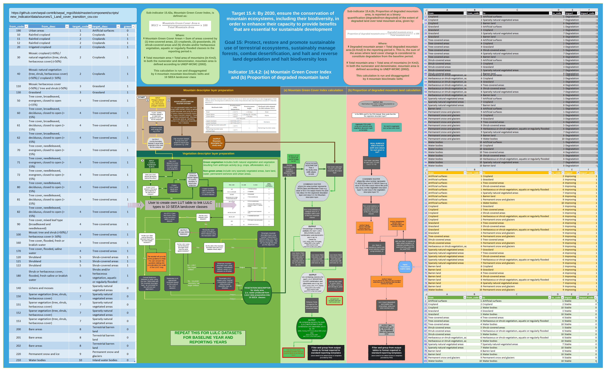

Introduction to MGCI
====================

SDG Indicator 15.4.2 – Mountain Green Cover Index (MGCI) is one of the
two indicators under SDG Target 15.4, which aims to "*ensure the conservation
of mountain ecosystems, including their biodiversity, to enhance their capacity
to provide benefits which are essential for sustainable development*". The Food
and Agriculture Organization (FAO) of the United Nations is the custodian agency
of this indicator.

The indicator is composed of two sub-indicators to monitor progress towards the
conservation of mountain ecosystems:

**Sub-indicator 15.4.2a**, Mountain Green Cover Index (MGCI), is designed to
measure the extent and changes of green cover - i.e. forest, shrubs, trees,
pasture land, cropland, etc. – in mountain areas. MGCI is defined as the
percentage of green cover over the total surface of the mountain area of a
given country and for given reporting year. The aim of the index is to monitor
the evolution of the green cover and thus assess the status of conservation of
mountain ecosystems.

**Sub-indicator 15.4.2b**, Proportion of degraded mountain land, is designed to
monitor the extent of degraded mountain land as a result of land cover change of
a given country and for given reporting year. Similarly to sub-indicator "trends
in land cover" under SDG Indicator 15.3.1 (Sims et al. 2021), mountain ecosystem
degradation and recovery is assessed based on the definition of land cover type
transitions that constitute degradation, as either improving, stable or degraded.
The definition of degradation adopted for the computation of this indicator is the
one established Intergovernmental Science-Policy Platform on Biodiversity and
Ecosystem Services (IPBES)footnote reference [#]_.

.. [#]IPBES defines land degradation as “the many human-caused processes that
drive the decline or loss in biodiversity, ecosystem functions or ecosystem
services in any terrestrial and associated aquatic ecosystems” (IPBES, 2018)

Please see the full metadata
`here <https://unstats.un.org/sdgs/metadata/files/Metadata-15-04-02.pdf>`_
for further information about the indicator.

The purpose of this document is explain the workflow and provide
countries with detailed technical guidance on how to develop a
nationally relevant mountain layer using the Kapos mountain method,
use a nationally relevant landcover map and compute the MGCI to
standard reporting tables required for the submission to FAO for
this indicator. and as well as providing some best practice in
combining layers at different resolutions. The standardisation of
the guidance will also help enable consistency of reporting between
countries and enable FAO to make the necessary regional and global
summaries.

**The workflow and guidance are provided to enable users to choose
from 2 different software:**

- Step-by-Step instructions in **QGIS (with R integration)**
- SEPAL app: Users can register and log into the SEPAL data portal where a user-friendly interface will guide technicians through a series of menu-driven steps to prepare the layers and run the calculations

|imageworkflow|

Figure 1: Simplified Workflow (still need to edit and upload latest)

Overview of Mountain Area Map
-----------------------------

Several methodologies have been developed in the last decades to consistently
classify and map global mountain systems, using a variety of parameters such
as elevation, topography, climate and ecology.

For the purposes of standardization and international comparability of nationally
derived-estimates, this indicator adheres to the UNEP-WCMC mountain definition
(UNEP-WCMC, 2002). The UNEP-WCMC method defines total global mountain area as the
sum of seven classes (commonly known as ‘Kapos mountain classes’), based on elevation,
slope and local elevation ranges parameters. The mapping of mountain areas using this
methodology requires a Digital Elevation Model (DEM).

For disaggregation purposes, this mountain area is subdivided into bioclimatic belts
as defined by Körner et al. (2011). Körner et al. subdivides mountains vertically into
seven bioclimatic belts based on average temperatures, therefore accounting the
latitudinal change in elevation of thermally similar areas in the world’s mountains.
For the purposes of this indicator, these seven bioclimatic belts are aggregated into
four (Nival, Alpine, Montane and Remaining mountain areas), as illustrated in Table 1.

**Table 1.** Mountain bioclimatic belts as defined by Körner et al. (2011) and reclassification
 for data disaggregation of SDG Indicator 15.4.2. Growing season is defined as the number of days
 between daily mean temperature exceeds 0.9 °C then falls below 0.9 °C

+-----------------------------------------+-----------------------------------+-------------------------+------------------------------------------------------+
| Bioclimatic belts                       | Growing season mean temperature   | Growing season length   | Bioclimatic belts adopted for SDG Indicator 15.4.2   |
+=========================================+===================================+=========================+======================================================+
| Nival                                   | < 3.5 °C                          | < 10 days               | Nival                                                |
+-----------------------------------------+-----------------------------------+-------------------------+------------------------------------------------------+
| Upper alpine                            | < 3.5 °C                          | > 10 days & < 54 days   | Alpine                                               |
+-----------------------------------------+-----------------------------------+-------------------------+------------------------------------------------------+
| Lower alpine                            | < 6.4°C                           | < 54 days               |                                                      |
+-----------------------------------------+-----------------------------------+-------------------------+------------------------------------------------------+
| THE TREELINE                                                                                                                                                 |
+-----------------------------------------+-----------------------------------+-------------------------+------------------------------------------------------+
| Upper montane                           | > 6.4°C & ≤ 10 °C                 | ---                     | Montane                                              |
+-----------------------------------------+-----------------------------------+-------------------------+------------------------------------------------------+
| Lower montane                           | > 10 °C & ≤ 15 °C                 | ---                     |                                                      |
+-----------------------------------------+-----------------------------------+-------------------------+------------------------------------------------------+
| Remaining mountain area with frost      | > 15 °C                           | ---                     | Remaining mountain area                              |
+-----------------------------------------+-----------------------------------+-------------------------+------------------------------------------------------+
| Remaining mountain area without frost   | > 15 °C                           |                         |                                                      |
+-----------------------------------------+-----------------------------------+-------------------------+------------------------------------------------------+

A global mountain area map sub-divided by bioclimatic belts has been developed by FAO and made
available to national authorities to facilitate the computation of this indicator. This map is
the result of combining a global mountain area map developed from the Global Multi-Resolution
Terrain Elevation Data (GMTED2010), following the UNEP-WCMC methodology (Ravilious et al. 2021)
and a mountain bioclimatic belt map created by the Global Mountain Biodiversity Assessment

Overview of the land cover data
-------------------------------

Land cover refers to the observed physical cover of the Earth’s surface. It includes vegetation
and manmade features as well as bare rock, bare soil and inland water surfaces (FAO-GTOS, 2009).
The primary units for characterizing land cover are categories (e.g. Forest or Open Water). These
categories must be defined following a standardized land cover
classification in order to identify land cover changes consistently over time.

Several global standards of land cover classifications have been developed by international
initiatives for this purpose. For the purposes of standardization and harmonization when reporting
on SDG Indicator 15.4.2, this indicator has adapted the land cover classification established by the
United Nations Statistical Commission’s System of Environmental and Economic Accounting (UN-SEEA)(UN
Statistical Division, 2014) by selecting the most relevant SEEA classes for mountain ecosystems and
aggregating all croplands classes in the following classification (Table 2).

**Table 2.** Adapted UN-SEEA land cover classification for the computation and aggregate reporting
on SDG Indicator 15.4.2.

+-----------------------------------------------------------------------+------------------------------------------------------------------------------------------------------------------------------------------------------------------------------------------------------------------------------------------------------------------------------------------------------------------------------------------------------------------------------------------------------------------+
| **Land cover class**                                                  | **Description**                                                                                                                                                                                                                                                                                                                                                                                                  |
+=======================================================================+==================================================================================================================================================================================================================================================================================================================================================================================================================+
| 1. Artificial surfaces                                                | The class is composed of any type of areas with a predominant artificial surface. Any urban or related feature is included in this class, for example, urban parks (parks, parkland and laws). The class also includes industrial areas, and waste dump deposit and extraction sites.                                                                                                                            |
+-----------------------------------------------------------------------+------------------------------------------------------------------------------------------------------------------------------------------------------------------------------------------------------------------------------------------------------------------------------------------------------------------------------------------------------------------------------------------------------------------+
| 2. Croplands                                                          | The class is composed of cultivated vegetation, including herbaceous plants, trees and/or shurbs. It includes:                                                                                                                                                                                                                                                                                                   |
|                                                                       |                                                                                                                                                                                                                                                                                                                                                                                                                  |
|                                                                       | -  Herbaceous crops used for hay. All the non-perennial crops that do not last for more than two growing seasons and crops like sugar cane, where the upper part of the plant is regularly harvested while the root system can remain for more than one year in the field, are included in this class.                                                                                                           |
|                                                                       |                                                                                                                                                                                                                                                                                                                                                                                                                  |
|                                                                       | -  All types of orchards and plantations (fruit trees, coffee and tea plantation, oil palms, rubber plantation, Christmas trees, etc.).                                                                                                                                                                                                                                                                          |
|                                                                       |                                                                                                                                                                                                                                                                                                                                                                                                                  |
|                                                                       | -  Multiple or layered crops, including areas with two layers of different crops and/or areas with the presence of one important layer of natural vegetation (mainly trees) that covers one layer of cultivated crop.                                                                                                                                                                                            |
+-----------------------------------------------------------------------+------------------------------------------------------------------------------------------------------------------------------------------------------------------------------------------------------------------------------------------------------------------------------------------------------------------------------------------------------------------------------------------------------------------+
| 3. Grasslands                                                         | This class includes any geographical area dominated by natural herbaceous plants (grasslands, prairies, steppes and savannahs) with a cover of 10 per cent or more, irrespective of different human and/or animal activities, such as grazing or selective fire management. Woody plants (trees and/or shrubs) can be present, assuming their cover is less that 10 per cent.                                    |
+-----------------------------------------------------------------------+------------------------------------------------------------------------------------------------------------------------------------------------------------------------------------------------------------------------------------------------------------------------------------------------------------------------------------------------------------------------------------------------------------------+
| 4. Tree-covered areas                                                 | This class includes any geographical area dominated by natural tree plants with a cover of 10 per cent or more. Other types of plants (shrubs and/or herbs) can be present, even with a density higher than that of trees. Areas planted with trees for afforestation purposes and forest plantations are included in this class. This class includes areas seasonally or permanently flooded with freshwater.   |
+-----------------------------------------------------------------------+------------------------------------------------------------------------------------------------------------------------------------------------------------------------------------------------------------------------------------------------------------------------------------------------------------------------------------------------------------------------------------------------------------------+
| 5. Shrub-covered areas                                                | This class includes any geographical area dominated by natural shrubs having a cover of 10 per cent or more. Trees can be present in scattered form if their cover is less than 10 per cent. Herbaceous plants can also be present at any density. The class includes shrub-covered areas permanently or regularly flooded by inland fresh water.                                                                |
+-----------------------------------------------------------------------+------------------------------------------------------------------------------------------------------------------------------------------------------------------------------------------------------------------------------------------------------------------------------------------------------------------------------------------------------------------------------------------------------------------+
| 6. Shubs and/or herbaceous vegetation, aquatic or regularly flooded   | This class includes any geographical area dominated by natural herbaceous vegetation (cover of 10 per cent or more) that is permanently or regularly flooded by fresh or brackish water (swamps, marsh areas, etc.). Flooding must persist for at least two months per year to be considered regular. Woody vegetation (trees and/or shrubs) can be present if their cover is less than 10 per cent.             |
+-----------------------------------------------------------------------+------------------------------------------------------------------------------------------------------------------------------------------------------------------------------------------------------------------------------------------------------------------------------------------------------------------------------------------------------------------------------------------------------------------+
| 7.Sparsely natural vegetated areas                                    | This class includes any geographical areas were the cover of natural vegetation is between 2 per cent and 10 per cent. This includes permanently or regularly flooded areas.                                                                                                                                                                                                                                     |
+-----------------------------------------------------------------------+------------------------------------------------------------------------------------------------------------------------------------------------------------------------------------------------------------------------------------------------------------------------------------------------------------------------------------------------------------------------------------------------------------------+
| 8. Terrestrial barren land                                            | This class includes any geographical area dominated by natural abiotic surfaces (bare soil, sand, rocks, etc.) where the natural vegetation is absent or almost absent (covers less than 2 per cent). The class includes areas regularly flooded by inland water (lake shores, river banks, salt flats, etc.).                                                                                                   |
+-----------------------------------------------------------------------+------------------------------------------------------------------------------------------------------------------------------------------------------------------------------------------------------------------------------------------------------------------------------------------------------------------------------------------------------------------------------------------------------------------+
| 9. Permanent snow and glaciers                                        | This class includes any geographical area covered by snow or glaciers persistently for 10 months or more.                                                                                                                                                                                                                                                                                                        |
+-----------------------------------------------------------------------+------------------------------------------------------------------------------------------------------------------------------------------------------------------------------------------------------------------------------------------------------------------------------------------------------------------------------------------------------------------------------------------------------------------+
| 10. Inland water bodies                                               | This class includes any geographical area covered for most of the year by inland water bodies. In some cases, the water can be frozen for part of the year (less than 10 months). Because the geographical extent of water bodies can change, boundaries must be set consistently with those set by class 8, according to the dominant situation during the year and/or across multiple years.                   |
+-----------------------------------------------------------------------+------------------------------------------------------------------------------------------------------------------------------------------------------------------------------------------------------------------------------------------------------------------------------------------------------------------------------------------------------------------------------------------------------------------+

Land cover maps developed by relevant national authorities will generally provide the most relevant
data source to compute this indicator. However, in certain cases, such data may not be available.
In those cases, various regional or global products provide a viable alternative.

The global default source of land cover data for this indicator is the European Space Agency Climate
Change Initiative (ESA-CCI) Land Cover product (ESA, 2017). The ESA-CCI product consists of a series
of annual Land Cover maps at 300 m resolution, providing 22 land cover classes based on 300m MERIS,
1km SPOT – VEGETATION, 1km PROBA –V and 1km AVHRR. The ESA CCI adheres to the Cover Classification
System of the United Nations Food and Agriculture Organization (UN FAO) (Santoro et al. 2015).
Annual updates are currently available from 1992 to 2020. Additional years will be made available
by the European Space Agency

Overview of computation of Mountain Green Cover Index
-----------------------------------------------------

Planimetric area calculation vs Real surface area calculation
~~~~~~~~~~~~~~~~~~~~~~~~~~~~~~~~~~~~~~~~~~~~~~~~~~~~~~~~~~~~~

Area calculations for reporting purposes should be undertaken using
standard planimetric area butfor improved accuracy we offer an additional
real surface area. The real surface area takes into account the third
dimension of mountain surfaces (Jenness 2004), giving a better and more accurate
estimate of the true mountain area in a country (Bian et al., 2020). To calculate
the real surface area we use elevation data and the following the triangulation method
developed by Jenness (2004).

|image2|

Disaggregation and standardised reporting tables
~~~~~~~~~~~~~~~~~~~~~~~~~~~~~~~~~~~~~~~~~~~~~~~~

The results of the MGCI are output to standard reporting tables in
tables using the following fields:

(still to update this section)

Potential / known limitations of current methodology
----------------------------------------------------

The indicator can be calculated using freely available Earth Observation
data and simple GIS operations that can be processed in free and open
source software (FOSS) GIS. Potential limitations of the above described
methodology are related mainly to the quality of the land cover data.
The ESA CCI land cover maps are currently available at 300 meter
resolution which limits their applicability in the monitoring of small
and highly heterogeneous landscapes. Therefore, if countries have
national land cover maps of higher spatial resolution and comparable or
better quality, FAO advises using them, following the same methodology
presented here, for the generation of MGCI values.

(still to complete this section)

Acknowledgements
----------------

We would like to express our special thanks to Jeff Jenness from Jenness Enterprises, GIS Analysis and Application Design,
for his help in the development of the real surface area.

(still to complete this section)

.. |image2| image:: docs/source/media_QGIS/image2_orig.png
   :width: 700
.. |image3| image:: docs/source/media_QGIS/image3_orig.png
   :width: 700
.. |image4| image:: docs/source/media_QGIS/image4_orig.png
   :width: 700
.. |image5| image:: docs/source/media_QGIS/image5_orig.png
   :width: 700
.. |image6| image:: docs/source/media_QGIS/image6_orig.png
   :width: 700

