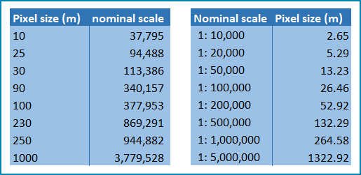

Relate
------

Defining projections to be used for the analysis
^^^^^^^^^^^^^^^^^^^^^^^^^^^^^^^^^^^^^^^^^^^^^^^^
With all map projections there will always be some distortions of area,
shape, distance and direction and therefore careful selection of
projection is important. There are no projections which fully preserve
both area and distance so selection should ensure that any distortions
are minimized. In selecting the projection, we therefore need to
consider the spatial properties we need to preserve. i.e. area and
distance.

For the purposes of this analysis, in which area needs to be preserved,
an equal area projection is required. Universal Transverse Mercator
(UTM) is a good option for countries covering only one UTM zone as both
distance and area are minimized within the zone but as distortion
increases outside the UTM zone an alternative projection is required for
countries covering more than one zone. Lambert Azimuthal Equal Area
projection (with a central meridian and central latitude set to the
centre of the country) is good solution for these countries as area
calculations result in figures similar to those if data within each UTM
zone were projected and calculated separately for their respective zone.
Documentation for the Lambert Azimuthal Equal Area projection indicates
that shapes, directions, angles, and distances are generally distorted,
but area distortion is minimised. If countries wish to choose an
alternative National projection, they should ensure that it has equal
area properties.

Defining an area of interest
^^^^^^^^^^^^^^^^^^^^^^^^^^^^

An area of interest (AOI) needs to be defined at the outset of this
analysis. Due to the nature of the calculations of the the real surface area layer
this needs to go beyond the boundary of the country by at least 7km as the calculations
look at focal cells around an individual pixel in the DEM dataset. We suggest
users buffer the bounding box of the country boundary out by 10km.

Understanding scale vs resolution
^^^^^^^^^^^^^^^^^^^^^^^^^^^^^^^^^

The scale of a vector dataset is usually expressed in a similar way to paper maps, i.e. in a ratio to show the amount of reduction from the real world e.g.  1:50,000. A country’s vector LULC map will have been created at a particular scale. determined by the Minimum Mapping Unit. i.e. the size of the smallest feature. A nominal scale is will have been assigned to the dataset to reflect the scale at which the data were collected and mapped. Conversion to raster requires this scale to be converted to a resolution, i.e. an appropriate pixel size for the scale of the data.                                                              |

To calculate map scale there are two parameters:  ground resolution and screen resolution.

.. math:: scale = 1: (resolution * PPI / 0.0254) \\

or

.. math:: resolution = scale * 0.0254/PPI

**Where**:

**resolution** =  ground resolution (the size in (m) that a pixel represents.

**PPI** =  the screen resolution (pixels number that every inch contains on the screen (default 96dpi).

**0.0254** = (m/inch),  the unit conversion between meter and inches.

**scale** = nominal scale of vector dataset

Some examples are provided in the table below:

|imagescale_table|

(source: https://enonline.supermap.com/iExpress9D/Appendix/scale.htm)

Choice of Land cover dataset and data access
^^^^^^^^^^^^^^^^^^^^^^^^^^^^^^^^^^^^^^^^^^^^
In sub-indicator 15.4.2a, land cover is used to categorize land into
green and non-green cover areas. As showed in Table 3, green cover
includes areas covered by both natural vegetation and vegetation
resulting from anthropic activity. Non-green areas include non-vegetated
areas such as bare land, water, permanent ice/snow, urban areas and
sparsely vegetated areas.

In addition, land cover is used to disaggregate the indicator into the
10 land cover classes included in Table 2, thus increasing the
indicator’s policy relevance.

**Table 3.** Classification of SEEA land cover classes into green and
non-green cover.\ * *

+---------------------------------------------------------------------------+------------------------+
| **SEEA land cover classes**                                               | **Green/Non-green**    |
+===========================================================================+========================+
| Croplands                                                                 | Green                  |
+---------------------------------------------------------------------------+------------------------+
| Grasslands                                                                | Green                  |
+---------------------------------------------------------------------------+------------------------+
| Tree-covered areas                                                        | Green                  |
+---------------------------------------------------------------------------+------------------------+
| Shrub-covered areas                                                       | Green                  |
+---------------------------------------------------------------------------+------------------------+
| Shrubs and/or herbaceous vegetation, aquatic or regularly flooded\ * *    | Green                  |
+---------------------------------------------------------------------------+------------------------+
| Artificial surfaces                                                       | Non-green              |
+---------------------------------------------------------------------------+------------------------+
| Sparsely natural vegetated areas\ * *                                     | Non-green              |
+---------------------------------------------------------------------------+------------------------+
| Terrestrial barren land                                                   | Non-green              |
+---------------------------------------------------------------------------+------------------------+
| Permanent snow and glaciers                                               | Non-green              |
+---------------------------------------------------------------------------+------------------------+
| Inland water bodies                                                       | Non-green              |
+---------------------------------------------------------------------------+------------------------+

Land cover maps developed by relevant national authorities will
generally provide the most relevant data source to compute this
indicator. To meet the technical quality requirements for calculating
this indicator, these land cover maps should:

-  Use a land cover legend defined using the Land Cover Meta Language
   [ISO 19144-2:2012] standard, have adequate classes to populate the
   transition matrix and be part of a hierarchical classification system
   to promote easy harmonisation to the SEEA classification

-  Be available during the 2000-2015 period and as close to the baseline
   year (2015) as possible.

-  Be produced for the whole mountain area of the country and be
   recorded at high spatial accuracy.

-  Have information on the classification accuracy for each land unit at
   each epoch of the data.

Where existing national or regional land cover products do not meet the
requirements described above, the global default dataset for this
indicator should be used. However, given unique national context and
degradation processes, it may be advantageous for a country to develop
their own land cover classification, using remote sensing imagery.

The default global dataset is the 300m global landcover product produced by the European Space
Agency (ESA) Climate Change Initiative (CCI) can be used if no
appropriate National level dataset is available. This LULC dataset can
be downloaded from
https://cds.climate.copernicus.eu/cdsapp#!/dataset/satellite-land-cover?tab=overview.4

For the Global ESA CCI dataset users must register to download the
required dataset and accept terms and conditions before they are
directed to download the data.

|image33|

Choice of DEM for generating real surface area calculations and data access
^^^^^^^^^^^^^^^^^^^^^^^^^^^^^^^^^^^^^^^^^^^^^^^^^^^^^^^^^^^^^^^^^^^^^^^^^^^

Development of a real surface area layer requires a Digital
Elevation Model (DEM). The selection of which DEM to use for this
can be chosen by the countries. We do not advise countries which DEM to
choose although table X provides some suggestions for open access sources.
DEM selection may be influenced by several factors including:

-  resolution of landcover dataset being used as the land cover layer

-  a country’s standard DEM or knowledge of which DEM most accurately
   represents elevation for the country

-  the processing power required to generate a DEM at the higher
   resolutions – particularly for larger or under-resourced countries.

Countries may want to pay particular attention to the scale of their
chosen land cover dataset when selecting the resolution of their DEM.
Selecting a DEM that is of similar resolution to the landc cover dataset is
likely to be the best option.

The higher the resolution (smaller the grid cells), the more detailed information. Higher resolution DEMs improve the accuracy of analysis such as hydrological modelling. However, they are more computationally expensive to use, particularly over large extents.

|image167|

Table 1: Sources of DEM datasets with open access. Sources ranging from
coarse scale data at 1km resolution down to finer 30m resolution. The
most recent globally consistent product available at 90m and 30m
resolutions is the Copernicus DEM which is a Digital Surface Model (DSM)
which represents the surface of the Earth including buildings,
infrastructure and vegetation.

For further information on DEMs and downloading them please see Annex 1.

.. |image33| image:: media_QGIS/image33_orig.png
   :width: 1200

.. |image167| image:: media_QGIS/image167.png
   :width: 1200

