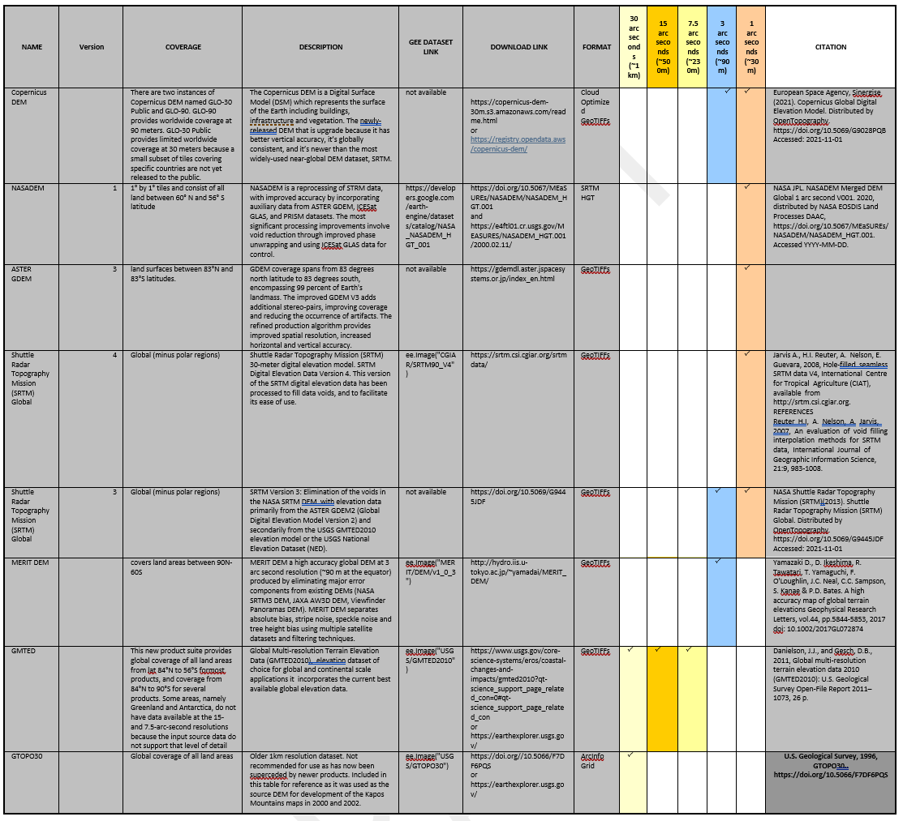
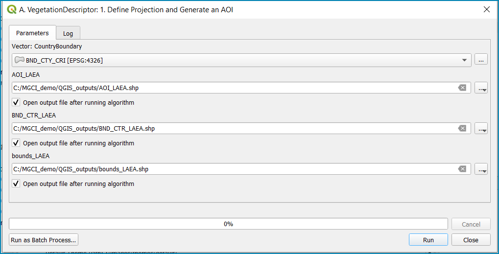

Introduction to MGCI
====================

    The Mountain Green Cover Index (MGCI) is designed to measure the
    extent and the changes of green vegetation in mountain areas - i.e.
    forest, shrubs, trees, pasture land, crop land, etc. – in order to
    monitor progress towards the mountain target. MGCI is defined as the
    percentage of green cover over the total surface of the mountain
    region of a given country and for given reporting year. The aim of
    the index is to monitor the evolution of the green cover and thus
    assess the status of conservation of mountain ecosystems.

    Please see the full metadata
    `here <https://unstats.un.org/sdgs/metadata/files/Metadata-15-04-02.pdf>`__
    for further information about the indicator.

    The purpose of this document is explain the workflow and provide
    countries with detailed technical guidance on how to develop a
    nationally relevant mountain layer using the Kapos mountain method,
    use a nationally relevant landcover map and compute the MGCI to
    standard reporting tables required for the submission to FAO for
    this indicator. and as well as providing some best practice in
    combining layers at different resolutions. The standardisation of
    the guidance will also help enable consistency of reporting between
    countries and enable FAO to make the necessary regional and global
    summaries.

    **The workflow and guidance are provided to enable users to choose
    from 3 different software:**

1) Step-by-Step instructions in **QGIS (with R integration)**

2) Step-by-Step instruction in **R** (plus and R-Script)

3) **Google Earth Engine App**: Users can register and log into the
   SEPAL data portal where a user-friendly interface will guide
   technicians through a series of menu-driven steps to prepare the
   mountain and vegetation descriptor layers before running the MGCI
   calculations. Users will be given the choice to upload their own data
   or choose from data already uploaded to the tool. The MGCI will be
   computed and outputs formatted to standard reporting tables.

Figure X: Simplified Workflow

1.1 Overview of Mountain Descriptor layer
-----------------------------------------

Mountains can be defined with reference to a variety of parameters, such
as climate, elevation, ecology (Körner, Paulsen, & Spehn, 2011)
(Karagulle, et al., 2017). This methodology adheres to the UNEP- WCMC
mountain definition, relying in turn on the mountain description
proposed by (Kapos, Rhind, Edwards, Prince, & Ravilious, 2000). This
description classifies mountains according to altitude, slope and
elevation range into 6 categories.

+----------------------+-------------------------------------------------------------------------------------------------------------+--------------------------------------------------------------------------------------------------------------------------------------------------------------------------------------------------------------------------------------------------------------+
| **Mountain Class**   | **Description**                                                                                             | *Please also note that (as per the methodology description in Kapos et. al. 2000), Inner isolated areas (<=25km2 in size) that don't meet criteria but are surrounded by mountains are identified and merged into whichever class they are surrounded by.*   |
+======================+=============================================================================================================+==============================================================================================================================================================================================================================================================+
| 1                    | Elevation > 4.500 meters                                                                                    |                                                                                                                                                                                                                                                              |
+----------------------+-------------------------------------------------------------------------------------------------------------+--------------------------------------------------------------------------------------------------------------------------------------------------------------------------------------------------------------------------------------------------------------+
| 2                    | Elevation 3.500–4.500 meters                                                                                |                                                                                                                                                                                                                                                              |
+----------------------+-------------------------------------------------------------------------------------------------------------+--------------------------------------------------------------------------------------------------------------------------------------------------------------------------------------------------------------------------------------------------------------+
| 3                    | Elevation 2.500–3.500 meters                                                                                |                                                                                                                                                                                                                                                              |
+----------------------+-------------------------------------------------------------------------------------------------------------+--------------------------------------------------------------------------------------------------------------------------------------------------------------------------------------------------------------------------------------------------------------+
| 4                    | Elevation 1.500–2.500 meters and slope > 2                                                                  |                                                                                                                                                                                                                                                              |
+----------------------+-------------------------------------------------------------------------------------------------------------+--------------------------------------------------------------------------------------------------------------------------------------------------------------------------------------------------------------------------------------------------------------+
| 5                    | Elevation 1.000–1.500 meters and slope > 5 or local elevation range (LER 7 kilometer radius) > 300 meters   |                                                                                                                                                                                                                                                              |
+----------------------+-------------------------------------------------------------------------------------------------------------+--------------------------------------------------------------------------------------------------------------------------------------------------------------------------------------------------------------------------------------------------------------+
| 6                    | Elevation 300–1.000 meters and local elevation range (7 kilometer radius) > 300 meters                      |                                                                                                                                                                                                                                                              |
+----------------------+-------------------------------------------------------------------------------------------------------------+--------------------------------------------------------------------------------------------------------------------------------------------------------------------------------------------------------------------------------------------------------------+

1.2 Overview of Vegetation Descriptor layer
-------------------------------------------

The vegetation descriptor layer categorizes land cover into green and
non-green areas. Green vegetation includes both natural vegetation and
vegetation resulting from anthropic activity (e.g. crops, afforestation,
etc.). Non-green areas include very sparsely vegetated areas, bare land,
water, permanent ice/snow and urban areas. The vegetation description
layer can be derived in different ways, but remote sensing based land
cover maps are the most convenient data source for this purpose, as they
provide the required information on green and non-green areas in a
spatially explicit manner and allow for comparison over time through
land cover change analysis. Currently, FAO uses land cover time series
produced by the European Space Agency (ESA) under the Climate Change
Initiative (CCI) as a general solution. The original CCI classes are
re-classified into six IPCC classes and further into binary
green/non-green cover classes as follows:

+---------------------------------------------------+--------------------+---------------------+
| ESA CCI class                                     | IPCC class         | Green / Non green   |
+===================================================+====================+=====================+
| 50, 60, 61, 62, 70, 71, 72, 80, 81, 82, 90, 100   | Forest\ :sup:`1`   | Green               |
+---------------------------------------------------+--------------------+---------------------+
| 110, 120, 121, 122, 130, 140,                     | Grassland          | Green               |
+---------------------------------------------------+--------------------+---------------------+
| 10,11, 12, 20, 30, 40                             | Cropland           | Green               |
+---------------------------------------------------+--------------------+---------------------+
| 160, 170, 180                                     | Wetland            | Non Green           |
+---------------------------------------------------+--------------------+---------------------+
| 190                                               | Settlement         | Non Green           |
+---------------------------------------------------+--------------------+---------------------+
| 150, 151, 152, 153, 200, 201, 202, 210, 220       | Other land         | Non Green           |
+---------------------------------------------------+--------------------+---------------------+

:sup:`1` Please note, that here the term “Forest” refers to land cover,
not necessarily land use

Comments and limitations:

**1.3 Overview of computation of Mountain Green Cover Index** 
--------------------------------------------------------------

1.3.1 Planimetric area calculation vs Real surface area calculation
~~~~~~~~~~~~~~~~~~~~~~~~~~~~~~~~~~~~~~~~~~~~~~~~~~~~~~~~~~~~~~~~~~~

To improve the accuracy of the mountain green cover index calculation a
decision has been made by FAO to calculate area using the standard
planimetric area and an additional real surface area. The real surface
area takes into account the third dimension of mountain surfaces
(Jenness 2004), giving a better and more accurate estimate of the true
mountain area in a country (Bian et al., 2020). For the purposes of the
MGCI, elevation data is used to calculate the real surface area
following the triangulation method developed by Jenness (2004).

|image0|

1.3.2 Disaggregation and standardised reporting tables 
~~~~~~~~~~~~~~~~~~~~~~~~~~~~~~~~~~~~~~~~~~~~~~~~~~~~~~~

The results of the MGCI are output to standard reporting tables in
tables using the following fields:

|image1|

Three levels of reporting are required

1) Aggregated mountain green cover Index by Kapos mountain class

|image2|

1) Area of mountain and area of green cover area within each Kapos
   mountain class

|image3|

1) Area of mountain and green cover within each LULC class area and
   Kapos mountain class

|image4|

1.4 Potential / known limitations of current methodology
--------------------------------------------------------

The indicator can be calculated using freely available Earth Observation
data and simple GIS operations that can be processed in free and open
source software (FOSS) GIS. Potential limitations of the above described
methodology are related mainly to the quality of the land cover data.
The ESA CCI land cover maps are currently available at 300 meter
resolution which limits their applicability in the monitoring of small
and highly heterogeneous landscapes. Therefore, if countries have
national land cover maps of higher spatial resolution and comparable or
better quality, FAO advises using them, following the same methodology
presented here, for the generation of MGCI values.

Regarding the interpretation of the indicator, although in the great
majority of cases the desired direction is an increase in green mountain
cover which reflects restriction of damage to natural ecosystems and
possibly even the expansion of forest, shrubland and grasslands through
conservation efforts, in more limited cases, an increase in the
indicator value in high elevation classes may also signify the
encroachment of vegetation on areas previously covered by glaciers or
other permanent or semi-permanent ice or snow layers, as a result of
global warming due to climate change. Such a change can be tracked with
the current methodology and flagged accordingly at the level of
disaggregated data by land cover type and elevation class, to
distinguish this case from the general desired trend of increasing
mountain green cover.

Initial set-up 
===============

1. 

   1. 

   2. 

   3. 

   4. 

2.1 Software Installation 
--------------------------

2.1.1 R software and packages installation
~~~~~~~~~~~~~~~~~~~~~~~~~~~~~~~~~~~~~~~~~~

1. Download and install R from https://www.r-project.org/ and then
   download and install RStudio Desktop from
   https://www.rstudio.com/products/rstudio/. Once the later has been
   completed, open RStudio in your computer.

2. Click on ‘File’ (top left corner) and then on ‘Open File…’. Select
   the file named ‘XXXXXXXX’ Click on …….to run and install all the
   packages and check that there are no errors.

3. Ensure the ‘sp ‘and ‘raster’ packages are correctly installed. Two of
   the options to do so are:

   >install.packages("name\_of\_package")

   >library(name\_of\_package)

   Or

   >(if(!require("name\_of\_package"))
   install.packages("name\_of\_package")

    A step-by-step guide on how to install R and R Studio (with images)
    can be found in Annex X.

    If you are not installing R and R studio from scratch, please make
    sure that your installations are upgraded. It is important to use
    the current version of R software (R-4.1.1 at the time of writing).
    The R version can be easily checked on the text within the ‘R
    Console’ box at the beginning of a new session (see Figure XX for
    standalone R and Figure ZZ for R Studio).

    |image5|

    |image6|

    If you are running R on Windows, package ‘installr’ allows you to
    quickly update the R version and the packages saved in your library
    (please check
    https://www.r-statistics.com/2015/06/a-step-by-step-screenshots-tutorial-for-upgrading-r-on-windows/
    for a step-by-step tutorial on how to do this or type the lines
    bellow on the R Console:

    >install.packages("installr") #you’ll have to select the CRAN mirror
    for use in this session depending on your geographical location

    |image7|

    >library(installr)

    >updateR() # and answer the questions to complete the update. The
    final set of questions are about copying your R packages to the new
    version of R.

    |image8|

2.1.2 QGIS software and plugins
~~~~~~~~~~~~~~~~~~~~~~~~~~~~~~~

We suggest users use the Long-Term Release version1 [1]_ of QGIS to
undertake their analysis as this is most stable versions and users are
less likely to incur technical difficulties and bugs.

There are various installers depending on your operating system but for
most users we recommend the QGIS Standalone Installer. Full instructions
are on their website
`https://qgis.org/en/site/forusers/download.html# <https://qgis.org/en/site/forusers/download.html>`__

Whilst the MGCI analysis runs entirely within the QGIS interface, users
wishing to use QGIS for the MGCI analysis are also required to install R
software (as outlined above). R scripts can be run from within the QGIS
interface. The R script will be only be used for calculating real
surface area during the MGCI calculation. Real surface area can be
calculated using one of the ready to use SAGA tools in the processing
toolbox, however after initial testing we found the results differed
from the GEE and R methods and therefore due to the need for consistency
between calculation methods for this SDG indicator, the best and easiest
method was to integrate the ‘surfaceArea’ function from package ‘sp in R
software.

Once QGIS and R are both correctly installed users will need to install
the following plugins:

1. **Processing R Provider:** This plugin essentially allows R scripts
   to be used directly within the QGIS processing toolbox with the
   simple addition of some QGIS header information placed at the top of
   the script to making the R script behave exactly like other
   processing tools in the QGIS processing toolbox. The header
   information allows graphical fields to be set in the processing
   dialogue window when running the tool e.g. the input raster, a
   specific field or the location and name of an output raster. Some
   header information is used to tell QGIS to either pass information to
   R and from QGIS about the tool to enable the R processing to happen
   within the QGIS interface.

-  From the QGIS Menu Toolbar click on **Plugins>>Manage and Install
   Plugins**

|image9|

-  From the Plugin dialogue window search for **processing R**

|image10|

    Click **Install Plugin** and then **Close**

|image11|

|image12|

    Once installed R will appear as a processing tool in the processing
    toolbox and an R Scripts button in the Processing Toolbox Menu.
    Users may find that the R scripts button is missing at this stage.

-  Click the arrow next to the **R** Tools to expand the R toolset.

The toolset should look similar to the below with a few example scripts.

|image13|

and the processing Toolbox Menu with the missing R scripts |image14|
button

|image15|

-  From the QGIS main menu click on **settings>>
   options>>processing>>providers**

-  expand **R** to see the R setting

|image16|

If you operating system is 64 bit, tick **Use 64bit version**

-  Check the **R folder** is pointing to the correct location (where it
   is installed on your computer)

-  Click okay

-  Save the QGIS project and re-open to activate the changes.

You should now see that the R script button has appeared on the
processing toolbox menu

|image17|

Next add additional resources to the R processing toolbox

-  To add other R resources click on **plugins>>resource
   sharing>>resource sharing**

    |image18|

-  Click on **All Collections** on the left hand panel and click **QGIS
   R script collection (QGIS Official Repository)** then click
   **Install**

    |image19|

A wider collection of scripts should now be present in the R-scripts
collection. These are not required for MGCI but useful for R-Integration
with QGIS.

-  |image20|\ To check that the R integration is correctly installed and
   working check that a new script can be created by clicking **‘Create
   New R script’** button at the top of the Processing toolbox.

-  Click the **Open Script** button and open the real surface area R
   script that has been adapted to run in QGIS. The file is called
   **RSA\_R\_script\_with\_QGIS\_headers \_final\_v1.rsx** script (to be
   provided)

   |image21|

   The RSA script should open

   |image22|

Note that the script header indicates that the R script will appear
under the **Raster Processing group** in the R toolset in the QGIS
Processing Toolbox, the name of the tool will be **Create RSA raster
v1.**

-  Click the **Save** **script as** button |image23| to save the script
   in your QGIS rscripts folder. Save the script as
   **RSA\_R\_script\_with\_QGIS\_headers\_final\_v1.rsx**

|image24|

-  Click **Save**

-  Add a sample raster (to be provided) to your QGIS project and run the
   following steps to check that the QGIS R-installation is working
   correctly for the RSA script.

|image25|

-  In the Processing Toolbox, double click on the **Create RSA Raster
   V1** tool to open the tool dialogue

    |image26|

|image27|

-  Leave the output to save to a temporary file

-  Click **Run**

    If R has been installed correctly the script should run with no
    errors and an output should be generated which is one cell less in
    all directions compared to the input

-  To make it easier to check the output change the symbology on the
   output to shade **Singleband/Pseudocolor**

|image28|

    The temporary output should look like the below. The reason that the
    layer is one cell less all the way round is that the real surface
    area uses 8 surrounding cells around each cell in the calculation
    and the reason that when processing the data for calculating the
    mountain and real surface area layers that the area of interest
    needs to be defined large than the boundary of the country.

    |image29|

    **Resource sharing plugin:** This plugin is a useful R related
    plugin (which is not essential for the MGCI but useful for users
    wishing to integrate R with QGIS).

    Once the resource sharing plugin is installed some scripts should
    also be visible. They are grouped into several categories as in the
    screengrab below.

    |image30|

    For further information see the following sections of the QGIS user
    manual at

-  https://docs.qgis.org/3.16/en/docs/user_manual/processing/3rdParty.html#r-scripts

-  docs.qgis.org/3.16/en/docs/user\_manual/processing/3rdParty.html#index-5

2.2 Detailed workflows 
-----------------------

2.2.1 R
~~~~~~~

2.2.2 QGIS
~~~~~~~~~~

2.3 Defining analysis environments and data selection 
------------------------------------------------------

2.3.1 Defining projections to be used for the analysis
~~~~~~~~~~~~~~~~~~~~~~~~~~~~~~~~~~~~~~~~~~~~~~~~~~~~~~

DEM data are usually delivered in geographic coordinate system (EPSG:
4326). For generation of the mountain descriptor layer slope and area
need to be calculated from the DEM. There is no single map projection
that can be used as slope generation requires a projection with
different properties (equidistant) compared to the area calculation
(equal area). In selecting the projection, we therefore need to consider
the spatial properties we need to preserve. i.e. area and distance.

With all map projections there will always be some distortions of area,
shape, distance and direction and therefore careful selection of
projection is important. There are no projections which fully preserve
both area and distance so selection should ensure that any distortions
are minimized. To minimise errors, it is important not to project the
DEM multiple times as it degrades the data and introduces additional
errors, so each projection needs to be done from the source DEM.

Depending on whether the analysis is undertaken using GEE in SEPAL or
using desktop software (QGIS or R) influences the way the analysis is
undertaken. However, comparisons have been made to ensure that the
methods are as closely aligned as possible.

The main difference between the desktop and GEE approach is that GEE
recommends that processing is undertaken in geographic coordinate system
and only the statistics at the end are calculated in an equal area
projection.

For R and QGIS an equal area projection is required for most steps in
the analysis. Universal Transverse Mercator (UTM) is a good option for
countries covering only one UTM zone as both distance and area are
minimized within the zone but as distortion increases outside the UTM
zone an alternative projection is required for countries covering more
than one zone. Lambert Azimuthal Equal Area projection (with a central
meridian and central latitude set to the centre of the country) is good
solution for these countries as area calculations result in figures
similar to those if data within each UTM zone were projected and
calculated separately for their respective zone. Documentation for the
Lambert Azimuthal Equal Area projection indicates that shapes,
directions, angles, and distances are generally distorted, but area
distortion is minimised. If countries wish to choose an alternative
National projection, they should ensure that it has equal area
properties [2]_.

2.3.2 Overview of slope calculation methods 
~~~~~~~~~~~~~~~~~~~~~~~~~~~~~~~~~~~~~~~~~~~~

**Selected slope method for QGIS and R:**

For slope generation in the Mountain Descriptor layer (in QGIS and R) we
explored various options including the methods outlined on We explored
various methods but in the end opted we opted to project the DEM to an
equidistant projection to enable a consistent approach to be taken by
all countries and the method used in the 002 Kapos mountain layer
generation. Whilst with this method error increases away from a defined
central latitude and longitude, we found that other errors were
occurring when using the conformal Mercator approach described on
gis.stackexchange [3]_ which we were not able to resolve. The later
approach used a simple expression was used for its scale distortion.
This method assumed that scale is correct at the equator and that its
distortion equals the secant of the latitude, or in other words, a slope
map can be generated showing percent slope which can then be divided by
the cosine of the latitude to correct the distortion of scale.

+----+
|    |
+====+
+----+

+----+
+----+

+----+
+----+

**Selected slope method for GEE:**

For ease of implementation in Google Earth Engine we opted for using a
Terrain Analysis in Google Earth Engine (TAGEE) module developed by
Safanelli et. al (2020). The module uses spheroid geometries meaning
that the DEM does not need to be projected to do the slope calculation.

2.3.3 Defining an area of interest
~~~~~~~~~~~~~~~~~~~~~~~~~~~~~~~~~~

An area of interest (AOI) needs to be defined at the outset of this
analysis. Due to the nature of the calculations of the mountain
descriptor layer and the real surface area layer this needs to go beyond
the boundary of the country by at least 7km as the calculations look at
focal cells around an individual pixel in the DEM dataset. We suggest
users buffer the bounding box of the country boundary out by 10km.

2.3.4 Choice of LULC dataset and data access
~~~~~~~~~~~~~~~~~~~~~~~~~~~~~~~~~~~~~~~~~~~~

It is preferable that a National LULC map is used as the vegetation
descriptor layer for their MGCI analysis however countries can choose a
regional or global dataset if no national dataset is available. The
global 300m global landcover product produced by the European Space
Agency (ESA) Climate Change Initiative (CCI) can be used if no
appropriate National level dataset is available. This LULC dataset can
be downloaded from
https://cds.climate.copernicus.eu/cdsapp#!/dataset/satellite-land-cover?tab=overview.4

For the Global ESA CCI dataset users must register to download the
required dataset and accept terms and conditions before they are
directed to download the data.

|image31|

2.3.5 Choice of DEM and data access
~~~~~~~~~~~~~~~~~~~~~~~~~~~~~~~~~~~

Development of the mountain descriptor layer requires a Digital
Elevation Model (DEM). The selection of which DEM to use for the
mountain descriptor layer will be done by the countries. We do not
advise countries which DEM to choose although table X provides some
suggestions for open access sources. DEM selection may be influenced by
several factors including:

-  resolution of landcover dataset being used as the vegetation
   descriptor layer

-  a country’s standard DEM or knowledge of which DEM most accurately
   represents mountain for the country

-  the processing power required to generate a DEM at the higher
   resolutions – particularly for larger or under-resourced countries.

Countries may want to pay particular attention to the scale of their
chosen LULC dataset when selecting the resolution of their DEM.
Selecting a DEM that is of similar resolution to the LULC dataset is
likely to be the best option. Otherwise selecting a higher resolution
and aggregating the resultant mountain descriptor layer to the
resolution of the LULC dataset. UNEP-WCMC has evaluated the effects of
DEM resolution on the area of mountain in the mountain descriptor layer
and the effects of scaling up from finer to coarser resolutions. The
results showed that whilst there were differences in the mountain areas
(km:sup:`2`) between classes relative to the areas derived from the
native data, the difference was not statistically different.

+--------------------------------------------------+---------------+----------------------------------------------------------------------------------------------------------------------------------------------------------------------------------------------------------------------------------------------------------------------------------------------------------------------+-----------------------------------------------------------------------------------------------------------------------------------------------------------------------------------------------------------------------------------------------------------------------------------------------------------------------------------------------------------------------+---------------------------------------------------------------------------------------+--------------------------------------------------------------------------------------------------------------------------------------------------------------------------+----------------------------+-----------------------------+------------------------------+-------------------------------+----------------------------+----------------------------+-----------------------------------------------------------------------------------------------------------------------------------------------------------------------------------------------------------------------------------------------------------+
| **NAME**                                         | **Version**   | **COVERAGE**                                                                                                                                                                                                                                                                                                         | **DESCRIPTION**                                                                                                                                                                                                                                                                                                                                                       | **GEE DATASET LINK**                                                                  | **DOWNLOAD LINK**                                                                                                                                                        | **FORMAT**                 | **30 arc seconds (~1km)**   | **15 arc seconds (~500m)**   | **7.5 arc seconds (~230m)**   | **3 arc seconds (~90m)**   | **1 arc seconds (~30m)**   | **CITATION**                                                                                                                                                                                                                                              |
+--------------------------------------------------+---------------+----------------------------------------------------------------------------------------------------------------------------------------------------------------------------------------------------------------------------------------------------------------------------------------------------------------------+-----------------------------------------------------------------------------------------------------------------------------------------------------------------------------------------------------------------------------------------------------------------------------------------------------------------------------------------------------------------------+---------------------------------------------------------------------------------------+--------------------------------------------------------------------------------------------------------------------------------------------------------------------------+----------------------------+-----------------------------+------------------------------+-------------------------------+----------------------------+----------------------------+-----------------------------------------------------------------------------------------------------------------------------------------------------------------------------------------------------------------------------------------------------------+
| Copernicus DEM                                   |               | There are two instances of Copernicus DEM named GLO-30 Public and GLO-90. GLO-90 provides worldwide coverage at 90 meters. GLO-30 Public provides limited worldwide coverage at 30 meters because a small subset of tiles covering specific countries are not yet released to the public.                            | The Copernicus DEM is a Digital Surface Model (DSM) which represents the surface of the Earth including buildings, infrastructure and vegetation. The newly-released DEM that is upgrade because it has better vertical accuracy, it’s globally consistent, and it’s newer than the most widely-used near-global DEM dataset, SRTM.                                   | not available                                                                         | https://copernicus-dem-30m.s3.amazonaws.com/readme.html                                                                                                                  | Cloud Optimized GeoTIFFs   |                             |                              |                               | P                          | P                          | European Space Agency, Sinergise (2021). Copernicus Global Digital Elevation Model. Distributed by OpenTopography. https://doi.org/10.5069/G9028PQB Accessed: 2021-11-01                                                                                  |
|                                                  |               |                                                                                                                                                                                                                                                                                                                      |                                                                                                                                                                                                                                                                                                                                                                       |                                                                                       |                                                                                                                                                                          |                            |                             |                              |                               |                            |                            |                                                                                                                                                                                                                                                           |
|                                                  |               |                                                                                                                                                                                                                                                                                                                      |                                                                                                                                                                                                                                                                                                                                                                       |                                                                                       | or                                                                                                                                                                       |                            |                             |                              |                               |                            |                            |                                                                                                                                                                                                                                                           |
|                                                  |               |                                                                                                                                                                                                                                                                                                                      |                                                                                                                                                                                                                                                                                                                                                                       |                                                                                       |                                                                                                                                                                          |                            |                             |                              |                               |                            |                            |                                                                                                                                                                                                                                                           |
|                                                  |               |                                                                                                                                                                                                                                                                                                                      |                                                                                                                                                                                                                                                                                                                                                                       |                                                                                       | https://registry.opendata.aws/copernicus-dem/                                                                                                                            |                            |                             |                              |                               |                            |                            |                                                                                                                                                                                                                                                           |
+--------------------------------------------------+---------------+----------------------------------------------------------------------------------------------------------------------------------------------------------------------------------------------------------------------------------------------------------------------------------------------------------------------+-----------------------------------------------------------------------------------------------------------------------------------------------------------------------------------------------------------------------------------------------------------------------------------------------------------------------------------------------------------------------+---------------------------------------------------------------------------------------+--------------------------------------------------------------------------------------------------------------------------------------------------------------------------+----------------------------+-----------------------------+------------------------------+-------------------------------+----------------------------+----------------------------+-----------------------------------------------------------------------------------------------------------------------------------------------------------------------------------------------------------------------------------------------------------+
| NASADEM                                          | 1             | 1° by 1° tiles and consist of all land between 60° N and 56° S latitude                                                                                                                                                                                                                                              | NASADEM is a reprocessing of STRM data, with improved accuracy by incorporating auxiliary data from ASTER GDEM, ICESat GLAS, and PRISM datasets. The most significant processing improvements involve void reduction through improved phase unwrapping and using ICESat GLAS data for control.                                                                        | https://developers.google.com/earth-engine/datasets/catalog/NASA\_NASADEM\_HGT\_001   | https://doi.org/10.5067/MEaSUREs/NASADEM/NASADEM\_HGT.001                                                                                                                | SRTM HGT                   |                             |                              |                               |                            | P                          | NASA JPL. NASADEM Merged DEM Global 1 arc second V001. 2020, distributed by NASA EOSDIS Land Processes DAAC, https://doi.org/10.5067/MEaSUREs/NASADEM/NASADEM\_HGT.001. Accessed YYYY-MM-DD.                                                              |
|                                                  |               |                                                                                                                                                                                                                                                                                                                      |                                                                                                                                                                                                                                                                                                                                                                       |                                                                                       |                                                                                                                                                                          |                            |                             |                              |                               |                            |                            |                                                                                                                                                                                                                                                           |
|                                                  |               |                                                                                                                                                                                                                                                                                                                      |                                                                                                                                                                                                                                                                                                                                                                       |                                                                                       | and                                                                                                                                                                      |                            |                             |                              |                               |                            |                            |                                                                                                                                                                                                                                                           |
|                                                  |               |                                                                                                                                                                                                                                                                                                                      |                                                                                                                                                                                                                                                                                                                                                                       |                                                                                       |                                                                                                                                                                          |                            |                             |                              |                               |                            |                            |                                                                                                                                                                                                                                                           |
|                                                  |               |                                                                                                                                                                                                                                                                                                                      |                                                                                                                                                                                                                                                                                                                                                                       |                                                                                       | https://e4ftl01.cr.usgs.gov/MEASURES/NASADEM\_HGT.001/2000.02.11/                                                                                                        |                            |                             |                              |                               |                            |                            |                                                                                                                                                                                                                                                           |
+--------------------------------------------------+---------------+----------------------------------------------------------------------------------------------------------------------------------------------------------------------------------------------------------------------------------------------------------------------------------------------------------------------+-----------------------------------------------------------------------------------------------------------------------------------------------------------------------------------------------------------------------------------------------------------------------------------------------------------------------------------------------------------------------+---------------------------------------------------------------------------------------+--------------------------------------------------------------------------------------------------------------------------------------------------------------------------+----------------------------+-----------------------------+------------------------------+-------------------------------+----------------------------+----------------------------+-----------------------------------------------------------------------------------------------------------------------------------------------------------------------------------------------------------------------------------------------------------+
| ASTER GDEM                                       | 3             | land surfaces between 83°N and 83°S latitudes.                                                                                                                                                                                                                                                                       | GDEM coverage spans from 83 degrees north latitude to 83 degrees south, encompassing 99 percent of Earth's landmass. The improved GDEM V3 adds additional stereo-pairs, improving coverage and reducing the occurrence of artifacts. The refined production algorithm provides improved spatial resolution, increased horizontal and vertical accuracy.               | not available                                                                         | https://gdemdl.aster.jspacesystems.or.jp/index\_en.html                                                                                                                  | GeoTIFFs                   |                             |                              |                               |                            | P                          |                                                                                                                                                                                                                                                           |
+--------------------------------------------------+---------------+----------------------------------------------------------------------------------------------------------------------------------------------------------------------------------------------------------------------------------------------------------------------------------------------------------------------+-----------------------------------------------------------------------------------------------------------------------------------------------------------------------------------------------------------------------------------------------------------------------------------------------------------------------------------------------------------------------+---------------------------------------------------------------------------------------+--------------------------------------------------------------------------------------------------------------------------------------------------------------------------+----------------------------+-----------------------------+------------------------------+-------------------------------+----------------------------+----------------------------+-----------------------------------------------------------------------------------------------------------------------------------------------------------------------------------------------------------------------------------------------------------+
| Shuttle Radar Topography Mission (SRTM) Global   | 4             | Global (minus polar regions)                                                                                                                                                                                                                                                                                         | Shuttle Radar Topography Mission (SRTM) 30-meter digital elevation model. SRTM Digital Elevation Data Version 4. This version of the SRTM digital elevation data has been processed to fill data voids, and to facilitate its ease of use.                                                                                                                            | ee.Image("CGIAR/SRTM90\_V4")                                                          | https://srtm.csi.cgiar.org/srtmdata/                                                                                                                                     | GeoTIFFs                   |                             |                              |                               |                            | P                          | Jarvis A., H.I. Reuter, A. Nelson, E. Guevara, 2008, Hole-filled seamless SRTM data V4, International Centre for Tropical Agriculture (CIAT), available from http://srtm.csi.cgiar.org.                                                                   |
|                                                  |               |                                                                                                                                                                                                                                                                                                                      |                                                                                                                                                                                                                                                                                                                                                                       |                                                                                       |                                                                                                                                                                          |                            |                             |                              |                               |                            |                            |                                                                                                                                                                                                                                                           |
|                                                  |               |                                                                                                                                                                                                                                                                                                                      |                                                                                                                                                                                                                                                                                                                                                                       |                                                                                       |                                                                                                                                                                          |                            |                             |                              |                               |                            |                            | REFERENCES                                                                                                                                                                                                                                                |
|                                                  |               |                                                                                                                                                                                                                                                                                                                      |                                                                                                                                                                                                                                                                                                                                                                       |                                                                                       |                                                                                                                                                                          |                            |                             |                              |                               |                            |                            |                                                                                                                                                                                                                                                           |
|                                                  |               |                                                                                                                                                                                                                                                                                                                      |                                                                                                                                                                                                                                                                                                                                                                       |                                                                                       |                                                                                                                                                                          |                            |                             |                              |                               |                            |                            | Reuter H.I, A. Nelson, A. Jarvis, 2007, An evaluation of void filling interpolation methods for SRTM data, International Journal of Geographic Information Science, 21:9, 983-1008.                                                                       |
+--------------------------------------------------+---------------+----------------------------------------------------------------------------------------------------------------------------------------------------------------------------------------------------------------------------------------------------------------------------------------------------------------------+-----------------------------------------------------------------------------------------------------------------------------------------------------------------------------------------------------------------------------------------------------------------------------------------------------------------------------------------------------------------------+---------------------------------------------------------------------------------------+--------------------------------------------------------------------------------------------------------------------------------------------------------------------------+----------------------------+-----------------------------+------------------------------+-------------------------------+----------------------------+----------------------------+-----------------------------------------------------------------------------------------------------------------------------------------------------------------------------------------------------------------------------------------------------------+
| Shuttle Radar Topography Mission (SRTM) Global   | 3             | Global (minus polar regions)                                                                                                                                                                                                                                                                                         | SRTM Version 3: Elimination of the voids in the NASA SRTM DEM with elevation data primarily from the ASTER GDEM2 (Global Digital Elevation Model Version 2) and secondarily from the USGS GMTED2010 elevation model or the USGS National Elevation Dataset (NED).                                                                                                     | not available                                                                         | https://doi.org/10.5069/G9445JDF                                                                                                                                         | GeoTIFFs                   |                             |                              |                               | P                          | P                          | NASA Shuttle Radar Topography Mission (SRTM)(2013). Shuttle Radar Topography Mission (SRTM) Global. Distributed by OpenTopography. https://doi.org/10.5069/G9445JDF Accessed: 2021-11-01                                                                  |
+--------------------------------------------------+---------------+----------------------------------------------------------------------------------------------------------------------------------------------------------------------------------------------------------------------------------------------------------------------------------------------------------------------+-----------------------------------------------------------------------------------------------------------------------------------------------------------------------------------------------------------------------------------------------------------------------------------------------------------------------------------------------------------------------+---------------------------------------------------------------------------------------+--------------------------------------------------------------------------------------------------------------------------------------------------------------------------+----------------------------+-----------------------------+------------------------------+-------------------------------+----------------------------+----------------------------+-----------------------------------------------------------------------------------------------------------------------------------------------------------------------------------------------------------------------------------------------------------+
| MERIT DEM                                        |               | covers land areas between 90N-60S                                                                                                                                                                                                                                                                                    | MERIT DEM a high accuracy global DEM at 3 arc second resolution (~90 m at the equator) produced by eliminating major error components from existing DEMs (NASA SRTM3 DEM, JAXA AW3D DEM, Viewfinder Panoramas DEM). MERIT DEM separates absolute bias, stripe noise, speckle noise and tree height bias using multiple satellite datasets and filtering techniques.   | ee.Image("MERIT/DEM/v1\_0\_3")                                                        | http://hydro.iis.u-tokyo.ac.jp/~yamadai/MERIT\_DEM/                                                                                                                      | GeoTIFFs                   |                             |                              |                               | P                          |                            | Yamazaki D., D. Ikeshima, R. Tawatari, T. Yamaguchi, F. O'Loughlin, J.C. Neal, C.C. Sampson, S. Kanae & P.D. Bates. A high accuracy map of global terrain elevations Geophysical Research Letters, vol.44, pp.5844-5853, 2017 doi: 10.1002/2017GL072874   |
+--------------------------------------------------+---------------+----------------------------------------------------------------------------------------------------------------------------------------------------------------------------------------------------------------------------------------------------------------------------------------------------------------------+-----------------------------------------------------------------------------------------------------------------------------------------------------------------------------------------------------------------------------------------------------------------------------------------------------------------------------------------------------------------------+---------------------------------------------------------------------------------------+--------------------------------------------------------------------------------------------------------------------------------------------------------------------------+----------------------------+-----------------------------+------------------------------+-------------------------------+----------------------------+----------------------------+-----------------------------------------------------------------------------------------------------------------------------------------------------------------------------------------------------------------------------------------------------------+
| GMTED                                            |               | This new product suite provides                                                                                                                                                                                                                                                                                      | Global Multi-resolution Terrain Elevation Data (GMTED2010), elevation dataset of choice for global and continental scale applications it incorporates the current best available global elevation data.                                                                                                                                                               | ee.Image("USGS/GMTED2010")                                                            | https://www.usgs.gov/core-science-systems/eros/coastal-changes-and-impacts/gmted2010?qt-science\_support\_page\_related\_con=0#qt-science\_support\_page\_related\_con   | GeoTIFFs                   | P                           | P                            | P                             |                            |                            | Danielson, J.J., and Gesch, D.B., 2011, Global multi-resolution terrain elevation data 2010 (GMTED2010): U.S. Geological Survey Open-File Report 2011–1073, 26 p.                                                                                         |
|                                                  |               |                                                                                                                                                                                                                                                                                                                      |                                                                                                                                                                                                                                                                                                                                                                       |                                                                                       |                                                                                                                                                                          |                            |                             |                              |                               |                            |                            |                                                                                                                                                                                                                                                           |
|                                                  |               | global coverage of all land areas from lat 84°N to 56°S formost products, and coverage from 84°N to 90°S for several products. Some areas, namely Greenland and Antarctica, do not have data available at the 15- and 7.5-arc-second resolutions because the input source data do not support that level of detail   |                                                                                                                                                                                                                                                                                                                                                                       |                                                                                       | or                                                                                                                                                                       |                            |                             |                              |                               |                            |                            |                                                                                                                                                                                                                                                           |
|                                                  |               |                                                                                                                                                                                                                                                                                                                      |                                                                                                                                                                                                                                                                                                                                                                       |                                                                                       |                                                                                                                                                                          |                            |                             |                              |                               |                            |                            |                                                                                                                                                                                                                                                           |
|                                                  |               |                                                                                                                                                                                                                                                                                                                      |                                                                                                                                                                                                                                                                                                                                                                       |                                                                                       | https://earthexplorer.usgs.gov/                                                                                                                                          |                            |                             |                              |                               |                            |                            |                                                                                                                                                                                                                                                           |
+--------------------------------------------------+---------------+----------------------------------------------------------------------------------------------------------------------------------------------------------------------------------------------------------------------------------------------------------------------------------------------------------------------+-----------------------------------------------------------------------------------------------------------------------------------------------------------------------------------------------------------------------------------------------------------------------------------------------------------------------------------------------------------------------+---------------------------------------------------------------------------------------+--------------------------------------------------------------------------------------------------------------------------------------------------------------------------+----------------------------+-----------------------------+------------------------------+-------------------------------+----------------------------+----------------------------+-----------------------------------------------------------------------------------------------------------------------------------------------------------------------------------------------------------------------------------------------------------+
| GTOPO30                                          |               | Global coverage of all land areas                                                                                                                                                                                                                                                                                    | Older 1km resolution dataset. Not recommended for use as has now been superceded by newer products. Included in this table for reference as it was used as the source DEM for development of the Kapos Mountains maps in 2000 and 2002.                                                                                                                               | ee.Image("USGS/GTOPO30")                                                              | https://doi.org//10.5066/F7DF6PQS                                                                                                                                        | ArcInfo Grid               | P                           |                              |                               |                            |                            | **U.S. Geological Survey, 1996, GTOPO30.. https://doi.org/10.5066/F7DF6PQS **                                                                                                                                                                             |
|                                                  |               |                                                                                                                                                                                                                                                                                                                      |                                                                                                                                                                                                                                                                                                                                                                       |                                                                                       |                                                                                                                                                                          |                            |                             |                              |                               |                            |                            |                                                                                                                                                                                                                                                           |
|                                                  |               |                                                                                                                                                                                                                                                                                                                      |                                                                                                                                                                                                                                                                                                                                                                       |                                                                                       | or                                                                                                                                                                       |                            |                             |                              |                               |                            |                            |                                                                                                                                                                                                                                                           |
|                                                  |               |                                                                                                                                                                                                                                                                                                                      |                                                                                                                                                                                                                                                                                                                                                                       |                                                                                       |                                                                                                                                                                          |                            |                             |                              |                               |                            |                            |                                                                                                                                                                                                                                                           |
|                                                  |               |                                                                                                                                                                                                                                                                                                                      |                                                                                                                                                                                                                                                                                                                                                                       |                                                                                       | https://earthexplorer.usgs.gov/                                                                                                                                          |                            |                             |                              |                               |                            |                            |                                                                                                                                                                                                                                                           |
+--------------------------------------------------+---------------+----------------------------------------------------------------------------------------------------------------------------------------------------------------------------------------------------------------------------------------------------------------------------------------------------------------------+-----------------------------------------------------------------------------------------------------------------------------------------------------------------------------------------------------------------------------------------------------------------------------------------------------------------------------------------------------------------------+---------------------------------------------------------------------------------------+--------------------------------------------------------------------------------------------------------------------------------------------------------------------------+----------------------------+-----------------------------+------------------------------+-------------------------------+----------------------------+----------------------------+-----------------------------------------------------------------------------------------------------------------------------------------------------------------------------------------------------------------------------------------------------------+

Table X: Sources of DEM datasets with open access. Sources ranging from
coarse scale data at 1km resolution down to finer 30m resolution. The
most recent globally consistent product available at 90m and 30m
resolutions is the Copernicus DEM which is a Digital Surface Model (DSM)
which represents the surface of the Earth including buildings,
infrastructure and vegetation.

Running the workflow using a user-friendly interface in SEPAL 
==============================================================

Daniel to write instructions for use of interface in SEPAL? I think here
we need to link to his markdown pages

1. .. rubric:: Running the workflow using a pre-prepared R script
      :name: running-the-workflow-using-a-pre-prepared-r-script

2. .. rubric:: Running the workflow following step-by-step instructions
      in QGIS
      :name: running-the-workflow-following-step-by-step-instructions-in-qgis

1. 

2. 

3. 

This section of the tutorial explains in detail how to carry out this
analysis in QGIS, using the Costa Rica as a case study using a 90m
resolution DEM from Copernicus. This section assumes that the user has
already downloaded the DEM and a LULC dataset (see section 2 and the
Annexes for further information).

The tutorial outlines in detail the steps all the tools used for
individual steps in the processing toolbox as well as providing a custom
toolbox to group and run the steps to help speed up the analysis and
allow for easier repeat processing.

|image32|

For this tutorial we are using Costa Rica as an example country for
processing the MGCI, the Copernicus 90m DEM and Global ESA CCI LULC
datasets.

5.1 Define projection and generate an AOI
-----------------------------------------

In the custom MGCI toolbox this step is run by the tool

|image33|

|image34|

The user selects the **country boundary** and sets **3** **output
files** then clicks **Run** to tun the tool

--------------------------------------------------------------------------------------------------------------------------------------------------------------------

Manual steps:

-  Add a country boundary layer to QGIS **Layer>>Add Layer>>Add Vector
   Layer**

    |image35|

    |image36|\ |image37|

-  Click **Add** and **Close** to close the Data Source Manager: Vector
   dialogue window

-  Right-click on the country boundary layer and click **Zoom to Layer**

*Note that for Costa Rica the country includes Cocos Island to the
southwest of the Costa Rican mainland in the Pacific Ocean.*

In this example the boundary layer is in Geographic coordinate system
(EPSG 4326). At this stage we want to set-up the projection for the main
parts of the MGCI analysis. We therefore want to set the project window
to an equal area projection and physically project the country boundary
to the same projection.

Costa Rica covers more than one UTM Zone so in this example we will
define a custom Lambert Azimuthal Equal Area projection with the central
meridian set to -84 and the latitude of origin to 8.5.

Costa Rica does have a National Projection (see https://epsg.io/5367)
which may be an alternative to the Lambert Azimuthal Equal Area.

If you need to define a custom projection, follow the instructions in
Box 1

+-----------------------------------------------------------------------------------------------------------------------------------------------------------------------+
| .. rubric:: BOX 1: Defining a custom projection                                                                                                                       |
|    :name: box-1-defining-a-custom-projection                                                                                                                          |
|                                                                                                                                                                       |
| -  From the main menu click **settings>>custom projections**                                                                                                          |
|                                                                                                                                                                       |
| -  Click the **+** button to a new custom projection                                                                                                                  |
|                                                                                                                                                                       |
| -  Give the custom projection a **name** e.g. in this example **CRI\_LAEQ**                                                                                           |
|                                                                                                                                                                       |
| -  Copy the following projection information into the **parameters** box, changing the lat and lon highlighted in yellow to the centre lat and lon of your country.   |
|                                                                                                                                                                       |
|    +proj=laea +lat\_0=8.5 +lon\_0=-84 +x\_0=0 +y\_0=0 +datum=WGS84 +units=m +no\_defs                                                                                 |
|                                                                                                                                                                       |
| |image38|                                                                                                                                                             |
|                                                                                                                                                                       |
| -  Click the **Validate** button to check that the parameters are valid and then **OK** to save the custom projection                                                 |
+=======================================================================================================================================================================+
+-----------------------------------------------------------------------------------------------------------------------------------------------------------------------+

Next change the project for the QGIS to your chosen equal area
projection. In this example it is the custom projection that was defined
in Box 1.

-  Click on the project projection **EPSG: 4326** in the bottom right
   hand corner of your QGIS project

|image39|

-  In the Project Properties dialogue window search for the chosen
   projection in the **Filter** tab

|image40|

-  Once located click on the equal area projection to set your QGIS
   project to be displayed in the chosen projection. E.g. in this
   example **CRI\_LEA**

-  Click **Apply** and **OK**

   |image41|

   See that the project now displays the custom projection in the bottom
   right hand corner.

Next use the reproject tool to project the country boundary layer to the
equal area projection

-  In the processing toolbox search for the **Reproject** tool

|image42|

|image43|

-  Set the Input layer to be the **country boundary**

-  Set the Target CRS to be the **Project CRS** (i.e. to the equal area
   projection)

-  | Set the output name to be the same as the input with a suffix to
     indicate the projection e.g. in this example
   | **BND\_CTY\_CRI\_ LAEA**

Now that the country boundary is in the chosen equal area projection, we
can generate a rectangular bounding box which we will use as an area of
interest (AOI). As indicated previously, the AOI needs to be larger than
the country boundary to avoid errors during the processing. A distance
of 10km around the bounding box is added to ensure the AOI is large
enough to accommodate the 7km focal range function used in the mountain
descriptor layer generation.

-  In the processing toolbox search for the **minimum bounding geometry
   tool**

|image44|

-  Select your **projected** **country boundary** for the Input layer

-  Choose Envelope (bounding Box) for the Geometry type

-  Set a new output with the prefix **bounds\_** for the name e.g.
   **bounds\_CRI\_LAEA**

-  Click **Run** to run the tool.

This has generated the bounding box. The next step adds the 10km buffer.

-  In the processing toolbox search for the **buffer tool**

-  Set the buffer **Distance** to **10**

-  Set the buffer **Units** to **Kilometres**

-  Set the **endcap style** to **square** and the **join style** to
   **Miter**

-  Save the Buffered output to the same name as the input with the
   suffix **\_BUF10**

-  Click **Run** to run the tool.

|image45|

If you change the symbology to semi-transparent symbol and draw it over
the original bounding box you should be able to see the additional
buffered area.

|image46|

The output is a bounding box 10km larger than the bounding box for the
country. This will be used as the Area of Interest (AOI) when preparing
the various layers for the MGCI analysis.

5.2 Preparation of Vegetation descriptor layer
----------------------------------------------

The development of vegetation descriptor layer starts with either a
raster or vector landuse landcover (LULC) dataset. Follow either section
5.2.1 if your LULC dataset is a raster data or 5.2.2 if your LULC
dataset is a vector.

5.2.1 Steps when using a raster dataset 
~~~~~~~~~~~~~~~~~~~~~~~~~~~~~~~~~~~~~~~~

To demonstrate the steps for processing a raster LULC dataset we will
use the Global ESA CCI LULC dataset. This dataset is provided in netcdf
(.nc) format. Similarly to Geotiffs, these can be added directly to
QGIS.

-  From the QGIS main toolbar click on **Layer>>Add Layer>>Add Raster
   Layer** to add the LULC file to your QGIS session.

|image47|

|image48|

-  Click **Add**

For most formats this will add the LULC dataset to the QGIS session. The
Global ESA CCI LULC netcdf file however contains 7 different layers
(similar to bands in an image) and users need to select the
**lccs\_class** layer.

-  Click **lccs\_class** to select the LULC layer

-  Click **OK** and the LULC layer will be added to your QGIS project

-  Click **Close** to close the Data Source Manager: Raster dialogue
   window

|image49|

Next check that the LULC layer has correct projection information and
appears in the correct place in the QGIS project.

-  First check that the LULC layer is correctly overlaying the country
   boundary data. If it does not your country boundary and/or your LULC
   layer may be lacking projection information or have the wrong
   projection information.

   |image50|

   QGIS will display a **?** next to the layer if projection information
   is missing.

-  If projection information is missing define the projection using the
   **Define Shapefile projection** tool in the processing toolbox (this
   will permanently attach projection information to the layer)
   alternatively you can just define it within the current QGIS project
   by right clicking on the layer.

   In this example we know the LULC is in Geographic coordinate system
   so we can assign coordinate system EPSG 4326 to the layer

   |image51|

   This layer should now draw correctly on the country boundary.

   If the LULC dataset is a regional or global extent it will need
   projecting and clipping to the AOI.

   In this example we are using a global dataset so we will need to
   follow **step (a) only** to clip the raster and save it in the equal
   area projection. For National datasets already clipped to the country
   boundary follow **step (b) only.**

(a) .. rubric:: Clip and project LULC raster (FOR REGIONAL/GLOBAL
       DATASETS ONLY):
       :name: clip-and-project-lulc-raster-for-regionalglobal-datasets-only

    In the custom MGCI toolbox this step is run by the tools

    |image52|

    |image53|

The user selects the **Raster LULC** and sets **source and target CRS,
the Vector AOI (**\ that was generated in the previous step\ **), the
output resolution, an output file** and clicks **Run** to run the tool.

    |image54|

    |image55|

The user selects the **crosswalk text file** (see manual steps for
required format) , the **Raster LULC** (clipped to AOI and in equal area
projection), selects the **style file** for symbolising the output, and
sets **the output vegetation descriptor file, then** and clicks **Run**
to run the tool.

--------------------------------------------------------------------------------------------------------------------------------------------------------------------

Manual steps:

-  In the processing toolbox search for **Clip**.

-  Double click on the **Clip raster by mask layer** under the GDAL
   toolset

    |image56|

-  Select the **LULC dataset** for the **Input Layer**

-  Select the **buffered bounding box layer** for the **Mask Layer**

-  Select the **Project CRS** for the **Target CRS**

-  Tick **Match the extent of the clipped raster to the extent of the
   mask layer**

-  Tick **set the output file resolution**

-  Type the **X and Y resolution in metres** (in this case the
   resolution of the LULC dataset is 300)

-  Tick **Use Input Layer Data Type**

-  Set the output **Clipped (mask)** e.g. to LULC\_clip\_LAEA\_BUF10.tif

   (see screengrab below)

|image57|\ |image58|

-  \ **Click Run** to run the tool

The new clipped LULC dataset in the equal area projection should be
added should be added to the map canvas\ **.**

-  Right click on the clipped LULC dataset (i.e. in this example the
   LULC\_clip\_LAEA\_BUF10 layer) and click **properties>>Symbology**

|image59|

-  Change the render type to **Palleted/Unique Values**

-  Click **Classify** and then **OK**

|image60|

You should now see the unique LULC classes present within the AOI for
the country.

(a) .. rubric:: Project LULC raster (FOR NATIONALDATASETS ONLY):
       :name: project-lulc-raster-for-nationaldatasets-only

(b) In the custom MGCI toolbox this step is run by the tool

|image61|

|image62|

The user selects the **Raster LULC** and sets **source and target CRS,
the output resolution** and an **output file** and clicks **Run** to run
the tool.

|image63|

|image64|

The user selects the **crosswalk text file** (see manual steps for
required format) , the **Raster LULC** (clipped to AOI and in equal area
projection), selects the **style file** for symbolising the output, and
sets **the output vegetation descriptor file, then** and clicks **Run**
to run the tool.

--------------------------------------------------------------------------------------------------------------------------------------------------------------------

Manual steps:

|image65|

-  search for **project** in the processing toolbox.

-  Double click on the GDAL tool **Warp (reproject)**

-  Select the **National** **LULC dataset** for the **Input Layer**

-  Select the **Project CRS** for the **Target CRS**

-  Set the resampling method to **Nearest Neighbour**

-  Set the output resolution (same as the input or the equivalent to the
   input in metres)

-  Set the output **Reprojected** layer name e.g. to
   **National\_LULC\_\_LAEA.tif**

-  Click **Run** to run the tool

|image66|

The new projected LULC dataset in the equal area projection should be
added should be added to the map canvas\ **.**

-  Right click on the projected LULC dataset and click
   **properties>>Symbology**

-  Change the render type to **Palleted/Unique Values**

-  Click **Classify** and then **OK**

    |image67|\ |image68|

The layer should now show all the National LULC classes for Costa Rica.

 
~

5.2.3 Steps when using a vector LULC dataset
~~~~~~~~~~~~~~~~~~~~~~~~~~~~~~~~~~~~~~~~~~~~

In the custom MGCI toolbox this step is run by the tools

|image69|

|image70|

The user selects the **Vector** **LULC**, a field containing the LULC
classes, sets a **target CRS, the output resolution** and an **output
file** and clicks **Run** to run the tool.

|image71|

|image72|

The user selects the **crosswalk text file** (see manual steps for
required format) , the **Raster LULC** (clipped to AOI and in equal area
projection), selects the **style file** for symbolising the output, and
sets **the output vegetation descriptor file, then** and clicks **Run**
to run the tool.

--------------------------------------------------------------------------------------------------------------------------------------------------------------------

Manual steps:

When using a vector LULC dataset the data will also need to be projected
to an equal area projection.

|image73|\ If the dataset is not already in an equal area projection,
search for **reproject** in the processing toolbox

-  Select the **National** **LULC vector dataset** for the **Input
   Layer**

-  Select the **Project CRS** for the **Target CRS**

-  Set the **reprojected** output layer e.g. **LULC\_vector\_LAEA.shp**

    |image74|

The next step is to rasterize the LULC data. When converting it is
important to choose an output resolution that is appropriate for the
scale of the vector dataset. (see Box 2).

+-------------------------------------------------------------------------------------------------------------------------------------------------------------------------------------------------------------------------------------------------------------------------------------------------------------------------------------------------------------------------------------------------------------------------------------------------------------------------------------------------------------------------------------------------------------------------------------------------------------------------------------------------------------------------+
| .. rubric:: BOX 2: Conversion between nominal scale and resolution                                                                                                                                                                                                                                                                                                                                                                                                                                                                                                                                                                                                      |
|    :name: box-2-conversion-between-nominal-scale-and-resolution                                                                                                                                                                                                                                                                                                                                                                                                                                                                                                                                                                                                         |
|                                                                                                                                                                                                                                                                                                                                                                                                                                                                                                                                                                                                                                                                         |
| The scale of a vector dataset is usually expressed in a similar way to paper maps, i.e. in a ratio to show the amount of reduction from the real world e.g. 1:50,000. A country’s vector LULC map will have been created a particular scale. determined by the Minimum Mapping Unit. i.e. the size of the smallest feature. A nominal scale is will have been assigned to the dataset to reflect the scale at which the data were collected and mapped. Conversion to raster requires this scale to be converted to a resolution, i.e. an appropriate pixel size for the scale of the data. Table X provides some general guidance / suggestions for such conversion.   |
|                                                                                                                                                                                                                                                                                                                                                                                                                                                                                                                                                                                                                                                                         |
| +-----------------+-----------------+-----------+------------+-------------+-------------+-----------+-------+                                                                                                                                                                                                                                                                                                                                                                                                                                                                                                                                                          |
| | Pixel Size(m)   | Nominal scale   |                                                                                                                                                                                                                                                                                                                                                                                                                                                                                                                                                                                                                                   |
| +=================+=================+===========+============+=============+=============+===========+=======+                                                                                                                                                                                                                                                                                                                                                                                                                                                                                                                                                          |
| |                 | 10K-25K         | 25K-50K   | 50K-100K   | 100K-200K   | 200K-500K   | 500K-1M   | >1M   |                                                                                                                                                                                                                                                                                                                                                                                                                                                                                                                                                          |
| +-----------------+-----------------+-----------+------------+-------------+-------------+-----------+-------+                                                                                                                                                                                                                                                                                                                                                                                                                                                                                                                                                          |
| | 250-1000        |                 |           |            |             |             |           |       |                                                                                                                                                                                                                                                                                                                                                                                                                                                                                                                                                          |
| +-----------------+-----------------+-----------+------------+-------------+-------------+-----------+-------+                                                                                                                                                                                                                                                                                                                                                                                                                                                                                                                                                          |
| | 140             |                 |           |            |             |             |           |       |                                                                                                                                                                                                                                                                                                                                                                                                                                                                                                                                                          |
| +-----------------+-----------------+-----------+------------+-------------+-------------+-----------+-------+                                                                                                                                                                                                                                                                                                                                                                                                                                                                                                                                                          |
| | 35-45           |                 |           |            |             |             |           |       |                                                                                                                                                                                                                                                                                                                                                                                                                                                                                                                                                          |
| +-----------------+-----------------+-----------+------------+-------------+-------------+-----------+-------+                                                                                                                                                                                                                                                                                                                                                                                                                                                                                                                                                          |
| | 30              |                 |           |            |             |             |           |       |                                                                                                                                                                                                                                                                                                                                                                                                                                                                                                                                                          |
| +-----------------+-----------------+-----------+------------+-------------+-------------+-----------+-------+                                                                                                                                                                                                                                                                                                                                                                                                                                                                                                                                                          |
| | 25-30           |                 |           |            |             |             |           |       |                                                                                                                                                                                                                                                                                                                                                                                                                                                                                                                                                          |
| +-----------------+-----------------+-----------+------------+-------------+-------------+-----------+-------+                                                                                                                                                                                                                                                                                                                                                                                                                                                                                                                                                          |
| | 23.5            |                 |           |            |             |             |           |       |                                                                                                                                                                                                                                                                                                                                                                                                                                                                                                                                                          |
| +-----------------+-----------------+-----------+------------+-------------+-------------+-----------+-------+                                                                                                                                                                                                                                                                                                                                                                                                                                                                                                                                                          |
| | 23.5            |                 |           |            |             |             |           |       |                                                                                                                                                                                                                                                                                                                                                                                                                                                                                                                                                          |
| +-----------------+-----------------+-----------+------------+-------------+-------------+-----------+-------+                                                                                                                                                                                                                                                                                                                                                                                                                                                                                                                                                          |
| | 20              |                 |           |            |             |             |           |       |                                                                                                                                                                                                                                                                                                                                                                                                                                                                                                                                                          |
| +-----------------+-----------------+-----------+------------+-------------+-------------+-----------+-------+                                                                                                                                                                                                                                                                                                                                                                                                                                                                                                                                                          |
| | 15-30           |                 |           |            |             |             |           |       |                                                                                                                                                                                                                                                                                                                                                                                                                                                                                                                                                          |
| +-----------------+-----------------+-----------+------------+-------------+-------------+-----------+-------+                                                                                                                                                                                                                                                                                                                                                                                                                                                                                                                                                          |
| | 15              |                 |           |            |             |             |           |       |                                                                                                                                                                                                                                                                                                                                                                                                                                                                                                                                                          |
| +-----------------+-----------------+-----------+------------+-------------+-------------+-----------+-------+                                                                                                                                                                                                                                                                                                                                                                                                                                                                                                                                                          |
| | 10              |                 |           |            |             |             |           |       |                                                                                                                                                                                                                                                                                                                                                                                                                                                                                                                                                          |
| +-----------------+-----------------+-----------+------------+-------------+-------------+-----------+-------+                                                                                                                                                                                                                                                                                                                                                                                                                                                                                                                                                          |
| | 5.8             |                 |           |            |             |             |           |       |                                                                                                                                                                                                                                                                                                                                                                                                                                                                                                                                                          |
| +-----------------+-----------------+-----------+------------+-------------+-------------+-----------+-------+                                                                                                                                                                                                                                                                                                                                                                                                                                                                                                                                                          |
| | 5               |                 |           |            |             |             |           |       |                                                                                                                                                                                                                                                                                                                                                                                                                                                                                                                                                          |
| +-----------------+-----------------+-----------+------------+-------------+-------------+-----------+-------+                                                                                                                                                                                                                                                                                                                                                                                                                                                                                                                                                          |
| | 5               |                 |           |            |             |             |           |       |                                                                                                                                                                                                                                                                                                                                                                                                                                                                                                                                                          |
| +-----------------+-----------------+-----------+------------+-------------+-------------+-----------+-------+                                                                                                                                                                                                                                                                                                                                                                                                                                                                                                                                                          |
| | 2-2.8           |                 |           |            |             |             |           |       |                                                                                                                                                                                                                                                                                                                                                                                                                                                                                                                                                          |
| +-----------------+-----------------+-----------+------------+-------------+-------------+-----------+-------+                                                                                                                                                                                                                                                                                                                                                                                                                                                                                                                                                          |
| | 0.8             |                 |           |            |             |             |           |       |                                                                                                                                                                                                                                                                                                                                                                                                                                                                                                                                                          |
| +-----------------+-----------------+-----------+------------+-------------+-------------+-----------+-------+                                                                                                                                                                                                                                                                                                                                                                                                                                                                                                                                                          |
|                                                                                                                                                                                                                                                                                                                                                                                                                                                                                                                                                                                                                                                                         |
| Table X : Resolutions recommended for Nominal scales vs pixel resolution                                                                                                                                                                                                                                                                                                                                                                                                                                                                                                                                                                                                |
|                                                                                                                                                                                                                                                                                                                                                                                                                                                                                                                                                                                                                                                                         |
| (Source: reproduced from https://marinedataliteracy.org/basics/scales/scales.htm)                                                                                                                                                                                                                                                                                                                                                                                                                                                                                                                                                                                       |
|                                                                                                                                                                                                                                                                                                                                                                                                                                                                                                                                                                                                                                                                         |
| To calculate map scale there are two parameters: ground resolution and screen resolution.                                                                                                                                                                                                                                                                                                                                                                                                                                                                                                                                                                               |
|                                                                                                                                                                                                                                                                                                                                                                                                                                                                                                                                                                                                                                                                         |
| |image75|                                                                                                                                                                                                                                                                                                                                                                                                                                                                                                                                                                                                                                                               |
|                                                                                                                                                                                                                                                                                                                                                                                                                                                                                                                                                                                                                                                                         |
| | Where:                                                                                                                                                                                                                                                                                                                                                                                                                                                                                                                                                                                                                                                                |
| | **Resolution** = ground resolution (the size in (m) that a pixel represents.                                                                                                                                                                                                                                                                                                                                                                                                                                                                                                                                                                                          |
|                                                                                                                                                                                                                                                                                                                                                                                                                                                                                                                                                                                                                                                                         |
| **PPI** = the screen resolution (pixels number that every inch contains on the screen (default 96dpi).                                                                                                                                                                                                                                                                                                                                                                                                                                                                                                                                                                  |
|                                                                                                                                                                                                                                                                                                                                                                                                                                                                                                                                                                                                                                                                         |
| **0.0254 =** (m/inch), the unit conversion between meter and inches.                                                                                                                                                                                                                                                                                                                                                                                                                                                                                                                                                                                                    |
|                                                                                                                                                                                                                                                                                                                                                                                                                                                                                                                                                                                                                                                                         |
| Scale = nominal scale of vector dataset                                                                                                                                                                                                                                                                                                                                                                                                                                                                                                                                                                                                                                 |
|                                                                                                                                                                                                                                                                                                                                                                                                                                                                                                                                                                                                                                                                         |
| (source: https://enonline.supermap.com/iExpress9D/Appendix/scale.htm)                                                                                                                                                                                                                                                                                                                                                                                                                                                                                                                                                                                                   |
+=========================================================================================================================================================================================================================================================================================================================================================================================================================================================================================================================================================================================================================================================================+
+-------------------------------------------------------------------------------------------------------------------------------------------------------------------------------------------------------------------------------------------------------------------------------------------------------------------------------------------------------------------------------------------------------------------------------------------------------------------------------------------------------------------------------------------------------------------------------------------------------------------------------------------------------------------------+

|image76|\ Once the resolution to convert the vector dataset to has been
determined the vector dataset can be converted to Raster.

-  In the processing toolbox search for **Rasterize.**

-  Double click on the GDAL **Rasterize (vector to raster)** tool

-  Select the **National** **LULC vector dataset in equal area
   projection** for the **Input Layer**

-  Select the **field containing LULC classes** for the **field to use
   for a burn-in value**

-  Set the **output raster size units** as **Georeferenced units**

-  Set both the **Width/ Horizontal resolution and Width/ vertical
   resolution** to the resolution determined by previous step using the
   formula to convert from the nominal

   vector scale (see BOX 2)

-  Set the **output extent** to **Calculate by Layer** and selecting the
   same dataset used for the Input Layer

-  Set the **rasterized** output layer e.g.
   **LULC\_LAEA\_fromvector.tif**

-  Click **Run** to run the tool

The new rasterised LULC dataset in the equal area projection should be
added should be added to the map canvas\ **.**

-  Right click on the projected LULC dataset and click
   **properties>>Symbology**

-  Change the render type to **Palleted/Unique Values**

-  Click **Classify** and then **OK**

|image77|\ |image78|

The layer should now show all the National LULC classes for Costa Rica.

5.2.4 Reclassify to IPCC landcover types
~~~~~~~~~~~~~~~~~~~~~~~~~~~~~~~~~~~~~~~~

The next step is to reclassify the LULC map prepared in 5.2.1, 5.2.2 or
5.2.3 into the 6 MGCI vegetation descriptor LULC types.

QGIS provides several tools for reclassification. The easiest one to use
in this instance is the **r.reclass** tool in the GRASS toolset as it
allows the upload of a simple crosswalk textfile containing the input
LULC types on the left and the IPCC reclass values on the right.

-  Create a text file to crosswalk landuse/landcover (LULC) types from
   the ESA CII or National landcover dataset to the 6 IPCC landcover
   classes

|image79|

-  |image80|\ Search for **reclass** in the processing toolbox and
   double click on **r.reclass**

-  Select the LULC output(from step 5.2.1, 5.2.2 or 5.2.3) as the
   **input raster layer**

-  Set the **GRASS GIS region extent** to be the same as the input layer

-  Set the **Reclassified** output e.g. VegetationDescriptor\_LAEA.tif

-  Click **Run** to run the tool

|image81|

The new **VegetationDescriptor** layer is added to the map.

Although the reclassification only had 6 output classes the symbology
initially show values 0-255. This is a QGIS visualisation only and you
can see that the actual layer only has 6 values.

-  Right click on the layer **properties>>>Symbology**

-  Change the Render type to **Palleted/Unique values** and click
   **Classify** to see only the classes present in the raster (i.e. the
   1-6 Vegetation descriptor classes).

-  Load the VegetationDescriptor.qml file for quickly assigning the
   colours and labels.

   |image82|

   |image83|

5.3 Preparation of Mountain descriptor 
---------------------------------------

Users should have read section 2.3.4 Choice of DEM and selected a DEM
for use in the analysis before starting this section as the generation
of the mountain descriptor layer requires a DEM as the input source.

In this tutorial the Copernicus 90m source DEM has been chosen as an
example.

5.3.1 Merging DEM tiles into a single DEM 
~~~~~~~~~~~~~~~~~~~~~~~~~~~~~~~~~~~~~~~~~~

In the custom MGCI toolbox this step is run by the tool

|image84|

|image85|

The user selects the **DEM tiles** and sets **the output file, then**
and clicks **Run** to run the tool.

--------------------------------------------------------------------------------------------------------------------------------------------------------------------

Manual steps:

The DEM tiles covering the full extent of Costa Rica have been download
from Copernicus using their AWS client. (Instructions for download of
Copernicus data can be found in the Annexs).

-  From the QGIS main toolbar click on **Layer>>Add Layer>>Add Raster
   Layer** to add the DEM tiles to your QGIS session.

|image86|

Click **Open** and then **Add.** The DEM tiles will be added to the QGIS
project

|image87|\ The next step is to merge the DEM tiles into a single raster.

-  Search for **Merge** in the processing toolbox window

-  Double click the **GDAL Merge tool**.

-  For the Input layers **select the DEM tiles** covering your area of
   interest

   |image88|

-  Tick the DEM tiles to merge and Click **OK** to make the selection
   and return to main **Merge Dialog window**

-  Set the **output data type** to Float32 (same as the input DEM tiles)

-  Set the **Merged** output name e.g. C:/MGCI\_tutorial/
   DEM\_copernicus\_merge.tif

   |image89|

   |image90|

-  Click **Run** to run the tool

The merged DEM is added to the QGIS project.

|image91|

5.3.2 Clip and project merged DEM
~~~~~~~~~~~~~~~~~~~~~~~~~~~~~~~~~

In the custom MGCI toolbox this step is run by the tool

|image92|

|image93|

The user selects the **merged** **DEM** and sets the **source and target
projection**, the **Vector AOI**, the **output resolution** and **the
output file, then** and clicks **Run** to run the tool.

--------------------------------------------------------------------------------------------------------------------------------------------------------------------

Manual steps:

The DEM tiles are likely to cover a much wider area than the country
being analysed therefore it is important to crop the extent to minimise
processing time. As indicated in section 2.3.2, the country boundary is
not used to clip the dataset directly as the various calculations during
the generation of the mountain descriptor layer require neighbouring
pixels to be analyses therefore the buffered bounding box generated in
section 5.1 should be used.

-  In the processing toolbox search for **Clip**.

-  Double click on the **Clip raster by mask layer** under the GDAL
   toolset

-  Select the **merged DEM dataset** for the **Input Layer**

-  Select the **buffered bounding box layer** for the **Mask Layer**

-  Select the **Project CRS** for the **Target CRS**

-  Tick **Match the extent of the clipped raster to the extent of the
   mask layer**

-  Tick **set the output file resolution**

-  Type the **X and Y resolution in metres** (in this case the
   resolution of the DEM dataset is 90)

-  Tick **Use Input Layer Data Type**

-  Set the output **Clipped (mask)** e.g. to
   DEM\_copernicus\_merge\_AOI\_LAEA.tif

-  Click **Run** to run the tool

   (see screen grab on next page)

|image94|

The new clipped DEM dataset in the equal area projection should be added
should be added to the map canvas\ **.**

|image95|

5.3.4 Generating slope layer from layer DEM
~~~~~~~~~~~~~~~~~~~~~~~~~~~~~~~~~~~~~~~~~~~

In the custom MGCI toolbox this step is run by the tools

|image96|

|image97|

|image98|

In, this section, depending on whether your country falls within a
single or multiple UTM Zones and the projection selected in section 5.1
Define projection and generate an AOI, the projection used for the slope
calculation will differ as it is important to use an equidistant
projection to reduce errors in slope calculation. An overview of slope
calculation methods is provided in section 2.3.2.

IF your country falls within **a single UTM Zone only** ***AND*** **you
have used the UTM projection for the previous steps**, or **if the
projection you are using has equidistant properties**, slope can be
generated in the same projection as the rest of the analysis, otherwise
please follow instruction in **BOX 3** for creating a custom equidistant
projection before following the next steps.

-  
-  

+-----------------------------------------------------------------------------------------------------------------------------------------------------------------------+
| .. rubric:: BOX 3: Defining a custom Azimuthal Equidistant projection                                                                                                 |
|    :name: box-3-defining-a-custom-azimuthal-equidistant-projection                                                                                                    |
|                                                                                                                                                                       |
| -  From the main menu click **settings>>custom projections**                                                                                                          |
|                                                                                                                                                                       |
| -  Click the **+** button to a new custom projection                                                                                                                  |
|                                                                                                                                                                       |
| -  Give the custom projection a **name** e.g. in this example **CRI\_AZ\_EQUI**                                                                                       |
|                                                                                                                                                                       |
| -  Copy the following projection information into the **parameters** box, changing the lat and lon highlighted in yellow to the centre lat and lon of your country.   |
|                                                                                                                                                                       |
|    PROJCRS["Custom\_Azimuthal\_Equidistant",                                                                                                                          |
|                                                                                                                                                                       |
|    BASEGEOGCRS["WGS 84",                                                                                                                                              |
|                                                                                                                                                                       |
|    DATUM["World Geodetic System 1984",                                                                                                                                |
|                                                                                                                                                                       |
|    ELLIPSOID["WGS 84",6378137,298.257223563,                                                                                                                          |
|                                                                                                                                                                       |
|    LENGTHUNIT["metre",1],                                                                                                                                             |
|                                                                                                                                                                       |
|    ID["EPSG",7030]]],                                                                                                                                                 |
|                                                                                                                                                                       |
|    PRIMEM["Greenwich",0,                                                                                                                                              |
|                                                                                                                                                                       |
|    ANGLEUNIT["Degree",0.0174532925199433]]],                                                                                                                          |
|                                                                                                                                                                       |
|    CONVERSION["unnamed",                                                                                                                                              |
|                                                                                                                                                                       |
|    METHOD["Modified Azimuthal Equidistant",                                                                                                                           |
|                                                                                                                                                                       |
|    ID["EPSG",9832]],                                                                                                                                                  |
|                                                                                                                                                                       |
|    PARAMETER["Latitude of natural origin",8.5,                                                                                                                        |
|                                                                                                                                                                       |
|    ANGLEUNIT["Degree",0.0174532925199433],                                                                                                                            |
|                                                                                                                                                                       |
|    ID["EPSG",8801]],                                                                                                                                                  |
|                                                                                                                                                                       |
|    PARAMETER["Longitude of natural origin",-84,                                                                                                                       |
|                                                                                                                                                                       |
|    ANGLEUNIT["Degree",0.0174532925199433],                                                                                                                            |
|                                                                                                                                                                       |
|    ID["EPSG",8802]],                                                                                                                                                  |
|                                                                                                                                                                       |
|    PARAMETER["False easting",0,                                                                                                                                       |
|                                                                                                                                                                       |
|    LENGTHUNIT["metre",1],                                                                                                                                             |
|                                                                                                                                                                       |
|    ID["EPSG",8806]],                                                                                                                                                  |
|                                                                                                                                                                       |
|    PARAMETER["False northing",0,                                                                                                                                      |
|                                                                                                                                                                       |
|    LENGTHUNIT["metre",1],                                                                                                                                             |
|                                                                                                                                                                       |
|    ID["EPSG",8807]]],                                                                                                                                                 |
|                                                                                                                                                                       |
|    CS[Cartesian,2],                                                                                                                                                   |
|                                                                                                                                                                       |
|    AXIS["(E)",east,                                                                                                                                                   |
|                                                                                                                                                                       |
|    ORDER[1],                                                                                                                                                          |
|                                                                                                                                                                       |
|    LENGTHUNIT["metre",1,                                                                                                                                              |
|                                                                                                                                                                       |
|    ID["EPSG",9001]]],                                                                                                                                                 |
|                                                                                                                                                                       |
|    AXIS["(N)",north,                                                                                                                                                  |
|                                                                                                                                                                       |
|    ORDER[2],                                                                                                                                                          |
|                                                                                                                                                                       |
|    LENGTHUNIT["metre",1,                                                                                                                                              |
|                                                                                                                                                                       |
|    ID["EPSG",9001]]]]                                                                                                                                                 |
|                                                                                                                                                                       |
| |image99|                                                                                                                                                             |
|                                                                                                                                                                       |
| -  Click the **Validate** button to check that the parameters are valid and then **OK** to save the custom projection                                                 |
|                                                                                                                                                                       |
|     Next, In the **processing toolbox** search for **reproject**                                                                                                      |
|                                                                                                                                                                       |
| -  Double click on the **Warp (reproject)** tool under the **GDAL toolset**                                                                                           |
|                                                                                                                                                                       |
| -  Set the Input layer to be the **merged DEM in geographic coordinate system**                                                                                       |
|                                                                                                                                                                       |
|    *Note: it is important not to use the one that has already been projected as this can introduce errors into the DEM *                                              |
|                                                                                                                                                                       |
| -  Set the Source CRS to be **EPSG: 4326 (Geographic)**                                                                                                               |
|                                                                                                                                                                       |
| -  Set the Target CRS to be **your custom equidistant projection** e.g. CRI\_AZ\_EQUI                                                                                 |
|                                                                                                                                                                       |
| -  Set the resampling method to Nearest Neighbour                                                                                                                     |
|                                                                                                                                                                       |
| -  Set the output file resolution to the resolution of the DEM in meters e.g. 90m in this example                                                                     |
|                                                                                                                                                                       |
| -  Set the Reprojected output to e.g. **DEM\_copernicus\_merge\_CRI\_AZ\_EQUI.tif**                                                                                   |
|                                                                                                                                                                       |
| -  Click Run to run the tool                                                                                                                                          |
|                                                                                                                                                                       |
| |image100|                                                                                                                                                            |
|                                                                                                                                                                       |
| The reprojected layer is added to the QGIS project. Slope can now be generated from this layer                                                                        |
+=======================================================================================================================================================================+
+-----------------------------------------------------------------------------------------------------------------------------------------------------------------------+

-  
-  
-  
-  
-  

-  
-  
-  

-  
-  
-  

-  
-  

-  
-  
-  
-  
-  
-  
-  

-  In the processing toolbox search for **Slope**

-  Double click on the **slope** tool under **Raster analysis** in the
   **GDAL** toolset.

-  *We will use this tool instead of the* *basic QGIS slope tool* *as it
   has an option to compute edges which means it looks at edge pixels
   and no data values*.

-  Set the **Input layer** to be the reprojected DEM i.e. the
   equidistant version unless, as specified above, your country falls
   within a single UTM Zone only *AND* you have used the UTM projection
   for the previous steps, or if the projection you are using has
   equidistant properties e.g. in this example
   **DEM\_copernicus\_merge\_CRI\_AZ\_EQUI.tif** , the projected
   equidistant DEM generated from BOX 3.

-  
-  Tick **compute edges**

-  Set the **Slope** output to e.g.
   **DEM\_copernicus\_merge\_SLOPE\_CRI\_AZ\_EQUI.tif**

-  Click **Run** to run the tool

|image101|

-  
-  
-  

-  
-  
-  

-  
-  
-  

-  

The slope raster can now be projected to the main analysis equal area
projection and be clipped to the AOI.

-  In the processing toolbox search for **Clip**.

-  Double click on the **Clip raster by mask layer** under the GDAL
   toolset

-  Select the **slope raster** for the **Input Layer**

   e.g. **DEM\_copernicus\_merge\_SLOPE\_CRI\_AZ\_EQUI.tif**

-  Select the **AOI** **buffered bounding box layer** for the **Mask
   Layer**

-  Select the **Source CRS** of the input slope dataset e.g.
   **CRI\_AZ\_EQUI**

-  Select the **Project CRS** for the **Target CRS**

-  Tick **Match the extent of the clipped raster to the extent of the
   mask layer**

-  Tick **set the output file resolution**

-  Type the **X and Y resolution in metres** (in this case the
   resolution of the DEM dataset is 90)

-  Tick **Use Input Layer Data Type**

-  Set the output **Clipped (mask)** e.g. to
   **DEM\_copernicus\_merge\_AOI\_LAEA\_SLOPE.tif**

-  Click **Run** to run the tool

|image102|

The new **clipped** **SLOPE dataset in the equal area projection**
should be added should be added to the map canvas\ **.**

5.3.5 Generating local elevation range from DEM
~~~~~~~~~~~~~~~~~~~~~~~~~~~~~~~~~~~~~~~~~~~~~~~

In the custom MGCI toolbox this step is run by the tool

|image103|

|image104|

For Kapos classes 5 and 6 a 7km local elevation range is required for
the identification of areas that occur in regions with significant
relief, even though elevations may not be especially high, and
conversely high-elevation areas with little local relief. This local
elevation range is generated by defining a 7km radius of interest around
each grid cell and calculating the difference between the maximum and
minimum values within a neighborhood. In QGIS the focal functions only
allow for the specification of the neighborhood size in pixels (i.e.
number of cells) so therefore, when running the next steps the size of
the neighborhhod will be influenced by the cellsize of the DEM.

|image105|

The Kapos 2000 documentation stated that the local elevation range was
evaluated for a 5 cell (or 7 km) radius around the target cell.

This it looks at a 5 x 5 neighborhood around each cell.

As the 2000 analysis was undertaken at 1km resolution we can use this to
estimate the ratio between the 7km radius distance and the number of
cells for the neighborhood :

Neighborhood size = 7000 / DEM cellsize \* (5000/7000)

The tool requires the neighborhood to be rounded to the nearest odd
whole number.

-  In the processing toolbox search for **r.neighbor**.

-  Double click on the **r.neighbor** tool under the GRASS toolset

-  Select the **Input Raster Layer to** the Projected DEM clipped to the
   AOI

-  Set the **neighborhood operation** to **Maximum**

-  Set the **neighborhood size to** 55 (determined by:
   7000/90\*(5000/7000))

-  Set the **GRASS GIS 7 region extent** to the **same as the Input
   Layer specified above**

-  Set the **GRASS GIS 7 cellsize** to the **same as the Input Layer
   specified above**

-  Set the output **Neighbors layer** e.g. to
   FOCMAX\_copernicus\_merge\_AOI\_LAEA

-  Click **Run** to run the tool

   |image106|

   Repeat the step for the focal minimum using the same parameters but
   this time

-  Set the **neighborhood operation** to **Maximum**

-  Set the output **Neighbors layer** e.g. to
   FOCMIN\_copernicus\_merge\_AOI\_LAEA

|image107|

The two new focal maximum and focal minimum layers in the equal area
projection should have been added to the map canvas\ **.**

|image108| |image109|\ |image110|

The **local elevation** **range** can now be calculated using a simple
expression in the **raster calculator**

-  In the processing toolbox search for **Raster Calculator**

-  Double click on the **Raster Calculator** under the **Raster
   analysis** toolset

-  In the expression window type the following expression

   "FOCMAX\_copernicus\_merge\_AOI\_LAEA\_@1" -
   "FOCMIN\_copernicus\_merge\_AOI\_LAEA\_@1"

-  Set the **reference layer** to either of the focal grids or the
   projected DEM clipped to the AOI e.g.
   DEM\_copernicus\_merge\_AOI\_LAEA raster.

-  Set the **Output** to e.g. LocalElevationRange7km\_AOI\_LAEA\_.tif

-  Click **Run** to run the tool

    |image111|

The local elevation range in the equal area projection should have been
added to the map canvas\ **.**

|image112|

\ **5.3.6 Generating layers for each Kapos mountain class**

In the custom MGCI toolbox this step is run by the tool

|image113|

|image114|

We now have all the inputs required for generating the mountain classes
for the mountain descriptor layer. We will use the raster calculator to
input the followings expression to generate a raster layer for each
mountain class.

**Kapos Class 1**

"DEM\_copernicus\_merge\_AOI\_LAEA@1" >= 4500

|image115|

**Kapos Class 2**

"DEM\_copernicus\_merge\_AOI\_LAEA@1" >= 3500 AND
"DEM\_copernicus\_merge\_AOI\_LAEA@1" < 4500

|image116|

**Kapos Class 3**

"DEM\_copernicus\_merge\_AOI\_LAEA@1" >= 2500 AND
"DEM\_copernicus\_merge\_AOI\_LAEA@1" < 3500

|image117|

**Kapos Class 4**

"DEM\_copernicus\_merge\_AOI\_LAEA@1" >= 1500 AND
"DEM\_copernicus\_merge\_AOI\_LAEA@1" < 2500 AND
"DEM\_copernicus\_merge\_AOI\_LAEA\_SLOPE@1" > 2

|image118|

**Kapos Class 5**

("DEM\_copernicus\_merge\_AOI\_LAEA@1" >= 1000 AND
"DEM\_copernicus\_merge\_AOI\_LAEA@1" < 1500 AND
"DEM\_copernicus\_merge\_AOI\_LAEA\_SLOPE@1" >= 5) OR
("DEM\_copernicus\_merge\_AOI\_LAEA@1" >= 1000 AND
"DEM\_copernicus\_merge\_AOI\_LAEA@1" < 1500 AND
"LocalElevationRange7km\_AOI\_LAEA@1" >= 300)

|image119|

**Kapos Class 6**

"DEM\_copernicus\_merge\_AOI\_LAEA@1">= 300 AND
"DEM\_copernicus\_merge\_AOI\_LAEA@1" < 1000
AND"LocalElevationRange7km\_AOI\_LAEA@1" >= 300

|image120|

5.3.7 Generate an interim mountain layer with classes 1-6
~~~~~~~~~~~~~~~~~~~~~~~~~~~~~~~~~~~~~~~~~~~~~~~~~~~~~~~~~

In the custom MGCI toolbox this step is run by the tool

|image121|

|image122|

We can now use the following expression in the raster calculator to add
the different classes into a single map where class 1 has a value of 1,
class2 a value of 2 etc.

"K1\_AOI\_LAEA\_@1" + ("K2\_AOI\_LAEA\_@1"\*2) +
("K3\_AOI\_LAEA\_@1"\*3)+("K4\_AOI\_LAEA\_@1"\*4)+("K5\_AOI\_LAEA\_@1"
\* 5)+("K6\_AOI\_LAEA\_@1"\*6)

|image123|

The first interim dataset K1\_to\_K6\_AOI\_LAEA\_interim.tif of the
mountain descriptor layer should have been added should be added to the
map canvas\ **.**

-  To improve the symbology, right click on the new layer and click
   **properties** and then **symbology**

    |image124|

At the bottom of the layer properties dialogue window click the
**style** button and then load the predefined style file

|image125|

|image126|

5.3.8 Filling isolated pixels within mountain areas and merging into classes 1-6
~~~~~~~~~~~~~~~~~~~~~~~~~~~~~~~~~~~~~~~~~~~~~~~~~~~~~~~~~~~~~~~~~~~~~~~~~~~~~~~~

This step is in development. In the custom MGCI toolbox this step is run
by a set of tools

|image127|

The last part of the mountain descriptor layer generation is to identify
isolated ‘non-mountain’ grid cells ( < 25km\ :sup:`2` in size)occurring
in mountain areas i.e, isolated inner basins and plateaus that are
surrounded by mountains but do not themselves meet criteria 1-6.

Once identified these can be reclassified according to the predominant
class among their neighbours.

-  The first step is to generate a raster of all non-mountain areas
   using the following expression in the **Raster Calculator**

   **"K1\_to\_K6\_AOI\_LAEA\_interim@1" = 0**

-  Set the output layer to e.g. **non\_mountain\_areas\_LAEA.tif**

|image128|

|image129|

You can see that the resultant non-mountains output dataset has value 1
for nonmountains and 0 for mountains. We need to set the 0 values to no
data.

-  Use the **Raster calculator** again with the following expession.
   This formular will set the 0’s to no data and leave the 1’s remaining
   as 1.

("non\_mountain\_areas\_LAEA@1">0)\*( "non\_mountain\_areas\_LAEA@1") /
(("non\_mountain\_areas\_LAEA@1">0)\*1 +
("non\_mountain\_areas\_LAEA@1"<=0)\*0)

|image130|

|image131|

We can now use this layer to clump the the pixels into groups of
connected pixels

-  |image132|\ In the **Processing Toolbox** search for **r.clump**

-  Double click on the **r.clumps tool** under the GRASS toolset

-  Select the **Input layer** as the non-mountain dataset with 1’s and
   no data.

-  Set the **Title for output raster map** to **connected\_clumps**

-  Set the **GRASS GIS 7 region extent** to the **same as the Input
   Layer specified above**

-  Set the **GRASS GIS 7 cellsize** to the **same as the Input Layer
   specified above**

-  Set the output **Clumps layer** e.g. to
   non\_mountain\_clumps\_NA\_LAEA.tif

-  Click **Run** to run the tool

|image133|

You can see that the resultant clumped non-mountains output dataset
which has a different value for each clump.

|image134|

We can now use this clumped layer to select and reclass clumps < 25sqkm
(2500 ha)

-  In the **Processing Toolbox** search for **r.reclass.area**

-  Double click on the **r.reclass.area tool** under the **GRASS
   toolset**

-  Select the **Input layer** as the **non\_mountain\_clumps**

-  Set the **value option that sets the area size limit** to **2500**

-  Set the **Lesser or greater than specified value** to **lesser**

-  Tick **Input map is clumped**

-  Set the **GRASS GIS 7 region extent** to the **same as the Input
   Layer specified above**

-  Set the **GRASS GIS 7 cellsize** to the **same as the Input Layer
   specified above**

-  Set the output **Reclassified** layer e.g. to
   non\_mountain\_clumps\_lt\_25km2\_\_LAEA.tif

-  Click **Run** to run the tool

|image135|

If we zoom in to look at the output we can see the pixels that are
smaller than 25km2 in purple.

|image136|

We can now use the r.neighbor tool in the GRASS toolst to reclassified
according to the predominant class among their neighbours.

-  In the processing toolbox search for **r.neighbor**.

-  Double click on the **r.neighbor** tool under the GRASS toolset

-  Set the **Input Raster** dataset to the 1-6 interim Kapos map

   e.g. K1\_to\_K6\_AOI\_LAEA\_interim.tif

-  Set the **Raster Layer to select cells which should be processed** to
   **reclassified clumps for the Input Layer e.g.**
   non\_mountain\_clumps\_lt\_25km2\_\_LAEA.tif

-  Set the **neighborhood operation** to **Mode**

-  Set the **neighborhood size to 3** (we set it small for this first
   run so to make a best attempt to correctly recode according to
   closest neighbours)

-  Set the **GRASS GIS 7 region extent** to the **same as the Input
   Layer specified above**

-  Set the **GRASS GIS 7 cellsize** to the **same as the Input Layer
   specified above**

-  Set the output **Neighbors layer** e.g. to

   K1\_to\_K6\_AOI\_LAEA\_interim2.tif

-  Click **Run** to run the tool

|image137|

Copy the Kapos mountain class symbology to the new
K1\_to\_K6\_AOI\_LAEA\_interim2.tif

-  Right click on the the 1-6 interim Kapos map e.g.
   K1\_to\_K6\_AOI\_LAEA\_interim.tif

-  Click on styles>>copy style

-  Then right click on the new 1-6 interim Kapos plus filled neighbors
   layer e.g. K1\_to\_K6\_AOI\_LAEA\_interim2.tif and paste style

|image138|

See that the smallest of the identified isolated pixels < 25km2 have
been classified correctly into Kapos classes 1-6 but the larger ones are
still not classified.

|image139|

To rerun again on the new K1\_to\_K6\_AOI\_LAEA\_interim2.tif we first
have to extract the remaining pixels that are still to be reclassified
into a separate raster.

Use the **Raster Calculator** and the following expression to create the
new clumps subset.

"K1\_to\_K6\_AOI\_LAEA\_interim2@1" = 0 AND
"non\_mountain\_clumps\_lt\_25km2\_\_LAEA@1" > 0

|image140|

Use the Raster Calculator again but this time to convert the 0 cells in
the new clumps subset to no data using the following expression:

("non\_mountain\_clumps\_lt\_25km2\_\_LAEA\_subset2@1">0)\*(
"non\_mountain\_clumps\_lt\_25km2\_\_LAEA\_subset2@1") /
(("non\_mountain\_clumps\_lt\_25km2\_\_LAEA\_subset2@1">0)\*1 +
("non\_mountain\_clumps\_lt\_25km2\_\_LAEA\_subset2@1"<=0)\*0)

|image141|

We can then use the r.neighbor again to the remaining identified clumps
that didn’t get picked up first time round. (this time we suggest making
the neighborhood bigger area e.g. in this example we have used the same
number of pixels that was used for the local elevation range function
e.g. for a 90m resolution dataset 55 )

|image142|

Check to see if all pixels have been classified and if not so a further
run on a 3rd clumps subset will be required.

-  Use the **Raster Calculator** and the following expression to create
   the new clumps subset.

    "K1\_to\_K6\_AOI\_LAEA\_interim55@1" = 0 AND
    "non\_mountain\_clumps\_lt\_25km2\_\_LAEA\_subset2@1" > 0

|image143|

Convert the no data values to 0 using the ecxpression:

("non\_mountain\_clumps\_lt\_25km2\_\_LAEA\_subset3@1">0)\*(
"non\_mountain\_clumps\_lt\_25km2\_\_LAEA\_subset3@1") /
(("non\_mountain\_clumps\_lt\_25km2\_\_LAEA\_subset3@1">0)\*1 +
("non\_mountain\_clumps\_lt\_25km2\_\_LAEA\_subset3@1"<=0)\*0)

|image144|

Run the r.neighborhood again to catch the last pixels

|image145|

Select any remaining non-classified pixels using the expression:

"K1\_to\_K6\_AOI\_LAEA\_interim55\_55@1" = 0 AND
"non\_mountain\_clumps\_lt\_25km2\_\_LAEA\_subset3@1" > 0'

|image146|

If the resultant layer has all zeros then all pixels have been
classified

|image147|

|image148|

There is one last step before the Mountain Descriptor layer is complete.

-  Right click on the last K1\_to\_K6\_AOI\_LAEA layer that was
   generated in the previous step.

    See that the Raster is 32 bit floating point raster. We will use the
    GRASS r.reclass tool to convert the dataset to Byte and also embed
    the Kapos class descriptions to the mountain classes. Whilst QGIS
    cannot see it the class description when the file loads GRASS will
    be able to read them when calculating statistics and add the
    descriptions to output CSVs.

We have create a reclass file containing the mountain classes and
descriptions

|image149|

-  Run the **r.reclass** GRASS tool:

-  Set the reclassified output name to be
   **MountainDescriptor\_LAEA.tif**

|image150|

Copy and paste the style from the previous layer to shade and label the
classes in the MountainDescriptor\_LAEA.tif within the QGIS session.

|image151|

The Mountain Descriptor layer is now complete

5.4 Generation of Real Surface Area raster
------------------------------------------

In the custom MGCI toolbox this step is run by the tool

|image152|

|image153|

|image154|\ The final layer that needs generating is the Real Surface
Area raster from the DEM. The tools should have all been tested to check
your R integration is working in Section 2.1.

-  In the processing toolbox expand the R-tools

-  Expand Raster Processing and double-click on Create RSA raster V1

-  Select the projected DEM as the Input Layer

-  Set the cellsize to the resolution of your DEM in metres

-  |image155|\ Set an output name RealSufaceArea\_LAEA.tif

-  Click Run to run the tool

   |image156|

5.5 Preparing dataset for overlay analysis
------------------------------------------

5.5.1 Aggregating mountain and RSA layers to resolution of vegetation descriptor 
~~~~~~~~~~~~~~~~~~~~~~~~~~~~~~~~~~~~~~~~~~~~~~~~~~~~~~~~~~~~~~~~~~~~~~~~~~~~~~~~~

In the custom MGCI toolbox this step is run by the tool

|image157|

|image158|

Now that we have 3 raster datasets in their native resolutions we need
to bring the datasets together and ensure that correct aggregation is
undertaken and that the all the layers align to the VegetationDescriptor
layer.

In this example we have the Mountain Descriptor layer and the
RealSurfaceArea Rasters at 90m resolution but a VegetationDescriptor
layer at 300m resolution.

There are various tools that can be used but we have opted for the GRASS
tool **r.resamp.stats**

**a**\ s it allowed for various methods when resampling to a coarser
grid.

|image159|\ We will first aggregate the Real Surface Area raster.

-  Select the **RealSufaceArea \_LAEA.tif** as the Input Layer

-  Set the aggregation method to **sum**

-  Tick **Weight according to area** (as the documentation suggests it
   gives a more accurate result)

-  Set the region extent to **Calculate from** **layer>>Vegetation**
   **Descriptor\_AOI\_LAEA**

-  Set the cellsize to the the **same resolution as your Vegetation**
   **Descriptor layer** e.g. in this example **300m**

-  Set the **Resampled Aggregated layer** to a name that distinguishes
   the resampling of the layer e.g. **RSA\_LAEA\_AOI\_**

   **resample\_300.tif**

-  Click **Run** to run the tool

Next we will aggregate the mountain descriptor layer.

-  Select the **MountainDescriptor\_K1\_6** layer as the Input Layer e.g
   in this example **MoutainDescriptor\_K1\_6\_withoutK7.tif**

-  This time set the aggregation method to **mode** as we want to pick
   the value that represents the majority of smaller cell values in the
   coarser cell.

-  Tick **Weight according to area** (as the documentation suggests it
   gives a more accurate result)

-  Set the region extent to **Calculate from** **layer>>Vegetation
   Descriptor\_AOI\_LAEA**

-  Set the cellsize to the the **same resolution as your Vegetation
   Descriptor layer** e.g. in this example **300m**

-  Set the **Resampled Aggregated layer** to a name that distinguishes
   the resampling of the layer e.g. in this example
   **MoutainDescriptor\_K1\_6\_withoutK7\_agg300.tif**

|image160|

-  Click **Run** to run the tool

5.5.2 Combining vegetation and mountain classes into single layer
~~~~~~~~~~~~~~~~~~~~~~~~~~~~~~~~~~~~~~~~~~~~~~~~~~~~~~~~~~~~~~~~~

In the custom MGCI toolbox this step is run by the tool

|image161|

|image162|

As the MGCI required disaggregation by both the 6 LULC class and the 6
Mountain Class and the tools within QGIS will only allow a single input
for zones, we will combine the two datasets together to form a combined
zones dataset.

In the processing toolbox, search for and double click on the **raster
calculator**

|image163|

In the expression window we will sum the two dataset together but in
order to distinguish the vegetation class from the mountain call all the
vegetation values will be multiplied by 10. This means for example a
value of 35 in the output means the pixel has class 3 in the vegetation
descriptor layer and class 5 in the Mountain descriptor layer.

-  In the expression box formulate the expression e.g.
   **("VEGETATION\_DESCRIPTOR\_AOI\_LAEA@1"\*10) +
   "MoutainDescriptor\_K1\_6\_withoutK7\_agg300recl@1"**

-  Set the Reference layer as the **Vegetation Descriptor** layer

5.5.3 Clip layers to country boundary
~~~~~~~~~~~~~~~~~~~~~~~~~~~~~~~~~~~~~

In the custom MGCI toolbox this step is run by the tool

|image164|

|image165|

At this stage we can now clip the final aggregated datasets to the
country boundary (remember that up to this point we have used a bounding
box of the country boundary buffered out by 10km).

In the processing toolbox search for **Clip Raster by Mask** **Layer **

-  Set the Input layer the aggregated combined vegetation + mountain
   descriptor layer e.g. **veg10\_mountain.tif**

-  Set the **mask layer** to the **polygon country boundary in qual area
   projection** e.g. BND\_CTR\_LAEA

-  Set the **Source CRS** and the **Target CRS** to be the **equal area
   projection**

-  Tick **Match the extent of the clipped raster to the extent of the
   mask layer**

-  Tick **Keep resolution of input raster**

-  Set the **Clipped (mask)** output to **e.g.
   veg10\_mountain\_CTRY\_clip.tif**

-  Click **Run** to run the tool

|image166|

**Repeat the above step for the resampled RSA raster.**

|image167|

5.5.4 Generate Zonal statistics 
~~~~~~~~~~~~~~~~~~~~~~~~~~~~~~~~

In the custom MGCI toolbox this step is run by the tool

|image168|

|image169|

The data are now in a consistent format and clipped to the country
boundary, so we can now generate the statistics required for the MGCI
reporting. As we want to generate disaggregated statistics by LULC class
and Mountain Class we will use a zonal statistics tool with the combined
Vegetation + mountain layer as the summary unit and the RSA raster as
the summary layer. The Zonal statistics tool will automatically
calculate planimetric area in the output.

-  In the processing Toolbox search for **Zonal Statistics**

-  Double click on the **Raster Layer Zonal Statistics tool**

-  Set the **input layer** to the **Aggregated Real Surface Area**
   **raster** **clipped to the country boundary**

-  Set the **zones layer** to the **vegetation + mountain layer**
   **clipped to the country boundary**

-  Save the **Statistics output** to a **.csv file e.g. rsastats.csv**

|image170|

The Planimetric area generated in m\ :sup:`2`\ and will be stored in a
field called **m2**

-  In the processing Toolbox search for **Rename Field **

-  Set the **field to rename** as **m2**

-  Set the **New field name** to **PlanimetricArea\_m2**

-  Save the **Renamed output** to a **.csv file e.g. MGCI\_stats.csv**

|image171|

**Important Note:**

When the MGCI\_stats.csv file is added to the QGIS project it does not
add it correctly using delimited text. This means that all the fields
are viewedas string. Remove the MGCI\_stats.csv from the QGIS project
and re-add it using **Layer>>AddLayer>>Add Delimited Text Layer.** If
you do not to this the following steps run only from the MGCI toolbox
will fail to run.

The tool in the MGCI toolbox includes the above step but also does some
further refinement to add some additional fields to convert the RSA and
Planimetric Area into km\ :sup:`2` and drop any unrequired fields
generated by the zonal statistics function. It also joins on some
additional fields from a template file MGCI\_classes\_template.csv
|image172|

A diagram of the steps is below

|image173|

5.6 Computation of Mountain Green Cover Index
---------------------------------------------

The following steps are currently can only be run from the custom MGCI
toolbox. We did not feel there was benefit to detailing the many joins
and summary steps.

|image174|

|image175|

|image176|

|image177|

The tool |image178|\ takes the MGCI\_stats.csv table generated in the
previous step and generates some further summary statistics from it by
LULC type.

|image179|

The output table summary generated is shown below

|image180|

This table will help to populate the standard reporting tables.

The next tool |image181|\ generates a similar summary. This time by
MountainClass rather than LULC. It does some additional steps to
summarise the GREEN and NON-GREEN COVER within each mountain Class as
well as the total area and the MGCI calculation (Green Cover area /
mountain area)\*100.

|image182|

The output table summary generated is shown below

|image183|

This table will also help to populate the standard reporting tables.

5.7 Export to standard reporting table
--------------------------------------

In the custom MGCI toolbox this step is run by the tools

|image184|

The final step is to run the 3 tools for formatting the results to
standard reporting tables

The |image185|\ contains much of the disaggregated information.

The user selects the relevant tables and enters information for each of
the fields to populate the output table. Most fields use a look up but
some require user input.

When the users inputs have been filled out click run to run the tool.

Quality check the outputs. Check the information in the output table
matches that in the input tables.

|image186|

The diagram below is illustrative only showing how the various tables
and templates are joined and fields calculated.

The output table is presented below (note not all columns are shown in
screengrab)

|image187|

|image188|

Frequently Asked Questions
==========================

There are a number of mountain datasets that have been recently
developed. How do these datasets differ

1. .. rubric:: Glossary
      :name: glossary

2. .. rubric:: Annexes
      :name: annexes

Installing R (additional screengrabs to support users)
------------------------------------------------------

Download and install R from https://www.r-project.org/ and then install:

-  In an internet browser window navigate to **r-project.org**

|image189|

-  Click on **download R**

This will take you to https://cran.r-project.org/mirrors.html where you
can select the download location for the software depending on where in
the world you are located.

|image190|

|image191|

In this example we will navigate to one of the UK CRAN mirror sites.

-  Click on
   `**https://www.stats.bris.ac.uk/R/** <https://www.stats.bris.ac.uk/R/>`__

|image192|

-  Choose to **Install R for the first time**. Click on **Download R
   for…** (in this example Download R for Windows)

|image193|

-  Click to **Download R4.1.1 for Windows.** If you have an existing
   install, please refer to the R FAQs. However, it does indicate that
   the easiest thing for most people is to uninstall the old version of
   R and do a fresh install of the new version.

|image194|

-  Double click on the installer |image195|\ and follow the instructions
   presented in the screen grabs below

|image196|

-  Select language and click ok

|image197|

-  Click Next

|image198|

-  Click Next

|image199|

-  Untick either 32 bit or 64 bit depending on your system. (If you are
   unsure look at the system information under settings on your PC)

-  Click Next

|image200|

-  Click Next

|image201|

-  Click Next

|image202|

-  Click Next

|image203|

|image204|

-  Click Finish when the installation is complete

Installing RStudio (additional screengrabs to support users)
------------------------------------------------------------

Download and RStudio Desktop from
https://www.rstudio.com/products/rstudio/ and then install:

-  In an internet browser window navigate to
   `**https://www.rstudio.com/products/rstudio/** <https://www.rstudio.com/products/rstudio/>`__

|image205|

-  Click on **RStudio Desktop**

|image206|

-  Click on download **RStudio Desktop**

|image207|

-  Click to download the **Free** **RStudio Desktop**

|image208|

-  Click **Download** **RStudio for Windows**

-  Double click on the installer |image209| and follow the instructions
   presented in the screen grabs below

|image210|

-  Click Next

|image211|

-  Click Next

|image212|

-  Click Next

|image213|

-  Click Install

|image214|

-  Click Finish when the installation is complete

1. 

2. 

3. 

Accessing DEM data
------------------

**Open topography**

https://portal.opentopography.org/dataCatalog?group=global

**Copernicus** **SRTM** **30m or 90m**

https://copernicus-dem-30m.s3.amazonaws.com/readme.html

**USGS SRTM (USGS) 30m or 90m**

https://www.usgs.gov/centers/eros/science/usgs-eros-archive-digital-elevation-shuttle-radar-topography-mission-srtm-non?qt-science_center_objects=0#qt-science_center_objects

**GMTED: 230m 500m or 1km**

https://www.usgs.gov/core-science-systems/eros/coastal-changes-and-impacts/gmted2010?qt-science_support_page_related_con=0#qt-science_support_page_related_con

**CGIAR SRTM: 90m, 250m, 500m, and 1 km**

-  | **Bulk download (90m, 250m, 500m, and 1 km):**
   |  `https://drive.google.com/drive/folders/0B\_J08t5spvd8RWRmYmtFa2puZEE <https://goo.gl/T9YY2W>`__

-  | **Use in Google Earth Engine:**
   | https://developers.google.com/earth-engine/datasets/catalog/CGIAR_SRTM90_V4

Downloading DEM data from USGS
~~~~~~~~~~~~~~~~~~~~~~~~~~~~~~

Downloading DEM data from Copernicus 
~~~~~~~~~~~~~~~~~~~~~~~~~~~~~~~~~~~~~

Install the AWS cli client for free https://aws.amazon.com/cli/

Full instructions for the command line interface are here
https://docs.aws.amazon.com/cli/latest/userguide/cli-chap-welcome.html

Open a windows cmd prompt and check it is installed correctly by typing
**aws –version**

aws s3 cp s3://copernicus-dem-30m/tileList.txt test.txt
--no-sign-request

aws s3 cp s3://copernicus-dem-90m/tileList.txt test.txt
--no-sign-request

see https://copernicus-dem-30m.s3.amazonaws.com/readme.html

download the tile boundaries for ease of identifying tiles of interest

add dem tiles boundaries to QGIS as vector layers

add in gaul admin boundaries and zoom to area of interest

select tiles covering area of interest. Make sure tiles cover all
country boundary

|image215|

Right click on the layer and show attribute table

Change to show only select features

|image216|

In this case we have 12 tiles of interest

Copy all the selected rows to clipboard by using Ctrl + C

Paste into excel (adjust row height and column width to see data clearly

|image217|

Column b contains all the tile names you need to get from the AWS

Delete column A and row1 containing the headers

Now in cell B1 type the following formula:

For 30m:

="aws s3 cp s3://copernicus-dem-30m/"&A1&"/"&A1&".tif"&" "& A1&".tif
--no-sign-request"

Or for 90m:

="aws s3 cp s3://copernicus-dem-90m/"&A1&"/"&A1&".tif"&" "& A1&".tif
--no-sign-request"

And double click on the cell to copy the formula to the rest of the tile
rows

Output should look like this

|image218|

Now copy the cells in column b cells and paste into the command prompt
window

The DEM tiles should now be downloaded.

.. [1]
   At the time of writing the Long Term Release of QGIS is Version
   3.16.9 LTR 'Hannover'.

.. [2]
   | One technique for slope calculation which we rejected was to
     calculate slope from the DEM without projecting (i.e., using
     geographic coordinate system) and a scale factor to calculate slope
     based on a ratio of vertical to horizontal units. We dismissed this
     method as other users have indicated distortions increase with
     distance from the equator resulting in wrong slope calculations
     particularly near the poles. See
     https://gis.stackexchange.com/questions/14750/using-srtm-global-dem-for-slope-calculation/40456#40456.
   | For countries covering more than one UTM Zone we also explored the
     use of an azimuthal equidistant projection for slope computation.
     Slope near the origin of the projection is accurate but
     progressively gets less accurate with distance from the origin.

.. [3]
   More information can be found on these slope calculation methods on a
   gis.stackexchange.com
   https://gis.stackexchange.com/questions/14750/using-srtm-global-dem-for-slope-calculation

.. |image0| image:: media/image2.png
   :width: 6.26806in
   :height: 3.16875in
.. |image1| image:: media/image3.png
   :width: 6.26806in
   :height: 5.06528in
.. |image2| image:: media/image4.png
   :width: 6.26806in
   :height: 0.81458in
.. |image3| image:: media/image5.png
   :width: 6.26806in
   :height: 1.65347in
.. |image4| image:: media/image6.png
   :width: 6.26806in
   :height: 3.97847in
.. |image5| image:: media/image7.png
   :width: 5.97917in
   :height: 4.25867in
.. |image6| image:: media/image8.png
   :width: 6.03472in
   :height: 4.75909in
.. |image7| image:: media/image9.png
   :width: 6.26806in
   :height: 4.46458in
.. |image8| image:: media/image10.png
   :width: 6.26806in
   :height: 3.33742in
.. |image9| image:: media/image11.png
   :width: 5.52160in
   :height: 0.94805in
.. |image10| image:: media/image12.png
   :width: 6.26806in
   :height: 3.70278in
.. |image11| image:: media/image13.png
   :width: 4.42770in
   :height: 4.71941in
.. |image12| image:: media/image14.png
   :width: 4.42653in
   :height: 4.71816in
.. |image13| image:: media/image15.png
   :width: 3.44840in
   :height: 1.83359in
.. |image14| image:: media/image16.png
   :width: 0.43750in
   :height: 0.35417in
.. |image15| image:: media/image17.png
   :width: 3.21875in
   :height: 1.13542in
.. |image16| image:: media/image18.png
   :width: 6.26806in
   :height: 2.56667in
.. |image17| image:: media/image19.png
   :width: 2.32263in
   :height: 0.97904in
.. |image18| image:: media/image20.png
   :width: 6.26806in
   :height: 3.45417in
.. |image19| image:: media/image21.png
   :width: 5.21948in
   :height: 1.75024in
.. |image20| image:: media/image22.png
   :width: 1.95347in
   :height: 2.17361in
.. |image21| image:: media/image23.png
   :width: 5.10417in
   :height: 1.21875in
.. |image22| image:: media/image24.png
   :width: 5.75000in
   :height: 3.93750in
.. |image23| image:: media/image25.png
   :width: 0.29861in
   :height: 0.29276in
.. |image24| image:: media/image26.png
   :width: 6.26806in
   :height: 3.40417in
.. |image25| image:: media/image27.png
   :width: 6.26806in
   :height: 3.59931in
.. |image26| image:: media/image28.png
   :width: 3.18056in
   :height: 2.63633in
.. |image27| image:: media/image29.png
   :width: 6.26806in
   :height: 2.40000in
.. |image28| image:: media/image30.png
   :width: 5.48788in
   :height: 5.13889in
.. |image29| image:: media/image31.png
   :width: 5.43750in
   :height: 3.10009in
.. |image30| image:: media/image32.png
   :width: 3.37547in
   :height: 4.79234in
.. |image31| image:: media/image33.png
   :width: 6.26806in
   :height: 2.66389in
.. |image32| image:: media/image34.png
   :width: 6.26806in
   :height: 4.75764in
.. |image33| image:: media/image35.png
   :width: 4.21875in
   :height: 0.33333in
.. |image34| image:: media/image36.png
   :width: 6.26806in
   :height: 3.18056in
.. |image35| image:: media/image37.png
   :width: 5.65728in
   :height: 1.02917in
.. |image36| image:: media/image38.png
   :width: 4.00355in
   :height: 1.62431in
.. |image37| image:: media/image39.png
   :width: 1.74534in
   :height: 1.62292in
.. |image38| image:: media/image40.png
   :width: 5.29167in
   :height: 6.63899in
.. |image39| image:: media/image41.png
   :width: 6.28139in
   :height: 0.35833in
.. |image40| image:: media/image42.png
   :width: 6.28125in
   :height: 5.64371in
.. |image41| image:: media/image43.png
   :width: 5.73024in
   :height: 0.27500in
.. |image42| image:: media/image44.png
   :width: 6.26806in
   :height: 5.45486in
.. |image43| image:: media/image45.png
   :width: 2.46597in
   :height: 2.24167in
.. |image44| image:: media/image46.png
   :width: 6.26806in
   :height: 2.72569in
.. |image45| image:: media/image47.png
   :width: 6.26806in
   :height: 6.17639in
.. |image46| image:: media/image48.png
   :width: 6.26806in
   :height: 5.56458in
.. |image47| image:: media/image49.png
   :width: 6.26806in
   :height: 1.33194in
.. |image48| image:: media/image50.png
   :width: 6.26806in
   :height: 2.48403in
.. |image49| image:: media/image51.png
   :width: 6.10502in
   :height: 3.58383in
.. |image50| image:: media/image52.png
   :width: 4.54167in
   :height: 2.21453in
.. |image51| image:: media/image53.png
   :width: 5.50833in
   :height: 3.71962in
.. |image52| image:: media/image54.png
   :width: 5.66667in
   :height: 0.33333in
.. |image53| image:: media/image55.png
   :width: 6.26806in
   :height: 3.63194in
.. |image54| image:: media/image56.png
   :width: 4.06250in
   :height: 0.34375in
.. |image55| image:: media/image57.png
   :width: 6.26806in
   :height: 2.93958in
.. |image56| image:: media/image58.png
   :width: 3.48021in
   :height: 2.14167in
.. |image57| image:: media/image59.png
   :width: 5.49984in
   :height: 6.74167in
.. |image58| image:: media/image60.png
   :width: 5.50764in
   :height: 2.87097in
.. |image59| image:: media/image61.png
   :width: 5.79167in
   :height: 3.75759in
.. |image60| image:: media/image62.png
   :width: 5.79572in
   :height: 3.78333in
.. |image61| image:: media/image63.png
   :width: 5.25000in
   :height: 0.33333in
.. |image62| image:: media/image64.png
   :width: 6.26806in
   :height: 3.17083in
.. |image63| image:: media/image56.png
   :width: 4.06250in
   :height: 0.34375in
.. |image64| image:: media/image57.png
   :width: 6.26806in
   :height: 2.93958in
.. |image65| image:: media/image65.png
   :width: 4.08390in
   :height: 1.31268in
.. |image66| image:: media/image66.png
   :width: 6.26806in
   :height: 9.07222in
.. |image67| image:: media/image67.png
   :width: 3.43128in
   :height: 4.10833in
.. |image68| image:: media/image61.png
   :width: 6.26806in
   :height: 4.06667in
.. |image69| image:: media/image68.png
   :width: 6.26806in
   :height: 0.29167in
.. |image70| image:: media/image69.png
   :width: 6.26806in
   :height: 3.27014in
.. |image71| image:: media/image56.png
   :width: 4.06250in
   :height: 0.34375in
.. |image72| image:: media/image57.png
   :width: 6.26806in
   :height: 2.93958in
.. |image73| image:: media/image70.png
   :width: 2.63578in
   :height: 1.68774in
.. |image74| image:: media/image71.png
   :width: 5.28584in
   :height: 6.92500in
.. |image75| image:: media/image72.png
   :width: 4.97917in
   :height: 0.51042in
.. |image76| image:: media/image73.png
   :width: 4.84861in
   :height: 7.35000in
.. |image77| image:: media/image67.png
   :width: 3.35417in
   :height: 4.01667in
.. |image78| image:: media/image61.png
   :width: 6.26806in
   :height: 4.06667in
.. |image79| image:: media/image74.png
   :width: 6.21606in
   :height: 2.15833in
.. |image80| image:: media/image75.png
   :width: 2.73125in
   :height: 2.93333in
.. |image81| image:: media/image76.png
   :width: 6.26806in
   :height: 5.58958in
.. |image82| image:: media/image77.png
   :width: 5.72500in
   :height: 4.53763in
.. |image83| image:: media/image78.png
   :width: 5.72500in
   :height: 4.09871in
.. |image84| image:: media/image79.png
   :width: 3.88542in
   :height: 0.30208in
.. |image85| image:: media/image80.png
   :width: 6.26806in
   :height: 2.93611in
.. |image86| image:: media/image81.png
   :width: 6.26806in
   :height: 6.30417in
.. |image87| image:: media/image82.png
   :width: 2.16667in
   :height: 2.37500in
.. |image88| image:: media/image83.png
   :width: 3.29167in
   :height: 0.96306in
.. |image89| image:: media/image84.png
   :width: 5.73333in
   :height: 4.20440in
.. |image90| image:: media/image85.png
   :width: 5.70000in
   :height: 5.32741in
.. |image91| image:: media/image86.png
   :width: 6.26806in
   :height: 4.20000in
.. |image92| image:: media/image87.png
   :width: 5.17708in
   :height: 0.29167in
.. |image93| image:: media/image88.png
   :width: 6.26806in
   :height: 3.49861in
.. |image94| image:: media/image89.png
   :width: 5.83333in
   :height: 9.69306in
.. |image95| image:: media/image90.png
   :width: 6.26806in
   :height: 4.29028in
.. |image96| image:: media/image91.png
   :width: 5.14583in
   :height: 0.56250in
.. |image97| image:: media/image92.png
   :width: 6.26806in
   :height: 2.98403in
.. |image98| image:: media/image93.png
   :width: 6.26806in
   :height: 2.96389in
.. |image99| image:: media/image95.png
   :width: 5.48155in
   :height: 5.40260in
.. |image100| image:: media/image96.png
   :width: 5.17708in
   :height: 5.34399in
.. |image101| image:: media/image107.png
   :width: 6.26806in
   :height: 9.11597in
.. |image102| image:: media/image112.png
   :width: 6.26806in
   :height: 9.07917in
.. |image103| image:: media/image113.png
   :width: 4.17708in
   :height: 0.32292in
.. |image104| image:: media/image114.png
   :width: 6.26806in
   :height: 2.55486in
.. |image105| image:: media/image115.png
   :width: 1.62500in
   :height: 1.30208in
.. |image106| image:: media/image116.png
   :width: 5.70718in
   :height: 7.59524in
.. |image107| image:: media/image117.png
   :width: 6.26806in
   :height: 8.21042in
.. |image108| image:: media/image118.png
   :width: 2.14147in
   :height: 0.82576in
.. |image109| image:: media/image119.png
   :width: 1.31645in
   :height: 1.62121in
.. |image110| image:: media/image120.png
   :width: 1.31509in
   :height: 1.62121in
.. |image111| image:: media/image121.png
   :width: 5.78451in
   :height: 5.33333in
.. |image112| image:: media/image122.png
   :width: 6.26806in
   :height: 4.53472in
.. |image113| image:: media/image123.png
   :width: 4.66667in
   :height: 0.35417in
.. |image114| image:: media/image124.png
   :width: 6.26806in
   :height: 4.88889in
.. |image115| image:: media/image125.png
   :width: 6.26806in
   :height: 5.02847in
.. |image116| image:: media/image126.png
   :width: 6.26806in
   :height: 5.02986in
.. |image117| image:: media/image127.png
   :width: 6.26806in
   :height: 5.02708in
.. |image118| image:: media/image127.png
   :width: 6.26806in
   :height: 5.02708in
.. |image119| image:: media/image128.png
   :width: 6.26806in
   :height: 5.02847in
.. |image120| image:: media/image129.png
   :width: 6.26806in
   :height: 5.24306in
.. |image121| image:: media/image130.png
   :width: 6.26806in
   :height: 0.32500in
.. |image122| image:: media/image131.png
   :width: 6.26806in
   :height: 4.13264in
.. |image123| image:: media/image132.png
   :width: 6.26806in
   :height: 4.55556in
.. |image124| image:: media/image133.png
   :width: 5.97917in
   :height: 4.75366in
.. |image125| image:: media/image134.png
   :width: 5.85417in
   :height: 2.86158in
.. |image126| image:: media/image135.png
   :width: 6.26806in
   :height: 4.50139in
.. |image127| image:: media/image136.png
   :width: 5.95833in
   :height: 2.97917in
.. |image128| image:: media/image137.png
   :width: 6.26806in
   :height: 5.53472in
.. |image129| image:: media/image138.png
   :width: 6.26806in
   :height: 4.48333in
.. |image130| image:: media/image139.png
   :width: 6.26806in
   :height: 4.56111in
.. |image131| image:: media/image140.png
   :width: 6.26806in
   :height: 4.44792in
.. |image132| image:: media/image141.png
   :width: 3.09722in
   :height: 1.37500in
.. |image133| image:: media/image142.png
   :width: 6.26806in
   :height: 4.59236in
.. |image134| image:: media/image143.png
   :width: 6.26806in
   :height: 4.45694in
.. |image135| image:: media/image144.png
   :width: 6.26806in
   :height: 4.60278in
.. |image136| image:: media/image145.png
   :width: 6.26806in
   :height: 3.34861in
.. |image137| image:: media/image146.png
   :width: 6.26806in
   :height: 6.40000in
.. |image138| image:: media/image147.png
   :width: 6.26806in
   :height: 3.95486in
.. |image139| image:: media/image148.png
   :width: 6.26806in
   :height: 3.39167in
.. |image140| image:: media/image149.png
   :width: 6.26806in
   :height: 5.17708in
.. |image141| image:: media/image150.png
   :width: 6.26806in
   :height: 4.38403in
.. |image142| image:: media/image151.png
   :width: 6.26806in
   :height: 5.07500in
.. |image143| image:: media/image152.png
   :width: 6.26806in
   :height: 5.04306in
.. |image144| image:: media/image153.png
   :width: 6.26806in
   :height: 5.04375in
.. |image145| image:: media/image154.png
   :width: 6.26806in
   :height: 5.05625in
.. |image146| image:: media/image155.png
   :width: 6.26806in
   :height: 5.05208in
.. |image147| image:: media/image156.png
   :width: 5.71528in
   :height: 0.77630in
.. |image148| image:: media/image157.png
   :width: 5.22222in
   :height: 3.12836in
.. |image149| image:: media/image158.png
   :width: 6.26806in
   :height: 1.42500in
.. |image150| image:: media/image159.png
   :width: 6.26806in
   :height: 5.07083in
.. |image151| image:: media/image160.png
   :width: 6.26806in
   :height: 3.82639in
.. |image152| image:: media/image161.png
   :width: 3.16667in
   :height: 0.31250in
.. |image153| image:: media/image162.png
   :width: 6.26806in
   :height: 2.28056in
.. |image154| image:: media/image163.png
   :width: 1.74653in
   :height: 1.97917in
.. |image155| image:: media/image164.png
   :width: 4.58472in
   :height: 2.31944in
.. |image156| image:: media/image165.png
   :width: 6.26806in
   :height: 3.19861in
.. |image157| image:: media/image166.png
   :width: 3.71875in
   :height: 0.32292in

.. |image159| image:: media/image168.png
   :width: 4.36181in
   :height: 5.62569in
.. |image160| image:: media/image169.png
   :width: 5.42700in
   :height: 7.00870in
.. |image161| image:: media/image170.png
   :width: 3.03125in
   :height: 0.32292in
.. |image162| image:: media/image171.png
   :width: 6.26806in
   :height: 2.28403in

.. |image164| image:: media/image173.png
   :width: 2.47917in
   :height: 0.35417in
.. |image165| image:: media/image174.png
   :width: 6.26806in
   :height: 3.56250in
.. |image166| image:: media/image175.PNG
   :width: 6.26806in
   :height: 8.35903in
.. |image167| image:: media/image176.PNG
   :width: 6.26806in
   :height: 8.35903in
.. |image168| image:: media/image177.png
   :width: 3.50000in
   :height: 0.34375in
.. |image169| image:: media/image178.png
   :width: 6.26806in
   :height: 3.15347in
.. |image170| image:: media/image179.PNG
   :width: 6.26806in
   :height: 3.48611in
.. |image171| image:: media/image180.PNG
   :width: 6.26806in
   :height: 3.48611in
.. |image172| image:: media/image181.png
   :width: 1.33582in
   :height: 1.16181in
.. |image173| image:: media/image182.png
   :width: 6.26806in
   :height: 7.10000in
.. |image174| image:: media/image183.png
   :width: 3.56250in
   :height: 0.52083in
.. |image175| image:: media/image184.png
   :width: 6.26806in
   :height: 4.13819in
.. |image176| image:: media/image185.png
   :width: 6.26806in
   :height: 3.32639in
.. |image177| image:: media/image186.png
   :width: 6.26806in
   :height: 4.13958in
.. |image178| image:: media/image187.png
   :width: 3.39583in
   :height: 0.32292in
.. |image179| image:: media/image188.png
   :width: 6.26806in
   :height: 6.26111in
.. |image180| image:: media/image189.png
   :width: 6.26806in
   :height: 1.82569in
.. |image181| image:: media/image190.png
   :width: 3.20833in
   :height: 0.31250in
.. |image182| image:: media/image192.png
   :width: 6.26806in
   :height: 8.36042in
.. |image183| image:: media/image193.png
   :width: 6.26806in
   :height: 0.96667in
.. |image184| image:: media/image195.png
   :width: 3.37500in
   :height: 0.78125in
.. |image185| image:: media/image196.png
   :width: 3.19792in
   :height: 0.33333in
.. |image186| image:: media/image197.png
   :width: 6.26806in
   :height: 6.24306in
.. |image187| image:: media/image198.png
   :width: 6.26806in
   :height: 3.07778in
.. |image188| image:: media/image199.png
   :width: 6.26806in
   :height: 7.64236in
.. |image189| image:: media/image200.png
   :width: 6.10208in
   :height: 3.16513in
.. |image190| image:: media/image201.png
   :width: 6.10208in
   :height: 3.16056in
.. |image191| image:: media/image202.png
   :width: 6.13889in
   :height: 0.51146in
.. |image192| image:: media/image203.png
   :width: 6.14021in
   :height: 4.06549in
.. |image193| image:: media/image204.png
   :width: 6.13092in
   :height: 1.95833in
.. |image194| image:: media/image205.png
   :width: 6.13869in
   :height: 1.52778in
.. |image195| image:: media/image206.png
   :width: 1.38205in
   :height: 0.21154in
.. |image196| image:: media/image207.png
   :width: 3.60467in
   :height: 2.18781in
.. |image197| image:: media/image208.png
   :width: 5.75000in
   :height: 4.76172in
.. |image198| image:: media/image209.png
   :width: 5.71528in
   :height: 4.75941in
.. |image199| image:: media/image210.png
   :width: 5.70139in
   :height: 4.76269in
.. |image200| image:: media/image211.png
   :width: 6.02167in
   :height: 4.97986in
.. |image201| image:: media/image212.png
   :width: 5.70833in
   :height: 4.72891in
.. |image202| image:: media/image213.png
   :width: 5.93833in
   :height: 4.95903in
.. |image203| image:: media/image214.png
   :width: 5.99042in
   :height: 5.01112in
.. |image204| image:: media/image215.png
   :width: 6.00084in
   :height: 4.91735in
.. |image205| image:: media/image216.png
   :width: 6.26806in
   :height: 2.67639in
.. |image206| image:: media/image217.png
   :width: 6.26806in
   :height: 4.40000in
.. |image207| image:: media/image218.png
   :width: 5.43001in
   :height: 2.79001in
.. |image208| image:: media/image219.png
   :width: 5.07668in
   :height: 3.08334in
.. |image209| image:: media/image220.png
   :width: 2.07279in
   :height: 0.21970in
.. |image210| image:: media/image221.png
   :width: 6.26806in
   :height: 4.84861in
.. |image211| image:: media/image222.png
   :width: 6.26806in
   :height: 4.88403in
.. |image212| image:: media/image223.png
   :width: 6.26806in
   :height: 4.86875in
.. |image213| image:: media/image224.png
   :width: 6.26806in
   :height: 4.86875in
.. |image214| image:: media/image225.png
   :width: 6.26806in
   :height: 4.89653in
.. |image215| image:: media/image226.png
   :width: 6.26806in
   :height: 6.27569in
.. |image216| image:: media/image227.png
   :width: 5.33408in
   :height: 5.05279in
.. |image217| image:: media/image228.png
   :width: 6.26806in
   :height: 4.42014in
.. |image218| image:: media/image229.png
   :width: 6.26806in
   :height: 1.02222in
