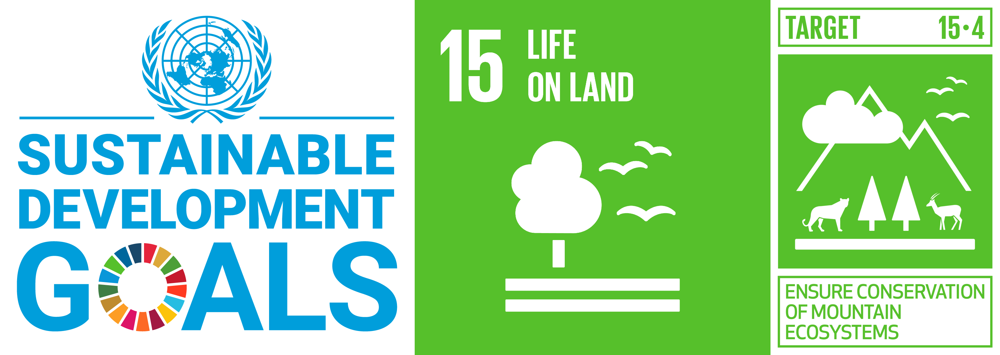

.. line-break::

SDG 15.4.2 Computation Tools Documentation
=========================================

Welcome to the technical documentation of SDG Indicator 15.4.2 to aid the calculation of SDG Indicator 15.4.2: (a) Mountain Green Cover Index and (b) proportion of degraded mountain land using tools developed by FAO and UNEP-WCMC:

Contents
--------

.. toctree::
   :maxdepth: 2

   overview
   defineenvs
   SEPAL<sepal/index>
   qgis_custom_models
   Annexes<annexes/index>
