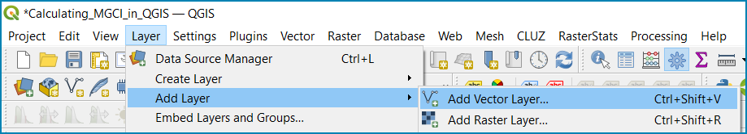
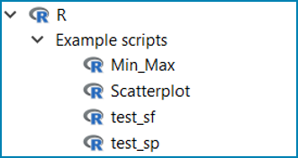
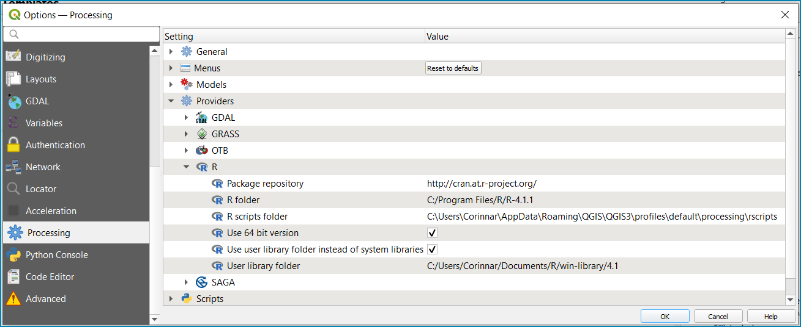

QGIS-MGCI-DML 15.4.2 :sub:`beta`
=================================

A QGIS-based workflow to support the computation of SDG Indicator 15.4.2, which includes:
sub-indicator a (Mountain Green Cover Index) 
and 
sub-indicator b (Proportion of degraded mountain land)

.. contents:: **Table of Contents**

General Information
--------------------

About QGIS-MGCI-DML :sub:`beta`
^^^^^^^^^^^^^^^^^^^^^^^^^^^^^^^

This documentation and geospatial workflow has been developed by the UN Environment Programme World Conservation Monitoring Centre (UNEP-WCMC) in collaboration with the Food and Agriculture Organization (FAO) of the United Nations to support member countries to compute and report against SDG Indicator 15.4.2. 

The geospatial workflow was developed using QGIS 3.22.16, a free and open-source geographic information system licensed under the GNU General Public License. QGIS is an official project of the Open Source Geospatial Foundation (OSGeo). It runs on Linux, Unix, Mac OSX, Windows and Android and supports numerous vector, raster, and database formats and functionalities. We suggest users use the Long-Term Release version [1]_ of QGIS to undertake their analysis as this is most stable versions and users are less likely to incur technical difficulties and bugs. There are various installers depending on your operating system but for most users we recommend the QGIS Standalone Installer. Full instructions are on their website: `https://qgis.org/en/site/forusers/download.html# <https://qgis.org/en/site/forusers/download.html>`__\. To run this workflow, you will also need to have R Software 4.4.1.

The QGIS-MGCI-DML 15.4.2 :sub:`beta` workflow is in a beta stage and therefore it is still under development. Please contact the QGIS-MGCI-DML 15.4.2 :sub:`beta` development team with any comments or suggestions.

If you have specific bugs to report or improvements to the tool that you would like to suggest, please use the `GitHub’s issue tracker
<https://github.com/dfguerrerom/wcmc-mgci/issues>`_ of the QGIS-MGCI-DML 15.4.2 :sub:`beta` module and do follow the `contribution guidelines
<https://github.com/dfguerrerom/wcmc-mgci/blob/master/CONTRIBUTE.md>`_.

Authors 
^^^^^^^

QGIS-MGCI-DML 15.4.2 :sub:`beta` has been developed by the UN Environment Programme World Conservation Monitoring Centre (UNEP-WCMC) in collaboration with the Food and Agriculture Organization (FAO) of the United Nations. Contributors to QGIS-MGCI-DML 15.4.2 :sub:`beta` and its documentation include Corinna Ravilious, Vignesh Kamath Cannanure, Boipelo Tshwene-Mauchaza, Cristina Telhado and Valerie Kapos. 

License
^^^^^^^
The QGIS-MGCI-DML 15.4.2 :sub:`beta` workflow and its documentation is made available under the terms of the `Creative Commons Attribution 4.0 International License (CC BY 4.0) <https://creativecommons.org/licenses/by/4.0/>`_ .

Initial setup
-------------
Before using QGIS-MGCI-DML 15.4.2 :sub:`beta` to run this workflow you will need have QGIS 3.20 or a higher version installed in your computer.

We suggest users use the Long-Term Release version  of QGIS to undertake their analysis as this is most stable versions and users are less likely to incur technical difficulties and bugs.  There are various installers depending on your operating system but for most users we recommend the QGIS Standalone Installer. Full instructions are on their website: https://qgis.org/en/site/forusers/download.html#

Whilst the MGCI-DML analysis runs entirely within the QGIS interface, users
wishing to use QGIS for the MGCI-DML analysis are also required to install R
software. R scripts can be run from within the QGIS interface and no prior 
knowledge of R is required.

and an R script will be only be used for calculating real
surface area during the MGCI-DML calculations. Real surface area can be
calculated using one of the ready to use SAGA tools in the processing
toolbox, however after initial testing we found the results differed
from the GEE and R methods and therefore due to the need for consistency
between calculation methods for this SDG indicator, the best and easiest
method was to integrate the ‘surfaceArea’ function from package ‘sp in R
software.

Once QGIS and R are both correctly installed users will need to install
the following plugins:

1. **Processing R Provider:** This plugin essentially allows R scripts
   to be used directly within the QGIS processing toolbox with the
   simple addition of some QGIS header information placed at the top of
   the script to making the R script behave exactly like other
   processing tools in the QGIS processing toolbox. The header
   information allows graphical fields to be set in the processing
   dialogue window when running the tool e.g. the input raster, a
   specific field or the location and name of an output raster. Some
   header information is used to tell QGIS to either pass information to
   R and from QGIS about the tool to enable the R processing to happen
   within the QGIS interface.

-  From the QGIS Menu Toolbar click on **Plugins>>Manage and Install
   Plugins**

   |image9orig|

-  From the Plugin dialogue window search for **processing R**

   |image10orig|

-  Click **Install Plugin** and then **Close**

Once installed R will appear as a processing tool in the processing
toolbox and an R Scripts button in the Processing Toolbox Menu.

|image12orig|
   
Users may find that the R scripts button is missing at this stage.

-  Click the arrow next to the **R** Tools to expand the R toolset.

The toolset should look similar to the below with a few example scripts.

|image13orig|

and the processing Toolbox Menu should look like this with the missing R scripts button |image14|

|image15orig|

-  From the QGIS main menu click on **settings>>
   options>>processing>>providers**

-  expand **R** to see the R setting

   |image16orig|

If you operating system is 64 bit, tick **Use 64bit version**

-  Check the **R folder** is pointing to the correct location (where it
   is installed on your computer)

-  Click okay

-  Save the QGIS project and re-open to activate the changes.

You should now see that the R script button has appeared on the
processing toolbox menu

|image17orig|

Next add additional resources to the R processing toolbox

-  To add other R resources click on **plugins>>resource
   sharing>>resource sharing**

   |image18orig|

-  Click on **All Collections** on the left hand panel and click **QGIS
   R script collection (QGIS Official Repository)** then click
   **Install**

   |image19orig|

A wider collection of scripts should now be present in the R-scripts
collection. These are not required for MGCI but useful for R-Integration
with QGIS.

**Resource sharing plugin:** This plugin is a useful R related
plugin (which is not essential for the MGCI but useful for users
wishing to integrate R with QGIS).

Once the resource sharing plugin is installed some scripts should
also be visible. They are grouped into several categories as in the
screengrab below.

|image30orig|

For further information see the following sections of the QGIS user
manual at

-  https://docs.qgis.org/3.16/en/docs/user_manual/processing/3rdParty.html#r-scripts

-  https://docs.qgis.org/3.16/en/docs/user\_manual/processing/3rdParty.html#index-5

**Running analysis steps using custom QGIS toolbox**
====================================================

Instructions to calculate Sub-indicator 15.4.2a in QGIS using custom models
---------------------------------------------------------------------------

Instructions to calculate Sub-indicator 15.4.2b in QGIS using custom models
---------------------------------------------------------------------------

.. |image2| image:: media_QGIS/image2.png
   :width: 1200
.. |image3| image:: media_QGIS/image3.png
   :width: 1200
.. |image4| image:: media_QGIS/image4.png
   :width: 1200
.. |image5| image:: media_QGIS/image5.png
   :width: 1200
.. |image6| image:: media_QGIS/image6.png
   :width: 1200
.. |image7| image:: media_QGIS/image7.png
   :width: 1200
.. |image8| image:: media_QGIS/image8.png
   :width: 1200
.. |image9| image:: media_QGIS/image9.png
   :width: 1200
.. |image10| image:: media_QGIS/image10.png
   :width: 1200
.. |image11| image:: media_QGIS/image11.png
   :width: 1200
.. |image12| image:: media_QGIS/image12.png
   :width: 400
.. |image13| image:: media_QGIS/image13.png
   :width: 1200
.. |image14| image:: media_QGIS/image14.png
   :width: 1200
.. |image15| image:: media_QGIS/image15.png
   :width: 1200
.. |image16| image:: media_QGIS/image16.png
   :width: 1200
.. |image17| image:: media_QGIS/image17.png
   :width: 1200
.. |image9| image:: media_QGIS/image9.png
   :width: 1200
.. |image18| image:: media_QGIS/image18.png
   :width: 1200
.. |image19| image:: media_QGIS/image19.png
   :width: 600
.. |image20| image:: media_QGIS/image20.png
   :width: 600
.. |image21| image:: media_QGIS/image21.png
   :width: 1200
.. |image12| image:: media_QGIS/image12.png
   :width: 400
.. |image22| image:: media_QGIS/image22.png
   :width: 1200
.. |image23| image:: media_QGIS/image23.png
   :width: 1200
.. |image24| image:: media_QGIS/image24.png
   :width: 1000
.. |image25| image:: media_QGIS/image25.png
   :width: 1200
.. |image26| image:: media_QGIS/image26.png
   :width: 1200
.. |image27| image:: media_QGIS/image27.png
   :width: 400
.. |image28| image:: media_QGIS/image28.png
   :width: 1200
.. |image29| image:: media_QGIS/image29.png
   :width: 1200
.. |image30| image:: media_QGIS/image30.png
   :width: 600
.. |image31| image:: media_QGIS/image31.png
   :width: 1200
.. |image32| image:: media_QGIS/image32.png
   :width: 1200
.. |image33| image:: media_QGIS/image33.png
    :width: 1200
.. |image34| image:: media_QGIS/image34.png
   :width: 1200
.. |image35| image:: media_QGIS/image35.png
   :width: 1200
.. |image36| image:: media_QGIS/image36.png
   :width: 1200
.. |image37| image:: media_QGIS/image37.png
   :width: 1200
.. |image38| image:: media_QGIS/image38.png
   :width: 1200
.. |image39| image:: media_QGIS/image39.png
   :width: 1200
.. |image40| image:: media_QGIS/image40.png
   :width: 1200
.. |image41| image:: media_QGIS/image41.png
   :width: 1200
.. |image42| image:: media_QGIS/image42.png
   :width: 1200
.. |image43| image:: media_QGIS/image43.png
   :width: 1200
.. |image44| image:: media_QGIS/image44.png
   :width: 1200
.. |image45| image:: media_QGIS/image45.png
   :width: 1200
.. |image46| image:: media_QGIS/image46.png
   :width: 1200
.. |image47| image:: media_QGIS/image47.png
    :width: 600
.. |image48| image:: media_QGIS/image48.png
   :width: 1200
.. |image49| image:: media_QGIS/image49.png
   :width: 1200
.. |image50| image:: media_QGIS/image50.png
   :width: 1200
.. |image51| image:: media_QGIS/image51.png
   :width: 1200
.. |image52| image:: media_QGIS/image52.png
   :width: 400
.. |image53| image:: media_QGIS/image53.png
   :width: 1000
.. |image54| image:: media_QGIS/image54.png
   :width: 1000
.. |image55| image:: media_QGIS/image55.png
   :width: 1200
.. |image56| image:: media_QGIS/image56.png
    :width: 1200
.. |image57| image:: media_QGIS/image57.png
   :width: 400
.. |image58| image:: media_QGIS/image58.png
   :width: 1200
.. |image59| image:: media_QGIS/image59.png
   :width: 1200
.. |image60| image:: media_QGIS/image60.png
   :width: 1000
.. |image61| image:: media_QGIS/image61.png
   :width: 1200
.. |image62| image:: media_QGIS/image62.png
   :width: 1200
.. |image63| image:: media_QGIS/image63.png
   :width: 1200
.. |image64| image:: media_QGIS/image64.png
   :width: 1200
.. |image65| image:: media_QGIS/image65.png
   :width: 1200
.. |image66| image:: media_QGIS/image66.png
   :width: 1200
.. |image67| image:: media_QGIS/image67.png
   :width: 600
.. |image68| image:: media_QGIS/image68.png
   :width: 600
.. |image69| image:: media_QGIS/image69.png
   :width: 1200
.. |image70| image:: media_QGIS/image70.png
   :width: 1200
.. |image71| image:: media_QGIS/image71.png
   :width: 1200
.. |image72| image:: media_QGIS/image72.png
   :width: 1200
.. |image73| image:: media_QGIS/image73.png
   :width: 1200
.. |image74| image:: media_QGIS/image74.png
   :width: 1200
.. |image75| image:: media_QGIS/image75.png
   :width: 1200
.. |image76| image:: media_QGIS/image76.png
   :width: 1200
.. |image77| image:: media_QGIS/image77.png
   :width: 1200
.. |image52| image:: media_QGIS/image52.png
   :width: 600
.. |image78| image:: media_QGIS/image78.png
   :width: 1200
.. |image79| image:: media_QGIS/image79.png
   :width:1200
.. |image80| image:: media_QGIS/image80.png
   :width: 1200
.. |image81| image:: media_QGIS/image81.png
   :width: 1200
.. |image82| image:: media_QGIS/image82.png
   :width: 800
.. |image83| image:: media_QGIS/image83.png
   :width: 1000
.. |image84| image:: media_QGIS/image84.png
   :width: 1200
.. |image85| image:: media_QGIS/image85.png
   :width: 800
.. |image86| image:: media_QGIS/image86.png
   :width: 1200
.. |image87| image:: media_QGIS/image87.png
    :width: 1200
.. |image88| image:: media_QGIS/image88.png
   :width: 1200
.. |image89| image:: media_QGIS/image89.png
   :width: 1200
.. |image90| image:: media_QGIS/image90.png
   :width: 1200
.. |image91| image:: media_QGIS/image91.png
   :width: 1200
.. |image92| image:: media_QGIS/image92.png
   :width: 1200
.. |image93| image:: media_QGIS/image93.png
   :width: 1200
.. |image94| image:: media_QGIS/image94.png
   :width: 1200
.. |image95| image:: media_QGIS/image95.png
   :width: 1200
.. |image96| image:: media_QGIS/image96.png
   :width: 1200
.. |image97| image:: media_QGIS/image97.png
   :width: 1200
.. |image98| image:: media_QGIS/image98.png
    :width: 1200
.. |image99| image:: media_QGIS/image99.png
    :width: 1200
.. |image100| image:: media_QGIS/image100.png
   :width: 1200
.. |image101| image:: media_QGIS/image101.png
   :width: 1200
.. |image102| image:: media_QGIS/image102.png
   :width: 1200

.. |image9orig| image:: media_QGIS/image11_install_plugins.png
   :width: 5.52160in
   :height: 0.94805in
.. |image10orig| image:: media_QGIS/image12_processingRprovider.png
   :width: 6.26806in
   :height: 3.70278in
.. |image12orig| image:: media_QGIS/image14_processingtoolboxR.png
   :width: 4.42653in
   :height: 4.71816in

.. |image15orig| image:: media_QGIS/image17_processingtoolbox.png
   :width: 3.21875in
   :height: 1.13542in

.. |image17orig| image:: media_QGIS/image19_processingtoolboxR2.png
   :width: 2.32263in
   :height: 0.97904in
.. |image18orig| image:: media_QGIS/image20_QGISRscriptcollection1.png
   :width: 6.26806in
   :height: 3.45417in
.. |image19orig| image:: media_QGIS/image21_QGISRscriptcollection2.png
   :width: 5.21948in
   :height: 1.75024in
.. |image30orig| image:: media_QGIS/image32_Rscripts2.png
   :width: 3.37547in
   :height: 4.79234in
