MGCI R workflow
==================

.. contents:: **Table of Contents**

Definition 
----------
Put link to overview document
    
Initial set-up
--------------
put link to initial set up document

Introduction
------------

This section of the tutorial explains in detail how to carry out this analysis in R, using Costa Rica as a case study using a 90m resolution DEM from Copernicus and Global ESA CCI LULC datasets. This section assumes that the user has already downloaded the DEM and a LULC dataset (see section 2 and the Annexes for further information). 

The MGCI module has five main steps, and the index will be calculated based on the user inputs:

-  Area of interest selection

-  Vegetation descriptor

-  Mountain descriptor

-  Real surface area

-  MGCI results

Before starting with the steps to calculate MGCI, install and load the required packages, and set your working folder.

|image0|

Define projection and generate an AOI
-------------------------------------
Add a country or area of interest boundary layer. Input a polygon shapefile representing the boundary of your area of interest.

|image1|

The next step is to define a projection for the country boundary. In this example the boundary layer is in Geographic coordinate system (EPSG 4326).

Costa Rica covers more than one UTM Zone so in this example we will define a custom Lambert Azimuthal Equal Area projection with the central meridian set to **-84** and the latitude of origin to **8.5**.

Costa Rica does have a National Projection (see https://epsg.io/5367) which may be an alternative to the Lambert Azimuthal Equal Area.

Replace the projection in the code below to that of your area of interest:

|image2|

Now that the country boundary is in the chosen equal area projection, we can generate a buffer area of 10km around the country boundary/area of interest. A distance of 10km around the bounding box is added to ensure the AOI is large enough to accommodate the 7km focal range function used in the mountain descriptor layer generation.   

|image3|

Preparation of Vegetation descriptor layer
------------------------------------------

The development of vegetation descriptor layer starts with either a raster or vector landuse landcover (LULC) dataset.

Steps when using a raster dataset
~~~~~~~~~~~~~~~~~~~~~~~~~~~~~~~~~

To demonstrate the steps for processing a raster LULC dataset we will use the Global ESA CCI LULC dataset. Input the LULC layer. If the dataset is in GeoTiff format use the following code:

|image4|

If the dataset is in netCDF (.nc) format, use the following code (ensure that library(ncdf4) has been loaded). Edit the varname to the name of the required layer.

|image5|

First check that the LULC layer is correctly overlaying the country boundary data. If it does not, your country boundary and/or your LULC layer may be lacking projection information or have the wrong projection information. 

|image6|

Project to equal area projection depending on your study area.

|image7|

If LULC raster is a global/regional dataset, it needs to be clipped to the area of interest (skip this step for national datasets)

|image8|

Steps when using a vector LULC dataset
~~~~~~~~~~~~~~~~~~~~~~~~~~~~~~~~~~~~~~

First, input the LULC dataset in vector format. When using a vector LULC dataset the data will also need to be projected to an equal area projection.  If it is not already in equal area projection, project it to equal area projection depending on your study area.

|image9|

The next step is to rasterize the LULC data. When converting it is important to choose an output resolution that is appropriate for the scale of the vector dataset (**see section Defining analysis environments and data selection** for more detail). Once the resolution to convert the vector dataset to has been determined the vector dataset can be converted to Raster. First, create a template raster with the required resolution (needs to be determined), extent and projection (same as input layer) and then convert the vector to raster format with resolution, extent and projection same as that of the template raster.

|image10|

Reclassify to IPCC landcover types
~~~~~~~~~~~~~~~~~~~~~~~~~~~~~~~~~~

The next step is to reclassify the LULC map prepared in the previous steps into the 6 MGCI vegetation descriptor LULC types. 

Reclassify the LULC types from the ESA CII or National landcover dataset to the 6 IPCC landcover classes (**see section Defining analysis environments and data selection** for more detail)

|image11|

Plot the vegetation descriptor layer with the country boundary.

|image28|

|image29|

Preparation of Mountain descriptor
----------------------------------

Users should have read section **Defining analysis environments and data selection** on choice of DEM and selected a DEM for use in the analysis before starting this section as the generation of the mountain descriptor layer requires a DEM as the input source.  

In this tutorial the Copernicus 90m source DEM has been chosen as an example. 

Input the DEM raster.

|image12|

Merging DEM tiles into a single DEM
~~~~~~~~~~~~~~~~~~~~~~~~~~~~~~~~~~~

If you have multiple DEM raster tiles, follow the steps below to merge them. In this example, the DEM tiles covering the full extent of Costa Rica have been download from Copernicus using their AWS client. (Instructions for download of Copernicus data can be found in the **Annexs**). 

|image13|

Clip and project merged DEM
~~~~~~~~~~~~~~~~~~~~~~~~~~~
The DEM tiles are likely to cover a much wider area than the country being analysed therefore it is important to crop the extent to minimise processing time. As indicated in section 2.3.2, the country boundary is not used to clip the dataset directly as the various calculations during the generation of the mountain descriptor layer require neighbouring pixels to be analyses therefore the buffered area of interest generated in section 4.1 should be used. 

Clip the DEM to area of interest after projecting to equal area projection

|image14|

Generating slope layer from DEM layer
~~~~~~~~~~~~~~~~~~~~~~~~~~~~~~~~~~~~~

In, this section, depending on whether your chosen projection already has equidistant properties you will need to reproject the original merged DEM to an  equidistant projection (the one in its native coordinate system not the projected one to minimise introduction of errors from projecting a raster multiple times). This will  reduce errors in slope calculation. An overview of slope calculation methods is provided in the defining environments section.

IF your country falls within a single UTM Zone only AND you have used the UTM projection for the previous steps, or if the projection you are using has equidistant properties, slope can be generated in the same projection as the rest of the analysis, 

|image15|

otherwise please generate a custom equidistant azimuthal projection by changing the **+lat_0 = 8.5** and the **+lon_0 = -84** parameters in the example equidistant azimuthal projection to the central latitude and longitude of your area of interest.

|image16|

Generating local elevation range from DEM
~~~~~~~~~~~~~~~~~~~~~~~~~~~~~~~~~~~~~~~~~

For Kapos classes 5 and 6 a 7km local elevation range is required for the identification of areas that occur in regions with significant relief, even though elevations may not be especially high, and conversely high-elevation areas with little local relief. This local elevation range is generated by defining a 7km radius of interest around each grid cell and calculating the difference between the maximum and minimum values within a neighborhood. 

|image17|

Plot Focal range

|image30|

|image31|

Generating layers for each Kapos mountain class
~~~~~~~~~~~~~~~~~~~~~~~~~~~~~~~~~~~~~~~~~~~~~~~

We now have all the inputs required for generating the mountain classes for the mountain descriptor layer. We will reclassify the DEM raster processed in the previous steps to generate a raster layer for each mountain class. 

class 1: DEM\_aoi\_laea>=4500m

class 2: >=3500 & <4500

class 3: >=2500 & <3500

class 4: >=1500 & <2500 & slope>2

class 5: >=1000 & <1500 & slope>=5 OR >=1000 & <1500 & local elevation
range >=300

class 6: >=300 & <1000 & local elevation range >=300

|image18|

Generate an interim mountain layer with classes
~~~~~~~~~~~~~~~~~~~~~~~~~~~~~~~~~~~~~~~~~~~~~~~

The next step is to create a mosaic of all the classes into a single raster where class 1 has a value of 1, class2 a value of 2, etc. 

|image19|

Plot the mountain descriptor layer

|image32|

|image33|

Generation of Real Surface Area raster
~~~~~~~~~~~~~~~~~~~~~~~~~~~~~~~~~~~~~~

The final layer that needs generating is the Real Surface Area raster from the DEM. The following code generates the real surface area raster from the DEM. The steps are explained below.

|image20|

**Step 1: prepare your DEM raster for the calculation**

Part a uses function ‘trim’ to exclude all boundaries cells with no value (NA) from DEM raster. Part b removes one row and one column from the top, bottom, left, and right from the original raster (cropping the raster to the boundaries of the area of interest).

**Step 2: Convert DEM raster to matrix**

This step uses the function ‘as.matrix’ to convert the DEM raster into a matrix with the same number of columns and rows of your DEM raster. There are instructions within the R script to check if that is true.

**Step 3: Get coordinate information from DEM raster and assigns it to new object called m1**

This step uses the function ‘rasterToPoints’ to create a numeric object of type double from the cropped raster. The resulting object has 3 columns: x, y and layer. Columns ‘x’ and ‘y’ have the coordinates of each cell. Column ‘layer’ has the elevation value of each cell.

It uses function ‘as.vector’ assigned to each of one of the two coordinates columns to create numeric lists with the coordinates of the cells.

**Step 4: Calculate the real surface area of each grid cell within the DEM**

This step uses the ‘surfaceArea’ function from package ‘sp’. Information about this function can be found on page 105 of the package ‘sp’ documentation (https://cran.r-project.org/web/packages/sp/sp.pdf) and on GitHub (`*https://github.com/cran/sp/blob/master/src/surfaceArea.c* <https://github.com/cran/sp/blob/master/src/surfaceArea.c>`__).
This function will calculate the real surface area of each grid cell of the DEM, based on the matrix ‘m’ created on step 1 and the cell size inserted on ‘SECTION A.4’. The resulting object ‘rsa’ is a matrix with the same number of columns and rows as the matrix ‘m’ and, hence, of the DEM, but with the estimated values of the real surface area for all cells within the DEM.

It crops the resulting matrix ‘rsa’ to create a matrix with just the columns and rows of the area of interest.

**Step 5: Combine matrix with real surface area values and object with coordinate information**

This step uses the function ‘as.vector’ assigned to the transposed matrix ‘rsa’.

It uses the function ‘data.frame’ to create a new table ‘m3’ with three columns: two for coordinates ‘col.X’ and ‘col.Y’, and one with the real surface area values ‘m2’.

**Step 6: Convert matrix back to a raster with the original projection**

This step renames the columns of the new table ‘m3’ to ‘x’, ‘y’, and ‘real\_surface\_area’

It uses the function ‘rasterFromXYZ’ to convert the table ‘m3’ to a raster.

It adopts the projection of the original DEM raster ‘r’ on the newly created raster ‘r2’ (that has the real surface area of each pixel).

**Step 7: Sum the real surface area of all pixels within the study area**

This last step uses the cellStats function to sum values of all cells within the created raster ‘r2’.

Mountain Green Cover Index Calculation
--------------------------------------

Aggregating mountain and RSA layers to resolution of vegetation descriptor
~~~~~~~~~~~~~~~~~~~~~~~~~~~~~~~~~~~~~~~~~~~~~~~~~~~~~~~~~~~~~~~~~~~~~~~~~~

Now that we have 3 raster datasets in their native resolutions we need to bring the datasets together and ensure that correct aggregation is undertaken and that all the layers align to the Vegetation Descriptor layer. In this example we have the Mountain Descriptor layer and the RealSurfaceArea Rasters at 90m resolution but a Vegetation Descriptor layer at 300m resolution. 

Aggregate the real surface area using the sum aggregation and then resample it to the resolution of the vegetation layer (if the resolution of the vegetation descriptor layer is coarser).

|image21|

Next, compare the resolutions of the vegetation and mountain descriptor layers and aggregate & resample the finer resolution raster to that of the coarser resolution one.

|image22|

Combining vegetation and mountain classes into single layer
~~~~~~~~~~~~~~~~~~~~~~~~~~~~~~~~~~~~~~~~~~~~~~~~~~~~~~~~~~~

As the MGCI required disaggregation by both the 6 LULC class and the 6 Mountain Class, we will combine the two datasets together to form a combined zones dataset to calculate zonal statistics. We will sum the two dataset together but in order to distinguish the vegetation class from the mountain class, all the vegetation values will be multiplied by 10. This means for example a value of 35 in the output means the pixel has class 3 in the vegetation descriptor layer and class 5 in the Mountain descriptor layer.

|image23|

Clip layers to country boundary
~~~~~~~~~~~~~~~~~~~~~~~~~~~~~~~

At this stage we can now clip the final aggregated datasets to the country boundary (remember that up to this point we have used a bounding box of the country boundary buffered out by 10km).

|image24|

Generate Zonal statistics
~~~~~~~~~~~~~~~~~~~~~~~~~

The data are now in a consistent format and clipped to the country boundary, so we can now generate the statistics required for the MGCI reporting. As we want to generate disaggregated statistics by LULC class and Mountain Class we will use a zonal statistics tool with the combined Vegetation + mountain layer as the summary unit and the RSA raster as the summary layer.

|image25|

We will also calculate the planimetric area. For this, we will create a raster template similar to the combined Vegetation + mountain layer and we will assign the area of each cell as the cell value and use the zonal statistics tool with the template raster as the summary unit and the combined Vegetation + mountain layer raster as the summary layer.

|image26|

We can now generate a summary table containing real surface area and planimetric area calculations for LULC classes with each Kapos mountain class.

|image27|

Outputing and formattting to Standard MGCI reporting tables
~~~~~~~~~~~~~~~~~~~~~~~~~~~~~~~~~~~~~~~~~~~~~~~~~~~~~~~~~~~~

    To be added shortly

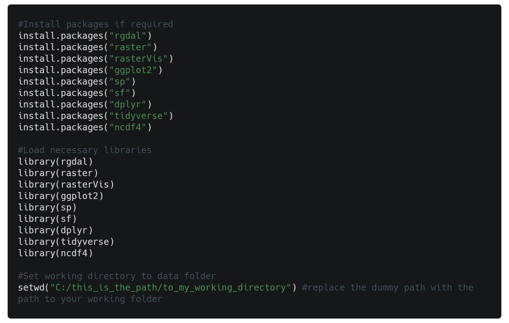

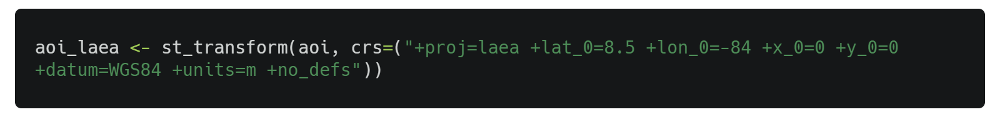

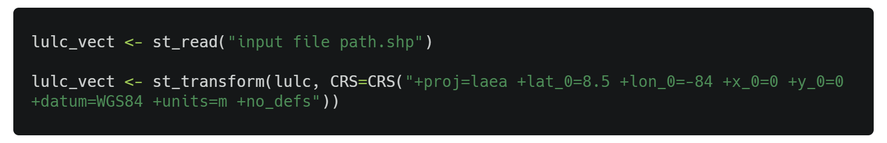
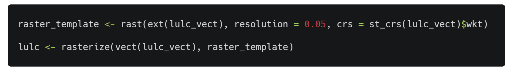
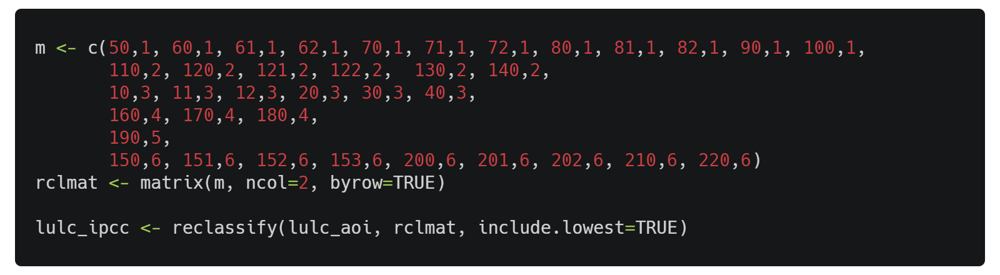

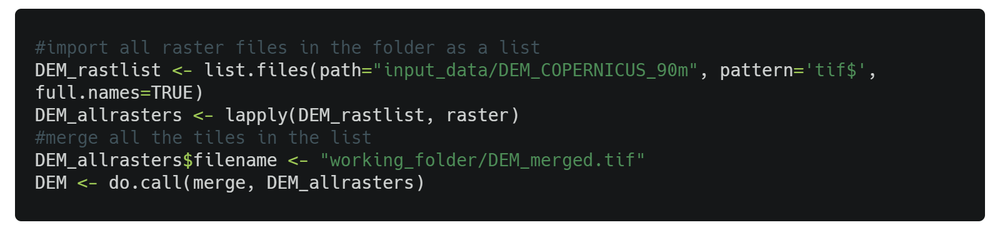
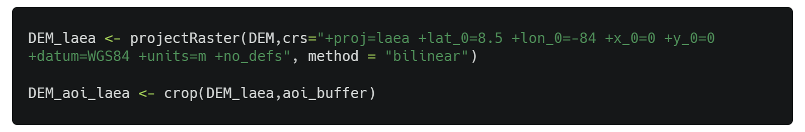

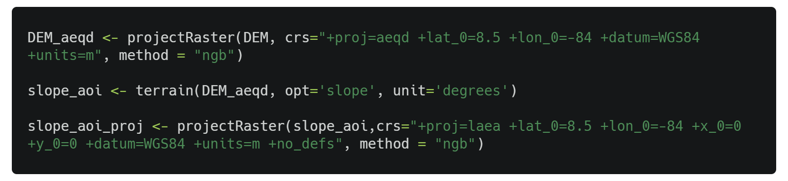
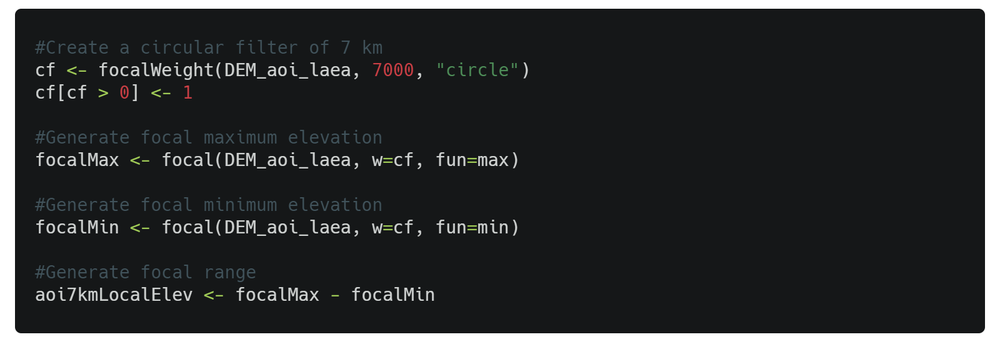
.. |image18| image:: media_R/image19.png
   :width: 6.26806in
   :height: 4.12153in

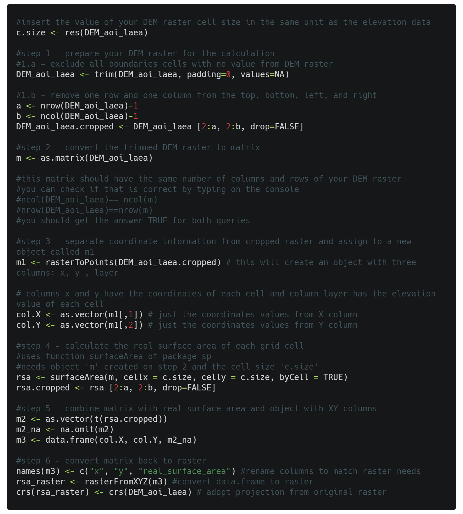
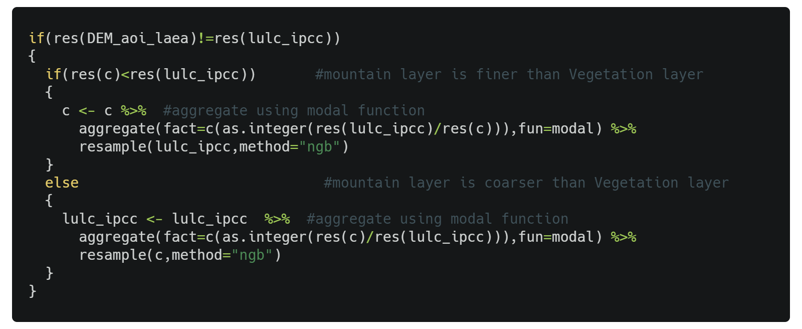

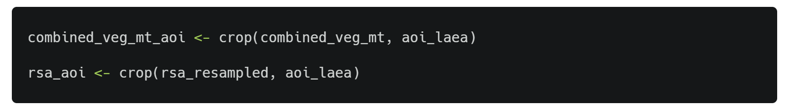

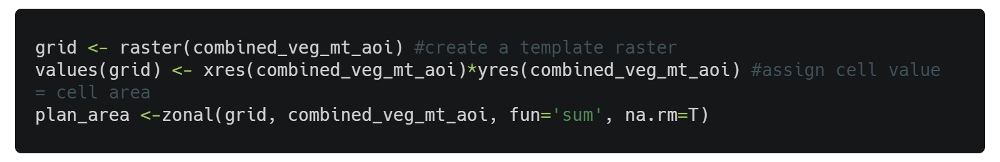
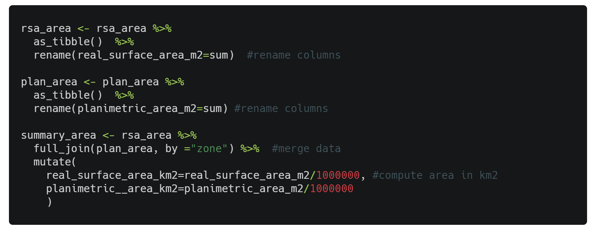

.. |image29| image:: media_R/image30.png
   :width: 6.26806in
   :height: 2.42917in

.. |image31| image:: media_R/image32.png
   :width: 6.26806in
   :height: 2.42917in

.. |image33| image:: media_R/image34.png
   :width: 6.26806in
   :height: 2.42917in
