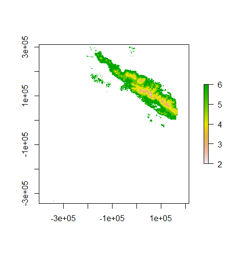
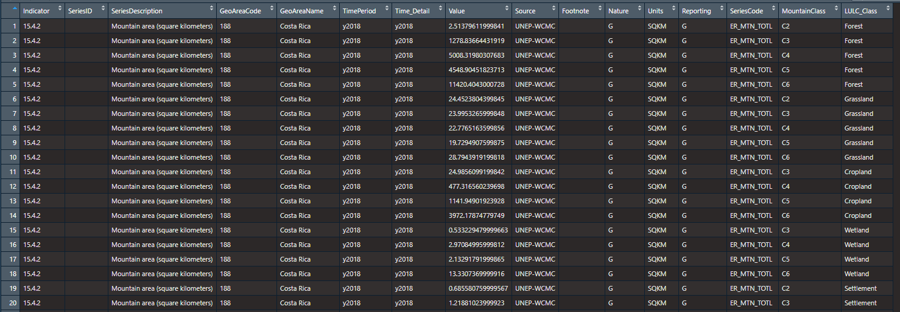
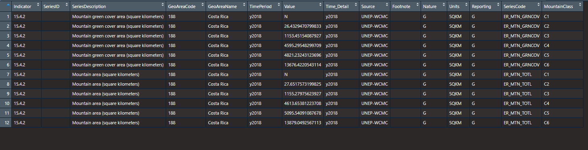
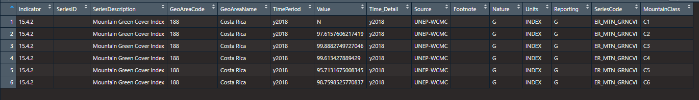
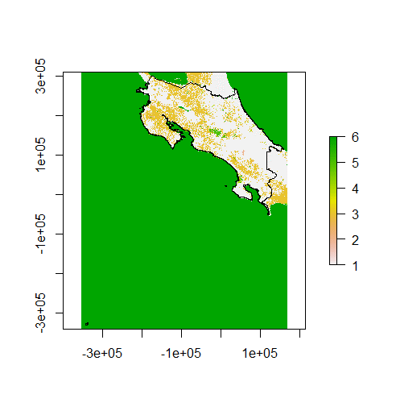
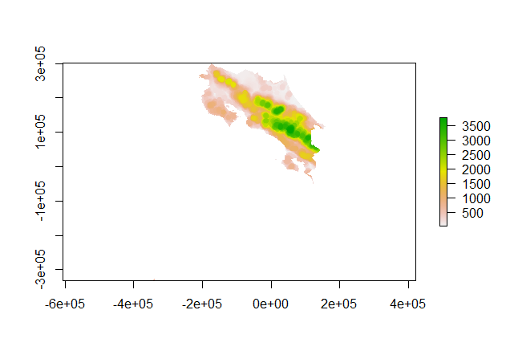

R-MGCI :sub:`beta`
==================

A R-Software-based tool to support the computation of SDG Indicator 15.4.2 – Mountain Green Cover Index.

General Information
-------------------

About R-MGCI :sub:`beta`
^^^^^^^^^^^^^^^^^^^^^^^^

This tool was developed by the UN Environment Programme World Conservation Monitoring Centre (UNEP-WCMC) in collaboration with the Food and Agriculture Organization (FAO) of the United Nations to support member countries to compute and report against SDG Indicator 15.4.2.

This script has been developed to be run on R 4.1.1 and RStudio 2021.09.0+351 "Ghost Orchid" release. If you are using older versions, it may be good to update them. `R <https://www.r-project.org/>`_ is available as Free Software under the terms of the Free Software Foundation’s GNU General Public License in source code form. It compiles and runs on a wide variety of UNIX platforms and similar systems (including FreeBSD and Linux), Windows and MacOS.

R-MGCI :sub:`beta` is in a beta stage and therefore it is still under development. Please contact the R-MGCI :sub:`beta` development team with any comments or suggestions.

If you have specific bugs to report or improvements to the tool that you would like to suggest, please use the `GitHub’s issue tracker
<https://github.com/dfguerrerom/wcmc-mgci/issues>`_ of the SEPAL-MGCI :sub:`beta` module and do follow the `contribution guidelines
<https://github.com/dfguerrerom/wcmc-mgci/blob/master/CONTRIBUTE.md>`_.

Authors 
^^^^^^^

R-MGCI :sub:`beta` has been developed by the UN Environment Programme World Conservation Monitoring Centre (UNEP-WCMC) in collaboration with the Food and Agriculture Organization (FAO) of the United Nations. Contributors to R-MGCI :sub:`beta` and its documentation include Vignesh Kamath Cannanure, Corinna Ravilious, Boipelo Tshwene-Mauchaza, Cristina Telhado and Valerie Kapos.

License
^^^^^^^
R-MGCI :sub:`beta` and its documentation is made available under the terms of the `Creative Commons Attribution 4.0 International License (CC BY 4.0) <https://creativecommons.org/licenses/by/4.0/>`_.

Background
^^^^^^^^^^

SDG Indicator 15.4.2 – Mountain Green Cover Index (MGCI) is one of the two indicators under SDG Target 15.4, which aims to:

"*ensure the conservation of mountain ecosystems, including their biodiversity, to enhance their capacity to provide benefits which are essential for sustainable development*". 

The Food and Agriculture Organization (FAO) of the United Nations is the custodian agency of this indicator. The Mountain Green Cover Index (MGCI) is designed to measure the extent and the changes of green vegetation in mountain areas to monitor progress towards SDG Target 15.4.

The MGCI is defined as the ratio of the mountain green cover area to the total mountain area:

.. math::
   
   MGCI = (Mountain Green Cover Area)/(Total Mountain Area)

Where: 

- **Mountain Green Cover Area**: sum of mountain area (km :sup:`2`) covered by cropland, grassland, forestland, shrubland and wetland, as defined based on the IPCC classification (Penman et al. 2003). This component is calculated from the vegetation descriptor layer. 
- **Total Mountain Area**: total area (Km2) of mountains. In both the numerator and denominator, mountain area is defined according to Kapos et al. 2000. This component is calculated from the mountain description layer.
- **Vegetation descriptor layer**: The vegetation descriptor layer categorizes land cover into green and non-green areas. Green vegetation includes both natural vegetation and vegetation resulting from anthropic activity (e.g. crops, afforestation, etc.). Non-green areas include very sparsely vegetated areas, bare land, water, permanent ice/snow and urban areas. The vegetation description layer is derived from a land cover map, where land cover categories are classified into IPCC categories and then in green/non-green areas. 
- **Mountain descriptor layer**:  The mountain descriptor layer consists in a map of mountain classes following the UNEP-WCMC classification (Kapos et al. 2000). The UNEP-WCMC classification classifies the world mountain areas according altitude, slope and elevation range into the following categories.

  .. _mountain_classes:

  .. csv-table:: Mountain classes
    :header: "UNEP-WCMC Mountain Class", "Description"
    :widths: auto
    :align: center
  
    "1","Elevation > 4.500 meters"
    "2","Elevation 3.500–4.500 meters"
    "3","Elevation 2.500–3.500 meters"
    "4","Elevation 1.500–2.500 meters and slope >= 2"
    "5","Elevation 1.000–1.500 meters and slope >= 5 or local elevation range (LER 7 kilometer radius) > 300 meters"
    "6","Elevation 300–1.000 meters and local elevation range (7 kilometer radius) > 300 meters"

R-MGCI :sub:`beta` allows the user to compute each of these description layers to then calculate MGCI values for any given area. The results of this analysis can be exported to a set of standardized reporting tables where MGCI values are disaggregated by mountain class and IPCC land category, as specified in the metadata of SDG Indicator 15.4.2.

References
^^^^^^^^^^

- Kapos, V., Rhind, J., Edwards, M., Prince, M., & Ravilious, C. (2000). Developing a map of the world’s mountain forests. In M. F. Price , & N. Butt (Eds.),?Forests in Sustainable Mountain Development: A State-of-Knowledge Report for 2000?(pp. 4-9). Wallingford: CAB International.? 
- Penman, J., Gytarsky, M., Hiraishi, T., Krug, T., Kruger, D., Pipatti, R., Buendia, L., Miwa, K., Ngara, T., Tanabe, K. (2003). Good Practice Guidance for Land Use, Land-use Change and Forestry. Good Practice Guidance for Land Use, Land-use Change and Forestry. 

Before using R-MGCI :sub:`beta`
-------------------------------

To run the this script you will need to have R 4.1.1 and RStudio 2021.09.0+351 "Ghost Orchid" installed. 

.. contents:: **Table of Contents**

Introduction
------------

This tutorial explains in detail how to run the R-MGCI :sub:`beta` step-by-step using Costa Rica as an example. It uses the 90m resolution Digital ELevation Model (DEM) from Copernicus `(COP-DEM_GLO-90) <https://spacedata.copernicus.eu/web/cscda/dataset-details?articleId=394198>`_ to create the mountain descriptor layer and land cover datasets from the  `European Space Agency (ESA) Climate Change Initiative (CCI) land cover datasets <https://maps.elie.ucl.ac.be/CCI/viewer/>`_ to create the vegetation descriptor layer. If using QGIS-MGCI for official purposes, it is recommended that users use nationally appropriate data sources if available. 

The MGCI module has five main steps, and the index will be calculated based on the user inputs:

-  Area of interest selection
-  Vegetation descriptor
-  Mountain descriptor
-  Real surface area
-  MGCI results

Before starting with the steps to calculate MGCI, install and load the required packages, and set your working folder.
This is outlined in the code below.

.. code-block:: s

   #Install packages if required
   install.packages("raster") 
   install.packages("sp")
   install.packages("sf")
   install.packages("tidyverse")
   install.packages("ncdf4")

   #Load necessary libraries
   library(raster)
   library(sp)
   library(sf)
   library(tidyverse)
   library(ncdf4)

   #Set working directory to data folder
   setwd("C:/this_is_the_path/to_my_working_directory") #replace the dummy path with the path to your working folder

Define projection and generate an AOI
-------------------------------------
Add a country or area of interest boundary layer. Input a polygon shapefile representing the boundary of your area of interest.

.. code-block:: s

   aoi <- st_read("C:/this_is_the_path/to_my_boundary_layer.shp")

The next step is to define a projection for the country boundary. In this example the boundary layer is in Geographic coordinate system (EPSG 4326).

Costa Rica covers more than one UTM Zone so in this example we will define a custom Lambert Azimuthal Equal Area projection with the central meridian set to **-84** and the latitude of origin to **8.5**.

Costa Rica does have a National Projection (see https://epsg.io/5367) which may be an alternative to the Lambert Azimuthal Equal Area.

Replace the projection in the code below to that of your area of interest:

.. code-block:: s

   aoi_laea <- st_transform(aoi, crs=("+proj=laea +lat_0=8.5 +lon_0=-84 +x_0=0 +y_0=0 +datum=WGS84 +units=m +no_defs"))

Now that the country boundary is in the chosen equal area projection, we can generate a buffer area of 10km around the country boundary/area of interest. A distance of 10km around the bounding box is added to ensure the AOI is large enough to accommodate the 7km focal range function used in the mountain descriptor layer generation.   

.. code-block:: s

   aoi_buffer <- st_buffer(aoi_laea, 10000)

Preparation of Vegetation descriptor layer
------------------------------------------

The development of vegetation descriptor layer starts with either a raster or vector landuse landcover (LULC) dataset.

Steps when using a raster dataset
^^^^^^^^^^^^^^^^^^^^^^^^^^^^^^^^^

To demonstrate the steps for processing a raster LULC dataset we will use the Global ESA CCI LULC dataset. Input the LULC layer. If the dataset is in GeoTiff format use the following code:

.. code-block:: s

   lulc <- raster("C:/this_is_the_path/to_my_LULC_file.tif")

If the dataset is in netCDF (.nc) format, use the following code (ensure that library(ncdf4) has been loaded). Edit the varname to the name of the required layer.

.. code-block:: s

   lulc <- raster("C:/this_is_the_path/to_my_LULC_file.nc", varname="lccs_class")

First check that the LULC layer is correctly overlaying the country boundary data. If it does not, your country boundary and/or your LULC layer may be lacking projection information or have the wrong projection information. 

.. code-block:: s

   plot(lulc)
   plot(aoi_laea, add=T, col=NA)

Project to equal area projection depending on your study area.

.. code-block:: s

   lulc <- projectRaster(lulc, crs="+proj=laea +lat_0=8.5 +lon_0=-84 +x_0=0 +y_0=0 +datum=WGS84 +units=m +no_defs", method = "ngb");

If LULC raster is a global/regional dataset, it needs to be clipped to the area of interest (skip this step for national datasets)

.. code-block:: s

   lulc_aoi <- crop(lulc,aoi_buffer);

Steps when using a vector LULC dataset
^^^^^^^^^^^^^^^^^^^^^^^^^^^^^^^^^^^^^^

First, input the LULC dataset in vector format. When using a vector LULC dataset the data will also need to be projected to an equal area projection.  If it is not already in equal area projection, project it to equal area projection depending on your study area.

.. code-block:: s

   lulc_vect <- st_read("C:/this_is_the_path/to_my_LULC_layer.shp");
   lulc_vect <- st_transform(lulc, CRS=CRS("+proj=laea +lat_0=8.5 +lon_0=-84 +x_0=0 +y_0=0 +datum=WGS84 +units=m +no_defs"));

The next step is to rasterize the LULC data. When converting it is important to choose an output resolution that is appropriate for the scale of the vector dataset (**see section Defining analysis environments and data selection** for more detail). Once the resolution to convert the vector dataset to has been determined the vector dataset can be converted to Raster. First, create a template raster with the required resolution (needs to be determined), extent and projection (same as input layer) and then convert the vector to raster format with resolution, extent and projection same as that of the template raster.

.. code-block:: s

   raster_template <- rast(ext(lulc_vect), resolution = 0.05, crs = st_crs(lulc_vect)$wkt)
   lulc <- rasterize(vect(lulc_vect), raster_template);

Reclassify to IPCC landcover types
^^^^^^^^^^^^^^^^^^^^^^^^^^^^^^^^^^

The next step is to reclassify the LULC map prepared in the previous steps into the 6 MGCI vegetation descriptor LULC types. 

Reclassify the LULC types from the ESA CII or National landcover dataset to the 6 IPCC landcover classes (**see section Defining analysis environments and data selection** for more detail)

.. code-block:: s

   m <- c(50,1, 60,1, 61,1, 62,1, 70,1, 71,1, 72,1, 80,1, 81,1, 82,1, 90,1, 100,1,
   110,2, 120,2, 121,2, 122,2,  130,2, 140,2, 
   10,3, 11,3, 12,3, 20,3, 30,3, 40,3,
   160,4, 170,4, 180,4, 
   190,5,
   150,6, 151,6, 152,6, 153,6, 200,6, 201,6, 202,6, 210,6, 220,6)
   rclmat <- matrix(m, ncol=2, byrow=TRUE)
   lulc_ipcc <- reclassify(lulc_aoi, rclmat, include.lowest=TRUE);

Plot the vegetation descriptor layer with the country boundary.

.. code-block:: s

   plot(lulc_ipcc)
   plot(aoi_laea, add=T, col=NA);

|image30|

Preparation of Mountain descriptor
----------------------------------

Users should have read section **Defining analysis environments and data selection** on choice of DEM and selected a DEM for use in the analysis before starting this section as the generation of the mountain descriptor layer requires a DEM as the input source.  

In this tutorial the Copernicus 90m source DEM has been chosen as an example. 

Input the DEM raster.

.. code-block:: s

   DEM <- raster("C:/this_is_the_path/to_my_DEM_layer.tif");

Merging DEM tiles into a single DEM
^^^^^^^^^^^^^^^^^^^^^^^^^^^^^^^^^^^

If you have multiple DEM raster tiles, follow the steps below to merge them. In this example, the DEM tiles covering the full extent of Costa Rica have been download from Copernicus using their AWS client. (Instructions for download of Copernicus data can be found in the **Annexs**). 

.. code-block:: s

   #import all raster files in the folder as a list
   DEM_rastlist <- list.files(path="C:/this_is_the_path/to_my_DEM_folder", pattern='tif$', full.names=TRUE)
   DEM_allrasters <- lapply(DEM_rastlist, raster)
   #merge all the tiles in the list
   DEM_allrasters$filename <- "working_folder/DEM_merged.tif" 
   DEM <- do.call(merge, DEM_allrasters);

Clip and project merged DEM
^^^^^^^^^^^^^^^^^^^^^^^^^^^
The DEM tiles are likely to cover a much wider area than the country being analysed therefore it is important to crop the extent to minimise processing time. As indicated in section 2.3.2, the country boundary is not used to clip the dataset directly as the various calculations during the generation of the mountain descriptor layer require neighbouring pixels to be analyses therefore the buffered area of interest generated in section 4.1 should be used. 

Clip the DEM to area of interest after projecting to equal area projection

.. code-block:: s

   DEM_laea <- projectRaster(DEM,crs="+proj=laea +lat_0=8.5 +lon_0=-84 +x_0=0 +y_0=0 +datum=WGS84 +units=m +no_defs", method = "bilinear")
   DEM_aoi_laea <- crop(DEM_laea,aoi_buffer);

Generating slope layer from DEM layer
^^^^^^^^^^^^^^^^^^^^^^^^^^^^^^^^^^^^^

In this section, depending on whether your chosen projection already has equidistant properties, you will need to reproject the original merged DEM to an  equidistant projection (the one in its native coordinate system not the projected one to minimise introduction of errors from projecting a raster multiple times). This will  reduce errors in slope calculation. An overview of slope calculation methods is provided in the defining environments section.

IF your country falls within a single UTM Zone only AND you have used the UTM projection for the previous steps, or if the projection you are using has equidistant properties, slope can be generated in the same projection as the rest of the analysis, 

.. code-block:: s

   slope_aoi <- terrain(DEM_aoi_laea, opt='slope', unit='degrees');

otherwise please generate a custom equidistant azimuthal projection by changing the **+lat_0 = 8.5** and the **+lon_0 = -84** parameters in the example equidistant azimuthal projection to the central latitude and longitude of your area of interest.

.. code-block:: s

   #Project to Azimuthal equal area projection
   DEM_aeqd <- projectRaster(DEM, crs="+proj=aeqd +lat_0=8.5 +lon_0=-84 +datum=WGS84 +units=m", method = "bilinear")
   #Compute slope
   slope <- terrain(DEM_aeqd, opt='slope', unit='degrees')
   #Project to Lambert equal area projection, crop to the study area and resample
   slope_aoi <- slope %>% 
   projectRaster(crs="+proj=laea +lat_0=8.5 +lon_0=-84 +x_0=0 +y_0=0 +datum=WGS84 +units=m +no_defs", method = "bilinear") %>%
   crop(aoi_buffer) %>%
   resample(DEM_aoi_laea,method="bilinear");

Generating local elevation range from DEM
^^^^^^^^^^^^^^^^^^^^^^^^^^^^^^^^^^^^^^^^^

For Kapos classes 5 and 6 a 7km local elevation range is required for the identification of areas that occur in regions with significant relief, even though elevations may not be especially high, and conversely high-elevation areas with little local relief. This local elevation range is generated by defining a 7km radius of interest around each grid cell and calculating the difference between the maximum and minimum values within a neighborhood. 

.. code-block:: s

   #Create a circular filter of 7 km
   cf <- focalWeight(DEM_aoi_laea, 7000, "circle")
   cf[cf > 0] <- 1
   
   #Generate focal maximum elevation
   focalMax <- focal(DEM_aoi_laea, w=cf, fun=max)  
   
   #Generate focal minimum elevation
   focalMin <- focal(DEM_aoi_laea, w=cf, fun=min)  
   
   #Generate focal range
   aoi7kmLocalElev <- focalMax - focalMin;   

Plot Focal range

|image32|

.. code-block:: s

   plot(aoi7kmLocalElev);

Generating layers for each Kapos mountain class
^^^^^^^^^^^^^^^^^^^^^^^^^^^^^^^^^^^^^^^^^^^^^^^

We now have all the inputs required for generating the mountain classes for the mountain descriptor layer. We will reclassify the DEM raster processed in the previous steps to generate a raster layer for each mountain class. 

.. csv-table:: Mountain classes
   :header: "Class", "Condition"
   :widths: auto
   :align: center

   "1","DEM\_aoi\_laea > 4.500"
   "2",">= 3.500–4.500"
   "3",">= 2.500–3.500"
   "4",">= 1.500–2.500 and slope > 2"
   "5",">=1.000 & <1.500 & slope>=5 OR >=1.000 & <1.500 & local elevation range >300"
   "6",">=300 & <1.000 & local elevation range >300"

.. code-block:: s

   #class 1: DEM_aoi_laea>=4500m, class 2: >=3500 & <4500, class 3: >=2500 & <3500, assign NA to remaining values 
   c123 <- reclassify(DEM_aoi_laea, c(4500,Inf,1, 3500,4499.999,2, 2500,3499.999,3, -Inf,2500,NA), include.lowest=TRUE)
   
   #class 4: >=1500 & <2500 & slope>=2
   c4 <- DEM_aoi_laea>=1500 & DEM_aoi_laea<2500 & slope_aoi>=2
   
   #assign value 4
   m <- c(1,4, 0,NA)
   rclmat <- matrix(m, ncol=2, byrow=TRUE)
   c4 <- reclassify(c4, rclmat, include.lowest=TRUE)
   
   #class 5: >=1000 & <1500 & slope>=5 OR >=1000 & <1500 & local elevation range >300
   c5 <- (DEM_aoi_laea>=1000 & DEM_aoi_laea<1500 & slope_aoi>=5) | (DEM_aoi_laea>=1000 & DEM_aoi_laea<1500 & aoi7kmLocalElev>300)
   #assign value 5
   m <- c(1,5, 0,NA)
   rclmat <- matrix(m, ncol=2, byrow=TRUE)
   c5 <- reclassify(c5, rclmat, include.lowest=TRUE)
   
   #class 6: >300 & <1000 & local elevation range >300
   c6 <- DEM_aoi_laea>300 & DEM_aoi_laea<1000 & aoi7kmLocalElev>300
   #assign value 6
   m <- c(1,6, 0,NA)
   rclmat <- matrix(m, ncol=2, byrow=TRUE)
   c6 <- reclassify(c6, rclmat, include.lowest=TRUE);

Generate an interim mountain layer with classes
^^^^^^^^^^^^^^^^^^^^^^^^^^^^^^^^^^^^^^^^^^^^^^^

The next step is to create a mosaic of all the classes into a single raster where class 1 has a value of 1, class2 a value of 2, etc. 

.. code-block:: s

   c <- mosaic(c123, c4, c5, c6, fun=max);

Plot the mountain descriptor layer

|image34|

.. code-block:: s

   plot(c);

|image33|

Generation of Real Surface Area raster
^^^^^^^^^^^^^^^^^^^^^^^^^^^^^^^^^^^^^^

The final layer that needs generating is the Real Surface Area raster from the DEM. The following code generates the real surface area raster from the DEM. The steps are explained below.

.. code-block:: s

   #insert the value of your DEM raster cell size in the same unit as the elevation data
   c.size <- res(DEM_aoi_laea);

**Step 1: prepare your DEM raster for the calculation**

Part a uses function ‘trim’ to exclude all boundaries cells with no value (NA) from DEM raster. Part b removes one row and one column from the top, bottom, left, and right from the original raster (cropping the raster to the boundaries of the area of interest).

.. code-block:: s

   #1.a - exclude all boundaries cells with no value from DEM raster
   DEM_aoi_laea <- trim(DEM_aoi_laea, padding=0, values=NA)
   #1.b - remove one row and one column from the top, bottom, left, and right
   a <- nrow(DEM_aoi_laea)-1
   b <- ncol(DEM_aoi_laea)-1
   DEM_aoi_laea.cropped <- DEM_aoi_laea [2:a, 2:b, drop=FALSE];

**Step 2: Convert DEM raster to matrix**

This step uses the function ‘as.matrix’ to convert the DEM raster into a matrix with the same number of columns and rows of your DEM raster. There are instructions within the R script to check if that is true.

.. code-block:: s

   #step 2 - convert the trimmed DEM raster to matrix
   m <- as.matrix(DEM_aoi_laea)
   #this matrix should have the same number of columns and rows of your DEM raster
   #you can check if that is correct by typing on the console 
   #ncol(DEM_aoi_laea)== ncol(m)
   #nrow(DEM_aoi_laea)==nrow(m)
   #you should get the answer TRUE for both queries;

**Step 3: Get coordinate information from DEM raster and assigns it to new object called m1**

This step uses the function ‘rasterToPoints’ to create a numeric object of type double from the cropped raster. The resulting object has 3 columns: x, y and layer. Columns ‘x’ and ‘y’ have the coordinates of each cell. Column ‘layer’ has the elevation value of each cell.

It uses function ‘as.vector’ assigned to each of one of the two coordinates columns to create numeric lists with the coordinates of the cells.

.. code-block:: s

   #step 3 - separate coordinate information from cropped raster and assign to a new object called m1
   m1 <- rasterToPoints(DEM_aoi_laea.cropped) # this will create an object with three columns: x, y , layer
   # columns x and y have the coordinates of each cell and column layer has the elevation value of each cell
   col.X <- as.vector(m1[,1]) # just the coordinates values from X column 
   col.Y <- as.vector(m1[,2]) # just the coordinates values from Y column
   
**Step 4: Calculate the real surface area of each grid cell within the DEM**

This step uses the ‘surfaceArea’ function from package ‘sp’. Information about this function can be found on page 105 of the package ‘sp’ documentation (https://cran.r-project.org/web/packages/sp/sp.pdf) and on GitHub (`*https://github.com/cran/sp/blob/master/src/surfaceArea.c* <https://github.com/cran/sp/blob/master/src/surfaceArea.c>`__).
This function will calculate the real surface area of each grid cell of the DEM, based on the matrix ‘m’ created on step 1 and the cell size inserted on ‘SECTION A.4’. The resulting object ‘rsa’ is a matrix with the same number of columns and rows as the matrix ‘m’ and, hence, of the DEM, but with the estimated values of the real surface area for all cells within the DEM.

It crops the resulting matrix ‘rsa’ to create a matrix with just the columns and rows of the area of interest.

.. code-block:: s

   #step 4 - calculate the real surface area of each grid cell  
   #uses function surfaceArea of package sp
   #needs object 'm' created on step 2 and the cell size 'c.size'
   rsa <- surfaceArea(m, cellx = c.size, celly = c.size, byCell = TRUE) 
   rsa.cropped <- rsa [2:a, 2:b, drop=FALSE]

**Step 5: Combine matrix with real surface area values and object with coordinate information**

This step uses the function ‘as.vector’ assigned to the transposed matrix ‘rsa’.
It uses the function ‘data.frame’ to create a new table ‘m3’ with three columns: two for coordinates ‘col.X’ and ‘col.Y’, and one with the real surface area values ‘m2’.

.. code-block:: s

  #step 5 - combine matrix with real surface area and object with XY columns
  m2 <- as.vector(t(rsa.cropped))
  m2_na <- na.omit(m2)
  m3 <- data.frame(col.X, col.Y, m2_na)

**Step 6: Convert matrix back to a raster with the original projection**

This step renames the columns of the new table ‘m3’ to ‘x’, ‘y’, and ‘real\_surface\_area’
It uses the function ‘rasterFromXYZ’ to convert the table ‘m3’ to a raster.
It adopts the projection of the original DEM raster ‘r’ on the newly created raster ‘r2’ (that has the real surface area of each pixel).

.. code-block:: s

   #step 6 - convert matrix back to raster
   names(m3) <- c("x", "y", "real_surface_area") #rename columns to match raster needs
   rsa_raster <- rasterFromXYZ(m3) #convert data.frame to raster
   crs(rsa_raster) <- crs(DEM_aoi_laea) # adopt projection from original raster

Mountain Green Cover Index Calculation
--------------------------------------

Aggregating mountain and RSA layers to resolution of vegetation descriptor
^^^^^^^^^^^^^^^^^^^^^^^^^^^^^^^^^^^^^^^^^^^^^^^^^^^^^^^^^^^^^^^^^^^^^^^^^^

Now that we have 3 raster datasets in their native resolutions we need to bring the datasets together and ensure that correct aggregation is undertaken and that all the layers align to the Vegetation Descriptor layer. In this example we have the Mountain Descriptor layer and the RealSurfaceArea Rasters at 90m resolution but a Vegetation Descriptor layer at 300m resolution. 

Since the aggregate function in R works slightly different than how it does in QGIS and GEE, we will be following a slightly different approach. 
First, we will compare if the resolution of DEM layer and that of Vegetation layer are different. If the resolution of DEM is finer than that of the Vegetation layer, we will aggregate both the Real Surface area raster (using sum function) and the Mountain layer raster (using modal function) to the closest resolution possible to the Vegetation layer using an integer factor (determined by: resolution of Vegetation layer/resolution of DEM). After the aggregation, the resolution and extent of the Real Surface area raster and the Mountain layer raster need to be the same (If not one of the layers will have to be resampled). The next step is to resample the vegetation layer to match that of the RealSurfaceArea raster and Mountain layer. 

Similarly, if the resolution of DEM is coarser than that of the Vegetation layer, we will aggregate the Vegetation layer (using modal function) to the closest resolution possible to the DEM layer using an integer factor (determined by: resolution of DEM/ resolution of Vegetation layer). The next step is to resample the RealSurfaceArea raster (using bilinear resampling) and the Mountain layer(using nearest neighbour sampling) to match that of the Vegetation layer.

.. code-block:: s

   if(res(DEM_aoi_laea)!=res(lulc_ipcc))
   {
   if(res(DEM_aoi_laea)<res(lulc_ipcc))      #DEM is finer than Vegetation layer
   {
     rsa_resampled <- rsa_raster %>%  #aggregate rsa using sum function
      aggregate(fact=(as.integer(xres(lulc_ipcc)/xres(DEM_aoi_laea))),fun=sum)
     
     c_resampled <- c %>%  #aggregate mountain layer using modal function
       aggregate(fact=(as.integer(xres(lulc_ipcc)/xres(DEM_aoi_laea))),fun=modal) %>%
       resample(rsa_resampled,method="ngb")
      
      lulc_ipcc_resampled <- lulc_ipcc  %>%  #resample
        resample(c_resampled,method="ngb")
     }
     else                      #DEM is coarser than Vegetation layer
     {
      lulc_ipcc_resampled <- lulc_ipcc  %>%  #aggregate vegetation layer using modal function
       aggregate(fact=(as.integer(xres(DEM_aoi_laea)/xres(lulc_ipcc))),fun=modal)
      
      c_resampled <- c %>% #resample mountain layer
      resample(lulc_ipcc_resampled,method="ngb")
      
    rsa_resampled <- rsa_raster %>%  #resample rsa
      resample(lulc_ipcc_resampled,method="bilinear")
    }
   }

Combining vegetation and mountain classes into single layer
^^^^^^^^^^^^^^^^^^^^^^^^^^^^^^^^^^^^^^^^^^^^^^^^^^^^^^^^^^^

As the MGCI required disaggregation by both the 6 LULC class and the 6 Mountain Class, we will combine the two datasets together to form a combined zones dataset to calculate zonal statistics. We will sum the two dataset together but in order to distinguish the vegetation class from the mountain class, all the vegetation values will be multiplied by 10. This means for example a value of 35 in the output means the pixel has class 3 in the vegetation descriptor layer and class 5 in the Mountain descriptor layer.

.. code-block:: s

   combined_veg_mt <- lulc_ipcc_resampled*10 + c_resampled

Clip layers to country boundary
^^^^^^^^^^^^^^^^^^^^^^^^^^^^^^^

At this stage we can now clip the final aggregated datasets to the country boundary (remember that up to this point we have used a bounding box of the country boundary buffered out by 10km).

.. code-block:: s

   combined_veg_mt_aoi <- crop(combined_veg_mt, aoi_laea)
   rsa_aoi <- crop(rsa_resampled, aoi_laea)

Generate Zonal statistics
^^^^^^^^^^^^^^^^^^^^^^^^^

The data are now in a consistent format and clipped to the country boundary, so we can now generate the statistics required for the MGCI reporting. As we want to generate disaggregated statistics by LULC class and Mountain Class we will use a zonal statistics tool with the combined Vegetation + mountain layer as the summary unit and the RSA raster as the summary layer.

.. code-block:: s

   rsa_area <- zonal(rsa_aoi, combined_veg_mt_aoi, fun='sum', na.rm=T)

We will also calculate the planimetric area. For this, we will create a raster template similar to the combined Vegetation + mountain layer and we will assign the area of each cell as the cell value and use the zonal statistics tool with the template raster as the summary unit and the combined Vegetation + mountain layer raster as the summary layer.

.. code-block:: s

   grid <- raster(combined_veg_mt_aoi) #create a template raster
   values(grid) <- xres(combined_veg_mt_aoi)*yres(combined_veg_mt_aoi) #assign cell value = cell area
   plan_area <-zonal(grid, combined_veg_mt_aoi, fun='sum', na.rm=T)

We can now generate a summary table containing real surface area and planimetric area calculations for LULC classes with each Kapos mountain class.

Outputing and formattting to Standard MGCI reporting tables
^^^^^^^^^^^^^^^^^^^^^^^^^^^^^^^^^^^^^^^^^^^^^^^^^^^^^^^^^^^^

First edit the following variables with inputs relevant to your data.
**GeoAreaCode:** Please enter the country code
**GeoAreaName:** Please enter the name of the country or region
**TimePeriod:** Please enter the year in question for which the analysis is done in the following format: yXXXX
**Source:** Please insert the name of the institution you belong to
**Nature:** This should be 'G' if the data used to compute the index is global or C if you have used your own data (you have uploaded your own land cover map)

.. code-block:: s

   GeoAreaCode <- "188" 
   GeoAreaName <- "Costa Rica" 
   TimePeriod <- "y2018" 
   Source <- "UNEP-WCMC" 
   Nature <- "G" 

The next steps outline summarising the data and computing Mountain Green Cover Index for Planimetric area and Real Surface Area 
A.	Summary tables for planimetric area 

- Total mountain area (planimetric area)

.. code-block:: s

   #Create a dataframe and enter column names
   ER_MTN_TOTL <- data.frame("Indicator"="15.4.2",
                       "SeriesID"="",
                       "SeriesDescription"="Mountain area (square kilometers)",	
                       "GeoAreaCode"=GeoAreaCode,	
                       "GeoAreaName"=GeoAreaName,	
                       "TimePeriod"=TimePeriod,
                       "Time_Detail"=TimePeriod,	
                       "Source"=Source,	
                       "Footnote"="",	
                       "Nature"=Nature,	
                       "Units"="SQKM",	
                       "Reporting"="G",	
                       "SeriesCode"="ER_MTN_TOTL",
                       "MountainClass"=rep(c("C1", "C2", "C3", "C4", "C5", "C6"),each=6),	
                       "LULC_Class"=rep(c("Forest", "Grassland", "Cropland", "Wetland", "Settlement", "Other land"),times=6))

      plan_area <- plan_area %>% 
        as.data.frame()  %>% 
        mutate(Value=sum/1000000) %>% #convert values to sqkm
        add_column("MountainClass"="", "LULC_Class"="") #add new columns

   #Enter the mountain and LULC class for each zone
   for(i in 1:nrow(plan_area)) {
     if(substr(plan_area$zone[i],1,1)=="1")
      plan_area$LULC_Class[i]="Forest"
     if(substr(plan_area$zone[i],1,1)=="2")
      plan_area$LULC_Class[i]="Grassland"
     if(substr(plan_area$zone[i],1,1)=="3")
      plan_area$LULC_Class[i]="Cropland"
     if(substr(plan_area$zone[i],1,1)=="4")
      plan_area$LULC_Class[i]="Wetland"
     if(substr(plan_area$zone[i],1,1)=="5")
      plan_area$LULC_Class[i]="Settlement"
     if(substr(plan_area$zone[i],1,1)=="6")
      plan_area$LULC_Class[i]="Other land" 

     if(substr(plan_area$zone[i],2,2)=="1")
      plan_area$MountainClass[i]="C1"
     if(substr(plan_area$zone[i],2,2)=="2")
      plan_area$MountainClass[i]="C2"
     if(substr(plan_area$zone[i],2,2)=="3")
      plan_area$MountainClass[i]="C3"
     if(substr(plan_area$zone[i],2,2)=="4")
      plan_area$MountainClass[i]="C4"
     if(substr(plan_area$zone[i],2,2)=="5")
      plan_area$MountainClass[i]="C5"
     if(substr(plan_area$zone[i],2,2)=="6")
      plan_area$MountainClass[i]="C6"
   }

   ER_MTN_TOTL <- plan_area %>%
     select(-sum, -zone) %>% #drop unwanted columns
     right_join(ER_MTN_TOTL, by=c("MountainClass","LULC_Class")) #add the values to the dataframe

   #Replace NA values with "N"
   ER_MTN_TOTL$Value[is.na(ER_MTN_TOTL$Value)] <- "N"

   ER_MTN_TOTL <- ER_MTN_TOTL[, c(4,5,6,7,8,9,10,1,11,12,13,14,15,16,2,3)] #reorder columns

   write_csv(ER_MTN_TOTL, paste0("working_folder/ER_MTN_TOTL_",GeoAreaCode,".csv"))

View the generated data table.

.. code-block:: s

   view(ER_MTN_TOTL)

|image36|

- Mountain Green cover area summary (planimetric area)

.. code-block:: s

   #Create a dataframe and enter column names
   ER_MTN_GRNCOV <- data.frame("Indicator"="15.4.2",
                        "SeriesID"="",
                        "GeoAreaCode"=GeoAreaCode,	
                        "GeoAreaName"=GeoAreaName,	
                        "TimePeriod"=TimePeriod,
                        "Time_Detail"=TimePeriod,	
                        "Source"=Source,	
                        "Footnote"="",	
                        "Nature"=Nature,	
                        "Units"="SQKM",	
                        "Reporting"="G",	
                        "SeriesCode"=rep(c("ER_MTN_GRNCOV", "ER_MTN_TOTL"),times=6),
                        "MountainClass"=rep(c("C1", "C2", "C3", "C4", "C5", "C6"),each=2))

   #Group and summarize by MountainClass to get Total Mountain area
   group <- ER_MTN_TOTL %>% 
     group_by(MountainClass, SeriesCode) %>% 
     summarise(Value1=sum(as.numeric(Value),na.rm=T))

   group <- group %>%  
     mutate(SeriesDescription1="Mountain area (square kilometers)")   #Enter SeriesDescription value

   ER_MTN_GRNCOV <- group %>%
     right_join(ER_MTN_GRNCOV, by=c("MountainClass","SeriesCode"))  #add the values to the dataframe

   #Drop non-green landcover data
   GRNCOV <- ER_MTN_TOTL %>%
     subset(LULC_Class!="Settlement" & LULC_Class!="Other land")

   #Group and summarize by MountainClass to get Mountain Green Cover Area
   group <- GRNCOV %>% 
     group_by(MountainClass) %>% 
     summarise(Value2=sum(as.numeric(Value),na.rm=T)) %>%
     mutate(SeriesCode="ER_MTN_GRNCOV")

   group <- group %>%
     mutate(SeriesDescription2="Mountain green cover area (square kilometers)") #Enter SeriesDescription value

   ER_MTN_GRNCOV <- group %>%
     right_join(ER_MTN_GRNCOV, by=c("MountainClass","SeriesCode"))  #add the values to the dataframe

   ER_MTN_GRNCOV <- ER_MTN_GRNCOV %>% 
     unite("Value", Value1, Value2, na.rm=T) %>% #combine values in the two columns
     unite("SeriesDescription", SeriesDescription1, SeriesDescription2, na.rm=T)

   #Replace 0 values with "N"
   ER_MTN_GRNCOV$Value[as.numeric(ER_MTN_GRNCOV$Value)==0] <- "N"

   ER_MTN_GRNCOV <- ER_MTN_GRNCOV[, c(5,6,4,7,8,9,2,10,11,12,13,14,15,3,1)] #reorder columns

   write_csv(ER_MTN_GRNCOV, paste0("working_folder/ER_MTN_GRNCOV_",GeoAreaCode,".csv"))

View the generated data table

.. code-block:: s

   view(ER_MTN_GRNCOV)

|image37|

- Mountain Green Cover index summary (planimetric area)

.. code-block:: s

   #Create a dataframe and enter column names
   ER_MTN_GRNCVI <- data.frame("Indicator"="15.4.2",
                        "SeriesID"="",
                        "SeriesDescription"="Mountain Green Cover Index",	
                        "GeoAreaCode"=GeoAreaCode,	
                        "GeoAreaName"=GeoAreaName,	
                        "TimePeriod"=TimePeriod,
                        "Value"="",
                        "Time_Detail"=TimePeriod,	
                        "Source"=Source,	
                        "Footnote"="",	
                        "Nature"=Nature,	
                        "Units"="INDEX",	
                        "Reporting"="G",	
                        "SeriesCode"="ER_MTN_GRNCVI",
                        "MountainClass"=c("C1", "C2", "C3", "C4", "C5", "C6"))

   for(val in c("C1", "C2", "C3", "C4", "C5", "C6"))
   {
     temp <- ER_MTN_GRNCOV %>% 
      filter(MountainClass==val)

     #Compute Mountain Green Cover Index
     ER_MTN_GRNCVI$Value[ER_MTN_GRNCVI$MountainClass==val] <-        (as.numeric(temp$Value[temp$SeriesCode=="ER_MTN_GRNCOV"])/as.numeric(temp$Value[temp$SeriesCode=="ER_MTN_TOTL"]))*100
   }

   #Replace NA values with "N"
   ER_MTN_GRNCVI$Value[is.na(ER_MTN_GRNCVI$Value)] <- "N"

   write_csv(ER_MTN_GRNCVI, paste0("working_folder/ER_MTN_GRNCVI_",GeoAreaCode,".csv"))

- Summary tables for Real Surface Area
  - Total mountain area (Real Surface Area)

  .. code-block:: s

     #Create a dataframe and enter column names
     ER_MTN_TOTL_rsa <- data.frame("Indicator"="15.4.2",
                            "SeriesID"="",
                            "SeriesDescription"="Mountain area (square kilometers)",	
                            "GeoAreaCode"=GeoAreaCode,	
                            "GeoAreaName"=GeoAreaName,	
                            "TimePeriod"=TimePeriod,
                            "Time_Detail"=TimePeriod,	
                            "Source"=Source,	
                            "Footnote"="",	
                            "Nature"=Nature,	
                            "Units"="SQKM",	
                            "Reporting"="G",	
                            "SeriesCode"="ER_MTN_TOTL",
                            "MountainClass"=rep(c("C1", "C2", "C3", "C4", "C5", "C6"),each=6),	
                            "LULC_Class"=rep(c("Forest", "Grassland", "Cropland", "Wetland", "Settlement", "Other land"),times=6))
  
     rsa_area <- rsa_area %>%
       as.data.frame()  %>% 
       mutate(Value=sum/1000000) %>% #convert values to sqkm
       add_column("MountainClass"="", "LULC_Class"="") #add new columns
  
     #Enter the mountain and LULC class for each zone
     for(i in 1:nrow(rsa_area)) {
       if(substr(rsa_area$zone[i],1,1)=="1")
        rsa_area$LULC_Class[i]="Forest"
       if(substr(rsa_area$zone[i],1,1)=="2")
        rsa_area$LULC_Class[i]="Grassland"
       if(substr(rsa_area$zone[i],1,1)=="3")
        rsa_area$LULC_Class[i]="Cropland"
       if(substr(rsa_area$zone[i],1,1)=="4")
        rsa_area$LULC_Class[i]="Wetland"
       if(substr(rsa_area$zone[i],1,1)=="5")
        rsa_area$LULC_Class[i]="Settlement"
       if(substr(rsa_area$zone[i],1,1)=="6")
        rsa_area$LULC_Class[i]="Other land" 
  
       if(substr(rsa_area$zone[i],2,2)=="1")
        rsa_area$MountainClass[i]="C1"
       if(substr(rsa_area$zone[i],2,2)=="2")
        rsa_area$MountainClass[i]="C2"
       if(substr(rsa_area$zone[i],2,2)=="3")
        rsa_area$MountainClass[i]="C3"
       if(substr(rsa_area$zone[i],2,2)=="4")
        rsa_area$MountainClass[i]="C4"
       if(substr(rsa_area$zone[i],2,2)=="5")
        rsa_area$MountainClass[i]="C5"
       if(substr(rsa_area$zone[i],2,2)=="6")
        rsa_area$MountainClass[i]="C6"
     }
  
     ER_MTN_TOTL_rsa <- rsa_area %>%
       select(-sum, -zone) %>% #drop unwanted columns
       right_join(ER_MTN_TOTL_rsa, by=c("MountainClass","LULC_Class")) #add the values to the dataframe
  
     #Replace NA values with "N"
     ER_MTN_TOTL_rsa$Value[is.na(ER_MTN_TOTL_rsa$Value)] <- "N"
  
     ER_MTN_TOTL_rsa <- ER_MTN_TOTL_rsa[, c(4,5,6,7,8,9,10,1,11,12,13,14,15,16,2,3)] #reorder columns
  
     write_csv(ER_MTN_TOTL_rsa, paste0("working_folder/ER_MTN_TOTL_",GeoAreaCode,"_rsa.csv"))
  
  - Mountain Green cover area summary (Real Surface Area)
  
  .. code-block:: s
  
     #Create a dataframe and enter column names
     ER_MTN_GRNCOV_rsa <- data.frame("Indicator"="15.4.2",
                             "SeriesID"="",
                             "GeoAreaCode"=GeoAreaCode,	
                             "GeoAreaName"=GeoAreaName,	
                             "TimePeriod"=TimePeriod,
                             "Time_Detail"=TimePeriod,	
                             "Source"=Source,	
                             "Footnote"="",	
                             "Nature"=Nature,	
                             "Units"="SQKM",	
                             "Reporting"="G",	
                             "SeriesCode"=rep(c("ER_MTN_GRNCOV", "ER_MTN_TOTL"),times=6),
                             "MountainClass"=rep(c("C1", "C2", "C3", "C4", "C5", "C6"),each=2))
  
     #Group and summarize by MountainClass to get Total Mountain area
     group <- ER_MTN_TOTL_rsa %>% 
       group_by(MountainClass, SeriesCode) %>% 
       summarise(Value1=sum(as.numeric(Value),na.rm=T))
  
     group <- group %>%  
       mutate(SeriesDescription1="Mountain area (square kilometers)")   #Enter SeriesDescription value
  
     ER_MTN_GRNCOV_rsa <- group %>%
       right_join(ER_MTN_GRNCOV_rsa, by=c("MountainClass","SeriesCode"))  #add the values to the dataframe
  
     #Drop non-green landcover data
     GRNCOV <- ER_MTN_TOTL_rsa %>%
       subset(LULC_Class!="Settlement" & LULC_Class!="Other land")
  
     #Group and summarize by MountainClass to get Mountain Green Cover Area
     group <- GRNCOV %>% 
       group_by(MountainClass) %>% 
       summarise(Value2=sum(as.numeric(Value),na.rm=T)) %>%
       mutate(SeriesCode="ER_MTN_GRNCOV")
  
     group <- group %>%
       mutate(SeriesDescription2="Mountain green cover area (square kilometers)") #Enter SeriesDescription value
  
     ER_MTN_GRNCOV_rsa <- group %>%
       right_join(ER_MTN_GRNCOV_rsa, by=c("MountainClass","SeriesCode"))  #add the values to the dataframe
  
     ER_MTN_GRNCOV_rsa <- ER_MTN_GRNCOV_rsa %>% 
       unite("Value", Value1, Value2, na.rm=T) %>% #combine values in the two columns
       unite("SeriesDescription", SeriesDescription1, SeriesDescription2, na.rm=T)
  
     #Replace 0 values with "N"
     ER_MTN_GRNCOV_rsa$Value[as.numeric(ER_MTN_GRNCOV_rsa$Value)==0] <- "N"
  
     ER_MTN_GRNCOV_rsa <- ER_MTN_GRNCOV_rsa[, c(5,6,4,7,8,9,2,10,11,12,13,14,15,3,1)] #reorder columns
  
     write_csv(ER_MTN_GRNCOV_rsa, paste0("working_folder/ER_MTN_GRNCOV_",GeoAreaCode,"_rsa.csv"))

  - Mountain Green Cover index summary (Real Surface Area)

  .. code-block:: s

     #Create a dataframe and enter column names
     ER_MTN_GRNCVI_rsa <- data.frame("Indicator"="15.4.2",
                             "SeriesID"="",
                             "SeriesDescription"="Mountain Green Cover Index",	
                             "GeoAreaCode"=GeoAreaCode,	
                             "GeoAreaName"=GeoAreaName,	
                             "TimePeriod"=TimePeriod,
                             "Value"="",
                             "Time_Detail"=TimePeriod,	
                             "Source"=Source,	
                             "Footnote"="",	
                             "Nature"=Nature,	
                             "Units"="INDEX",	
                             "Reporting"="G",	
                             "SeriesCode"="ER_MTN_GRNCVI",
                             "MountainClass"=c("C1", "C2", "C3", "C4", "C5", "C6"))
  
     for(val in c("C1", "C2", "C3", "C4", "C5", "C6"))
     {
       temp <- ER_MTN_GRNCOV_rsa %>% 
        filter(MountainClass==val)
  
       #Compute Mountain Green Cover Index
       ER_MTN_GRNCVI_rsa$Value[ER_MTN_GRNCVI_rsa$MountainClass==val] <- (as.numeric(temp$Value[temp$SeriesCode=="ER_MTN_GRNCOV"])/as.numeric(temp$Value[temp$SeriesCode=="ER_MTN_TOTL"]))*100
     }
  
     #Replace NA values with "N"
     ER_MTN_GRNCVI_rsa$Value[is.na(ER_MTN_GRNCVI_rsa$Value)] <- "N"
  
     write_csv(ER_MTN_GRNCVI_rsa, paste0("working_folder/ER_MTN_GRNCVI_",GeoAreaCode,"_rsa.csv"))

View the generated data table.

.. code-block:: s

   view(ER_MTN_GRNCOV)

|image38|

